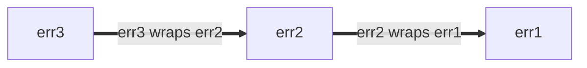

# Google Go Style Documents

Compiled from the official Google Go style documents:
- Overview: https://raw.githubusercontent.com/google/styleguide/gh-pages/go/index.md
- Guide: https://raw.githubusercontent.com/google/styleguide/gh-pages/go/guide.md
- Decisions: https://raw.githubusercontent.com/google/styleguide/gh-pages/go/decisions.md
- Best Practices: https://raw.githubusercontent.com/google/styleguide/gh-pages/go/best-practices.md

---

# Overview

# Go Style

https://google.github.io/styleguide/go

[Overview](index) | [Guide](guide) | [Decisions](decisions) |
[Best practices](best-practices)

<!--

-->



<a id="about"></a>

## About

The Go Style Guide and accompanying documents codify the current best approaches
for writing readable and idiomatic Go. Adherence to the Style Guide is not
intended to be absolute, and these documents will never be exhaustive. Our
intention is to minimize the guesswork of writing readable Go so that newcomers
to the language can avoid common mistakes. The Style Guide also serves to unify
the style guidance given by anyone reviewing Go code at Google.

Document            | Link                                                  | Primary Audience    | [Normative] | [Canonical]
------------------- | ----------------------------------------------------- | ------------------- | ----------- | -----------
**Style Guide**     | https://google.github.io/styleguide/go/guide          | Everyone            | Yes         | Yes
**Style Decisions** | https://google.github.io/styleguide/go/decisions      | Readability Mentors | Yes         | No
**Best Practices**  | https://google.github.io/styleguide/go/best-practices | Anyone interested   | No          | No

[Normative]: #normative
[Canonical]: #canonical

<a id="docs"></a>

### Documents

1.  The **[Style Guide](https://google.github.io/styleguide/go/guide)** outlines
    the foundation of Go style at Google. This document is definitive and is
    used as the basis for the recommendations in Style Decisions and Best
    Practices.

1.  **[Style Decisions](https://google.github.io/styleguide/go/decisions)** is a
    more verbose document that summarizes decisions on specific style points and
    discusses the reasoning behind the decisions where appropriate.

    These decisions may occasionally change based on new data, new language
    features, new libraries, or emerging patterns, but it is not expected that
    individual Go programmers at Google should keep up-to-date with this
    document.

1.  **[Best Practices](https://google.github.io/styleguide/go/best-practices)**
    documents some of the patterns that have evolved over time that solve common
    problems, read well, and are robust to code maintenance needs.

    These best practices are not canonical, but Go programmers at Google are
    encouraged to use them where possible to keep the codebase uniform and
    consistent.

These documents intend to:

*   Agree on a set of principles for weighing alternate styles
*   Codify settled matters of Go style
*   Document and provide canonical examples for Go idioms
*   Document the pros and cons of various style decisions
*   Help minimize surprises in Go readability reviews
*   Help readability mentors use consistent terminology and guidance

These documents do **not** intend to:

*   Be an exhaustive list of comments that can be given in a readability review
*   List all of the rules everyone is expected to remember and follow at all
    times
*   Replace good judgment in the use of language features and style
*   Justify large-scale changes to get rid of style differences

There will always be differences from one Go programmer to another and from one
team's codebase to another. However, it is in the best interest of Google and
Alphabet that our codebase be as consistent as possible. (See
[guide](guide#consistency) for more on consistency.) To that end, feel free to
make style improvements as you see fit, but you do not need to nit-pick every
violation of the Style Guide that you find. In particular, these documents may
change over time, and that is no reason to cause extra churn in existing
codebases; it suffices to write new code using the latest best practices and
address nearby issues over time.

It is important to recognize that issues of style are inherently personal and
that there are always inherent trade-offs. Much of the guidance in these
documents is subjective, but just like with `gofmt`, there is significant value
in the uniformity they provide. As such, style recommendations will not be
changed without due discourse, Go programmers at Google are encouraged to follow
the style guide even where they might disagree.

<a id="definitions"></a>

## Definitions

The following words, which are used throughout the style documents, are defined
below:

*   **Canonical**: Establishes prescriptive and enduring rules
    <a id="canonical"></a>

    Within these documents, "canonical" is used to describe something that is
    considered a standard that all code (old and new) should follow and that is
    not expected to change substantially over time. Principles in the canonical
    documents should be understood by authors and reviewers alike, so everything
    included within a canonical document must meet a high bar. As such,
    canonical documents are generally shorter and prescribe fewer elements of
    style than non-canonical documents.

    https://google.github.io/styleguide/go#canonical

*   **Normative**: Intended to establish consistency <a id="normative"></a>

    Within these documents, "normative" is used to describe something that is an
    agreed-upon element of style for use by Go code reviewers, in order that the
    suggestions, terminology, and justifications are consistent. These elements
    may change over time, and these documents will reflect such changes so that
    reviewers can remain consistent and up-to-date. Authors of Go code are not
    expected to be familiar with the normative documents, but the documents will
    frequently be used as a reference by reviewers in readability reviews.

    https://google.github.io/styleguide/go#normative

*   **Idiomatic**: Common and familiar <a id="idiomatic"></a>

    Within these documents, "idiomatic" is used to refer to something that is
    prevalent in Go code and has become a familiar pattern that is easy to
    recognize. In general, an idiomatic pattern should be preferred to something
    unidiomatic if both serve the same purpose in context, as this is what will
    be the most familiar to readers.

    https://google.github.io/styleguide/go#idiomatic

<a id="references"></a>

## Additional references

This guide assumes the reader is familiar with [Effective Go], as it provides a
common baseline for Go code across the entire Go community.

Below are some additional resources for those looking to self-educate about Go
style and for reviewers looking to provide further linkable context in their
reviews. Participants in the Go readability process are not expected to be
familiar with these resources, but they may arise as context in readability
reviews.

[Effective Go]: https://go.dev/doc/effective_go

**External References**

*   [Go Language Specification](https://go.dev/ref/spec)
*   [Go FAQ](https://go.dev/doc/faq)
*   [Go Memory Model](https://go.dev/ref/mem)
*   [Go Data Structures](https://research.swtch.com/godata)
*   [Go Interfaces](https://research.swtch.com/interfaces)
*   [Go Proverbs](https://go-proverbs.github.io/)

*   <a id="gotip"></a> Go Tip Episodes - stay tuned.

*   <a id="unit-testing-practices"></a> Unit Testing Practices - stay tuned.

**Relevant Testing-on-the-Toilet articles**

*   [TotT: Identifier Naming][tott-431]
*   [TotT: Testing State vs. Testing Interactions][tott-281]
*   [TotT: Effective Testing][tott-324]
*   [TotT: Risk-driven Testing][tott-329]
*   [TotT: Change-detector Tests Considered Harmful][tott-350]

[tott-431]: https://testing.googleblog.com/2017/10/code-health-identifiernamingpostforworl.html
[tott-281]: https://testing.googleblog.com/2013/03/testing-on-toilet-testing-state-vs.html
[tott-324]: https://testing.googleblog.com/2014/05/testing-on-toilet-effective-testing.html
[tott-329]: https://testing.googleblog.com/2014/05/testing-on-toilet-risk-driven-testing.html
[tott-350]: https://testing.googleblog.com/2015/01/testing-on-toilet-change-detector-tests.html

**Additional External Writings**

*   [Go and Dogma](https://research.swtch.com/dogma)
*   [Less is exponentially more](https://commandcenter.blogspot.com/2012/06/less-is-exponentially-more.html)
*   [Esmerelda's Imagination](https://commandcenter.blogspot.com/2011/12/esmereldas-imagination.html)
*   [Regular expressions for parsing](https://commandcenter.blogspot.com/2011/08/regular-expressions-in-lexing-and.html)
*   [Gofmt's style is no one's favorite, yet Gofmt is everyone's favorite](https://www.youtube.com/watch?v=PAAkCSZUG1c&t=8m43s)
    (YouTube)

<!--

-->



---

# Guide

<!--* toc_depth: 3 *-->

# Go Style Guide

https://google.github.io/styleguide/go/guide

[Overview](index) | [Guide](guide) | [Decisions](decisions) |
[Best practices](best-practices)

<!--

-->



**Note:** This is part of a series of documents that outline [Go Style](index)
at Google. This document is **[normative](index#normative) and
[canonical](index#canonical)**. See [the overview](index#about) for more
information.

<a id="principles"></a>

## Style principles

There are a few overarching principles that summarize how to think about writing
readable Go code. The following are attributes of readable code, in order of
importance:

1.  **[Clarity]**: The code's purpose and rationale is clear to the reader.
1.  **[Simplicity]**: The code accomplishes its goal in the simplest way
    possible.
1.  **[Concision]**: The code has a high signal-to-noise ratio.
1.  **[Maintainability]**: The code is written such that it can be easily
    maintained.
1.  **[Consistency]**: The code is consistent with the broader Google codebase.

[Clarity]: #clarity
[Simplicity]: #simplicity
[Concision]: #concision
[Maintainability]: #maintainability
[Consistency]: #consistency

<a id="clarity"></a>

### Clarity

The core goal of readability is to produce code that is clear to the reader.

Clarity is primarily achieved with effective naming, helpful commentary, and
efficient code organization.

Clarity is to be viewed through the lens of the reader, not the author of the
code. It is more important that code be easy to read than easy to write. Clarity
in code has two distinct facets:

*   [What is the code actually doing?](#clarity-purpose)
*   [Why is the code doing what it does?](#clarity-rationale)

<a id="clarity-purpose"></a>

#### What is the code actually doing?

Go is designed such that it should be relatively straightforward to see what the
code is doing. In cases of uncertainty or where a reader may require prior
knowledge in order to understand the code, it is worth investing time in order
to make the code's purpose clearer for future readers. For example, it may help
to:

*   Use more descriptive variable names
*   Add additional commentary
*   Break up the code with whitespace and comments
*   Refactor the code into separate functions/methods to make it more modular

There is no one-size-fits-all approach here, but it is important to prioritize
clarity when developing Go code.

<a id="clarity-rationale"></a>

#### Why is the code doing what it does?

The code's rationale is often sufficiently communicated by the names of
variables, functions, methods, or packages. Where it is not, it is important to
add commentary. The "Why?" is especially important when the code contains
nuances that a reader may not be familiar with, such as:

*   A nuance in the language, e.g., a closure will be capturing a loop variable,
    but the closure is many lines away
*   A nuance of the business logic, e.g., an access control check that needs to
    distinguish between the actual user and someone impersonating a user

An API might require care to use correctly. For example, a piece of code may be
intricate and difficult to follow for performance reasons, or a complex sequence
of mathematical operations may use type conversions in an unexpected way. In
these cases and many more, it is important that accompanying commentary and
documentation explain these aspects so that future maintainers don't make a
mistake and so that readers can understand the code without needing to
reverse-engineer it.

It is also important to be aware that some attempts to provide clarity (such as
adding extra commentary) can actually obscure the code's purpose by adding
clutter, restating what the code already says, contradicting the code, or adding
maintenance burden to keep the comments up-to-date. Allow the code to speak for
itself (e.g., by making the symbol names themselves self-describing) rather than
adding redundant comments. It is often better for comments to explain why
something is done, not what the code is doing.

The Google codebase is largely uniform and consistent. It is often the case that
code that stands out (e.g., by using an unfamiliar pattern) is doing so for a
good reason, typically for performance. Maintaining this property is important
to make it clear to readers where they should focus their attention when reading
a new piece of code.

The standard library contains many examples of this principle in action. Among
them:

*   Maintainer comments in
    [`package sort`](https://cs.opensource.google/go/go/+/refs/tags/go1.19.2:src/sort/sort.go).
*   Good
    [runnable examples in the same package](https://cs.opensource.google/go/go/+/refs/tags/go1.19.2:src/sort/example_search_test.go),
    which benefit both users (they
    [show up in godoc](https://pkg.go.dev/sort#pkg-examples)) and maintainers
    (they [run as part of tests](decisions#examples)).
*   [`strings.Cut`](https://pkg.go.dev/strings#Cut) is only four lines of code,
    but they improve the
    [clarity and correctness of callsites](https://github.com/golang/go/issues/46336).

<a id="simplicity"></a>

### Simplicity

Your Go code should be simple for those using, reading, and maintaining it.

Go code should be written in the simplest way that accomplishes its goals, both
in terms of behavior and performance. Within the Google Go codebase, simple
code:

*   Is easy to read from top to bottom
*   Does not assume that you already know what it is doing
*   Does not assume that you can memorize all of the preceding code
*   Does not have unnecessary levels of abstraction
*   Does not have names that call attention to something mundane
*   Makes the propagation of values and decisions clear to the reader
*   Has comments that explain why, not what, the code is doing to avoid future
    deviation
*   Has documentation that stands on its own
*   Has useful errors and useful test failures
*   May often be mutually exclusive with "clever" code

Tradeoffs can arise between code simplicity and API usage simplicity. For
example, it may be worthwhile to have the code be more complex so that the end
user of the API may more easily call the API correctly. In contrast, it may also
be worthwhile to leave a bit of extra work to the end user of the API so that
the code remains simple and easy to understand.

When code needs complexity, the complexity should be added deliberately. This is
typically necessary if additional performance is required or where there are
multiple disparate customers of a particular library or service. Complexity may
be justified, but it should come with accompanying documentation so that clients
and future maintainers are able to understand and navigate the complexity. This
should be supplemented with tests and examples that demonstrate its correct
usage, especially if there is both a "simple" and a "complex" way to use the
code.

This principle does not imply that complex code cannot or should not be written
in Go or that Go code is not allowed to be complex. We strive for a codebase
that avoids unnecessary complexity so that when complexity does appear, it
indicates that the code in question requires care to understand and maintain.
Ideally, there should be accompanying commentary that explains the rationale and
identifies the care that should be taken. This often arises when optimizing code
for performance; doing so often requires a more complex approach, like
preallocating a buffer and reusing it throughout a goroutine lifetime. When a
maintainer sees this, it should be a clue that the code in question is
performance-critical, and that should influence the care that is taken when
making future changes. If employed unnecessarily, on the other hand, this
complexity is a burden on those who need to read or change the code in the
future.

If code turns out to be very complex when its purpose should be simple, this is
often a signal to revisit the implementation to see if there is a simpler way to
accomplish the same thing.

<a id="least-mechanism"></a>

#### Least mechanism

Where there are several ways to express the same idea, prefer the one that uses
the most standard tools. Sophisticated machinery often exists, but should not be
employed without reason. It is easy to add complexity to code as needed, whereas
it is much harder to remove existing complexity after it has been found to be
unnecessary.

1.  Aim to use a core language construct (for example a channel, slice, map,
    loop, or struct) when sufficient for your use case.
2.  If there isn't one, look for a tool within the standard library (like an
    HTTP client or a template engine).
3.  Finally, consider whether there is a core library in the Google codebase
    that is sufficient before introducing a new dependency or creating your own.

As an example, consider production code that contains a flag bound to a variable
with a default value which must be overridden in tests. Unless intending to test
the program's command-line interface itself (say, with `os/exec`), it is simpler
and therefore preferable to override the bound value directly rather than by
using `flag.Set`.

Similarly, if a piece of code requires a set membership check, a boolean-valued
map (e.g., `map[string]bool`) often suffices. Libraries that provide set-like
types and functionality should only be used if more complicated operations are
required that are impossible or overly complicated with a map.

<a id="concision"></a>

### Concision

Concise Go code has a high signal-to-noise ratio. It is easy to discern the
relevant details, and the naming and structure guide the reader through these
details.

There are many things that can get in the way of surfacing the most salient
details at any given time:

*   Repetitive code
*   Extraneous syntax
*   [Opaque names](#naming)
*   Unnecessary abstraction
*   Whitespace

Repetitive code especially obscures the differences between each
nearly-identical section, and requires a reader to visually compare similar
lines of code to find the changes. [Table-driven testing] is a good example of a
mechanism that can concisely factor out the common code from the important
details of each repetition, but the choice of which pieces to include in the
table will have an impact on how easy the table is to understand.

When considering multiple ways to structure code, it is worth considering which
way makes important details the most apparent.

Understanding and using common code constructions and idioms are also important
for maintaining a high signal-to-noise ratio. For example, the following code
block is very common in [error handling], and the reader can quickly understand
the purpose of this block.

```go
// Good:
if err := doSomething(); err != nil {
    // ...
}
```

If code looks very similar to this but is subtly different, a reader may not
notice the change. In cases like this, it is worth intentionally ["boosting"]
the signal of the error check by adding a comment to call attention to it.

```go
// Good:
if err := doSomething(); err == nil { // if NO error
    // ...
}
```

[Table-driven testing]: https://go.dev/wiki/TableDrivenTests
[error handling]: https://go.dev/blog/errors-are-values
["boosting"]: best-practices#signal-boost

<a id="maintainability"></a>

### Maintainability

Code is edited many more times than it is written. Readable code not only makes
sense to a reader who is trying to understand how it works, but also to the
programmer who needs to change it. Clarity is key.

Maintainable code:

*   Is easy for a future programmer to modify correctly
*   Has APIs that are structured so that they can grow gracefully
*   Is clear about the assumptions that it makes and chooses abstractions that
    map to the structure of the problem, not to the structure of the code
*   Avoids unnecessary coupling and doesn't include features that are not used
*   Has a comprehensive test suite to ensure promised behaviors are maintained
    and important logic is correct, and the tests provide clear, actionable
    diagnostics in case of failure

When using abstractions like interfaces and types which by definition remove
information from the context in which they are used, it is important to ensure
that they provide sufficient benefit. Editors and IDEs can connect directly to a
method definition and show the corresponding documentation when a concrete type
is used, but can only refer to an interface definition otherwise. Interfaces are
a powerful tool, but come with a cost, since the maintainer may need to
understand the specifics of the underlying implementation in order to correctly
use the interface, which must be explained within the interface documentation or
at the call-site.

Maintainable code also avoids hiding important details in places that are easy
to overlook. For example, in each of the following lines of code, the presence
or lack of a single character is critical to understand the line:

```go
// Bad:
// The use of = instead of := can change this line completely.
if user, err = db.UserByID(userID); err != nil {
    // ...
}
```

```go
// Bad:
// The ! in the middle of this line is very easy to miss.
leap := (year%4 == 0) && (!(year%100 == 0) || (year%400 == 0))
```

Neither of these are incorrect, but both could be written in a more explicit
fashion, or could have an accompanying comment that calls attention to the
important behavior:

```go
// Good:
u, err := db.UserByID(userID)
if err != nil {
    return fmt.Errorf("invalid origin user: %s", err)
}
user = u
```

```go
// Good:
// Gregorian leap years aren't just year%4 == 0.
// See https://en.wikipedia.org/wiki/Leap_year#Algorithm.
var (
    leap4   = year%4 == 0
    leap100 = year%100 == 0
    leap400 = year%400 == 0
)
leap := leap4 && (!leap100 || leap400)
```

In the same way, a helper function that hides critical logic or an important
edge-case could make it easy for a future change to fail to account for it
properly.

Predictable names are another feature of maintainable code. A user of a package
or a maintainer of a piece of code should be able to predict the name of a
variable, method, or function in a given context. Function parameters and
receiver names for identical concepts should typically share the same name, both
to keep documentation understandable and to facilitate refactoring code with
minimal overhead.

Maintainable code minimizes its dependencies (both implicit and explicit).
Depending on fewer packages means fewer lines of code that can affect behavior.
Avoiding dependencies on internal or undocumented behavior makes code less
likely to impose a maintenance burden when those behaviors change in the future.

When considering how to structure or write code, it is worth taking the time to
think through ways in which the code may evolve over time. If a given approach
is more conducive to easier and safer future changes, that is often a good
trade-off, even if it means a slightly more complicated design.

<a id="consistency"></a>

### Consistency

Consistent code is code that looks, feels, and behaves like similar code
throughout the broader codebase, within the context of a team or package, and
even within a single file.

Consistency concerns do not override any of the principles above, but if a tie
must be broken, it is often beneficial to break it in favor of consistency.

Consistency within a package is often the most immediately important level of
consistency. It can be very jarring if the same problem is approached in
multiple ways throughout a package, or if the same concept has many names within
a file. However, even this should not override documented style principles or
global consistency.

<a id="core"></a>

## Core guidelines

These guidelines collect the most important aspects of Go style that all Go code
is expected to follow. We expect that these principles be learned and followed
by the time readability is granted. These are not expected to change frequently,
and new additions will have to clear a high bar.

The guidelines below expand on the recommendations in [Effective Go], which
provide a common baseline for Go code across the entire community.

[Effective Go]: https://go.dev/doc/effective_go

<a id="formatting"></a>

### Formatting

All Go source files must conform to the format outputted by the `gofmt` tool.
This format is enforced by a presubmit check in the Google codebase.
[Generated code] should generally also be formatted (e.g., by using
[`format.Source`]), as it is also browsable in Code Search.

[Generated code]: https://docs.bazel.build/versions/main/be/general.html#genrule
[`format.Source`]: https://pkg.go.dev/go/format#Source

<a id="mixed-caps"></a>

### MixedCaps

Go source code uses `MixedCaps` or `mixedCaps` (camel case) rather than
underscores (snake case) when writing multi-word names.

This applies even when it breaks conventions in other languages. For example, a
constant is `MaxLength` (not `MAX_LENGTH`) if exported and `maxLength` (not
`max_length`) if unexported.

Local variables are considered [unexported] for the purpose of choosing the
initial capitalization.

<!--#include file="/go/g3doc/style/includes/special-name-exception.md"-->

[unexported]: https://go.dev/ref/spec#Exported_identifiers

<a id="line-length"></a>

### Line length

There is no fixed line length for Go source code. If a line feels too long,
prefer refactoring instead of splitting it. If it is already as short as it is
practical for it to be, the line should be allowed to remain long.

Do not split a line:

*   Before an [indentation change](decisions#indentation-confusion) (e.g.,
    function declaration, conditional)
*   To make a long string (e.g., a URL) fit into multiple shorter lines

<a id="naming"></a>

### Naming

Naming is more art than science. In Go, names tend to be somewhat shorter than
in many other languages, but the same [general guidelines] apply. Names should:

*   Not feel [repetitive](decisions#repetition) when they are used
*   Take the context into consideration
*   Not repeat concepts that are already clear

You can find more specific guidance on naming in [decisions](decisions#naming).

[general guidelines]: https://testing.googleblog.com/2017/10/code-health-identifiernamingpostforworl.html

<a id="local-consistency"></a>

### Local consistency

Where the style guide has nothing to say about a particular point of style,
authors are free to choose the style that they prefer, unless the code in close
proximity (usually within the same file or package, but sometimes within a team
or project directory) has taken a consistent stance on the issue.

Examples of **valid** local style considerations:

*   Use of `%s` or `%v` for formatted printing of errors
*   Usage of buffered channels in lieu of mutexes

Examples of **invalid** local style considerations:

*   Line length restrictions for code
*   Use of assertion-based testing libraries

If the local style disagrees with the style guide but the readability impact is
limited to one file, it will generally be surfaced in a code review for which a
consistent fix would be outside the scope of the CL in question. At that point,
it is appropriate to file a bug to track the fix.

If a change would worsen an existing style deviation, expose it in more API
surfaces, expand the number of files in which the deviation is present, or
introduce an actual bug, then local consistency is no longer a valid
justification for violating the style guide for new code. In these cases, it is
appropriate for the author to clean up the existing codebase in the same CL,
perform a refactor in advance of the current CL, or find an alternative that at
least does not make the local problem worse.

<!--

-->



---

# Decisions

<!--* toc_depth: 3 *-->

# Go Style Decisions

https://google.github.io/styleguide/go/decisions

[Overview](index) | [Guide](guide) | [Decisions](decisions) |
[Best practices](best-practices)

<!--

-->



**Note:** This is part of a series of documents that outline [Go Style](index)
at Google. This document is **[normative](index#normative) but not
[canonical](index#canonical)**, and is subordinate to the
[core style guide](guide). See [the overview](index#about) for more information.

<a id="about"></a>

## About

This document contains style decisions intended to unify and provide standard
guidance, explanations, and examples for the advice given by the Go readability
mentors.

This document is **not exhaustive** and will grow over time. In cases where
[the core style guide](guide) contradicts the advice given here, **the style
guide takes precedence**, and this document should be updated accordingly.

See [the Overview](https://google.github.io/styleguide/go#about) for the full
set of Go Style documents.

The following sections have moved from style decisions to another part of the
guide:

*   **MixedCaps**: see [guide#mixed-caps](guide#mixed-caps)
    <a id="mixed-caps"></a>

*   **Formatting**: see [guide#formatting](guide#formatting)
    <a id="formatting"></a>

*   **Line Length**: see [guide#line-length](guide#line-length)
    <a id="line-length"></a>

<a id="naming"></a>

## Naming

See the naming section within [the core style guide](guide#naming) for
overarching guidance on naming. The following sections provide further
clarification on specific areas within naming.

<a id="underscores"></a>

### Underscores

Names in Go should in general not contain underscores. There are three
exceptions to this principle:

1.  Package names that are only imported by generated code may contain
    underscores. See [package names](#package-names) for more detail around how
    to choose multi-word package names.
1.  Test, Benchmark and Example function names within `*_test.go` files may
    include underscores.
1.  Low-level libraries that interoperate with the operating system or cgo may
    reuse identifiers, as is done in [`syscall`]. This is expected to be very
    rare in most codebases.

**Note:** Filenames of source code are not Go identifiers and do not have to
follow these conventions. They may contain underscores.

[`syscall`]: https://pkg.go.dev/syscall#pkg-constants

<a id="package-names"></a>

### Package names

<a id="TOC-PackageNames"></a>

In Go, package names must be concise and use only lowercase letters and numbers
(e.g., [`k8s`], [`oauth2`]). Multi-word package names should remain unbroken and
in all lowercase (e.g., [`tabwriter`] instead of `tabWriter`, `TabWriter`, or
`tab_writer`).

Avoid selecting package names that are likely to be [shadowed] by commonly used
local variable names. For example, `usercount` is a better package name than
`count`, since `count` is a commonly used variable name.

Go package names should not have underscores. If you need to import a package
that does have one in its name (usually from generated or third party code), it
must be renamed at import time to a name that is suitable for use in Go code.

An exception to this is that package names that are only imported by generated
code may contain underscores. Specific examples include:

*   Using the `_test` suffix for unit tests that only exercise the exported API
    of a package (package `testing` calls these
    ["black box tests"](https://pkg.go.dev/testing)). For example, a package
    `linkedlist` must define its black box unit tests in a package named
    `linkedlist_test` (not `linked_list_test`)

*   Using underscores and the `_test` suffix for packages that specify
    functional or integration tests. For example, a linked list service
    integration test could be named `linked_list_service_test`

*   Using the `_test` suffix for
    [package-level documentation examples](https://go.dev/blog/examples)

[`tabwriter`]: https://pkg.go.dev/text/tabwriter
[`k8s`]: https://pkg.go.dev/k8s.io/client-go/kubernetes
[`oauth2`]: https://pkg.go.dev/golang.org/x/oauth2
[shadowed]: best-practices#shadowing

Avoid uninformative package names like `util`, `utility`, `common`, `helper`,
`model`, `testhelper`, and so on that would tempt users of the package to
[rename it when importing](#import-renaming). See:

*   [Guidance on so-called "utility packages"](best-practices#util-packages)
*   [Go Tip #97: What's in a Name](https://google.github.io/styleguide/go/index.html#gotip)
*   [Go Tip #108: The Power of a Good Package Name](https://google.github.io/styleguide/go/index.html#gotip)

When an imported package is renamed (e.g. `import foopb
"path/to/foo_go_proto"`), the local name for the package must comply with the
rules above, as the local name dictates how the symbols in the package are
referenced in the file. If a given import is renamed in multiple files,
particularly in the same or nearby packages, the same local name should be used
wherever possible for consistency.

<!--#include file="/go/g3doc/style/includes/special-name-exception.md"-->

See also: [Go blog post about package names](https://go.dev/blog/package-names).

<a id="receiver-names"></a>

### Receiver names

<a id="TOC-ReceiverNames"></a>

[Receiver] variable names must be:

*   Short (usually one or two letters in length)
*   Abbreviations for the type itself
*   Applied consistently to every receiver for that type
*   Not an underscore; omit the name if it is unused

Long Name                   | Better Name
--------------------------- | -------------------------
`func (tray Tray)`          | `func (t Tray)`
`func (info *ResearchInfo)` | `func (ri *ResearchInfo)`
`func (this *ReportWriter)` | `func (w *ReportWriter)`
`func (self *Scanner)`      | `func (s *Scanner)`

[Receiver]: https://golang.org/ref/spec#Method_declarations

<a id="constant-names"></a>

### Constant names

Constant names must use [MixedCaps] like all other names in Go. ([Exported]
constants start with uppercase, while unexported constants start with
lowercase.) This applies even when it breaks conventions in other languages.
Constant names should not be a derivative of their values and should instead
explain what the value denotes.

```go
// Good:
const MaxPacketSize = 512

const (
    ExecuteBit = 1 << iota
    WriteBit
    ReadBit
)
```

[MixedCaps]: guide#mixed-caps
[Exported]: https://tour.golang.org/basics/3

Do not use non-MixedCaps constant names or constants with a `K` prefix.

```go
// Bad:
const MAX_PACKET_SIZE = 512
const kMaxBufferSize = 1024
const KMaxUsersPergroup = 500
```

Name constants based on their role, not their values. If a constant does not
have a role apart from its value, then it is unnecessary to define it as a
constant.

```go
// Bad:
const Twelve = 12

const (
    UserNameColumn = "username"
    GroupColumn    = "group"
)
```

<!--#include file="/go/g3doc/style/includes/special-name-exception.md"-->

<a id="initialisms"></a>

### Initialisms

<a id="TOC-Initialisms"></a>

Words in names that are initialisms or acronyms (e.g., `URL` and `NATO`) should
have the same case. `URL` should appear as `URL` or `url` (as in `urlPony`, or
`URLPony`), never as `Url`. As a general rule, identifiers (e.g., `ID` and `DB`)
should also be capitalized similar to their usage in English prose.

*   In names with multiple initialisms (e.g. `XMLAPI` because it contains `XML`
    and `API`), each letter within a given initialism should have the same case,
    but each initialism in the name does not need to have the same case.
*   In names with an initialism containing a lowercase letter (e.g. `DDoS`,
    `iOS`, `gRPC`), the initialism should appear as it would in standard prose,
    unless you need to change the first letter for the sake of [exportedness].
    In these cases, the entire initialism should be the same case (e.g. `ddos`,
    `IOS`, `GRPC`).

[exportedness]: https://golang.org/ref/spec#Exported_identifiers

<!-- Keep this table narrow. If it must grow wider, replace with a list. -->

English Usage | Scope      | Correct  | Incorrect
------------- | ---------- | -------- | --------------------------------------
XML API       | Exported   | `XMLAPI` | `XmlApi`, `XMLApi`, `XmlAPI`, `XMLapi`
XML API       | Unexported | `xmlAPI` | `xmlapi`, `xmlApi`
iOS           | Exported   | `IOS`    | `Ios`, `IoS`
iOS           | Unexported | `iOS`    | `ios`
gRPC          | Exported   | `GRPC`   | `Grpc`
gRPC          | Unexported | `gRPC`   | `grpc`
DDoS          | Exported   | `DDoS`   | `DDOS`, `Ddos`
DDoS          | Unexported | `ddos`   | `dDoS`, `dDOS`
ID            | Exported   | `ID`     | `Id`
ID            | Unexported | `id`     | `iD`
DB            | Exported   | `DB`     | `Db`
DB            | Unexported | `db`     | `dB`
Txn           | Exported   | `Txn`    | `TXN`

<!--#include file="/go/g3doc/style/includes/special-name-exception.md"-->

<a id="getters"></a>

### Getters

<a id="TOC-Getters"></a>

Function and method names should not use a `Get` or `get` prefix, unless the
underlying concept uses the word "get" (e.g. an HTTP GET). Prefer starting the
name with the noun directly, for example use `Counts` over `GetCounts`.

If the function involves performing a complex computation or executing a remote
call, a different word like `Compute` or `Fetch` can be used in place of `Get`,
to make it clear to a reader that the function call may take time and could
block or fail.

<!--#include file="/go/g3doc/style/includes/special-name-exception.md"-->

<a id="variable-names"></a>

### Variable names

<a id="TOC-VariableNames"></a>

The general rule of thumb is that the length of a name should be proportional to
the size of its scope and inversely proportional to the number of times that it
is used within that scope. A variable created at file scope may require multiple
words, whereas a variable scoped to a single inner block may be a single word or
even just a character or two, to keep the code clear and avoid extraneous
information.

Here is a rough baseline. These numeric guidelines are not strict rules. Apply
judgement based on context, [clarity], and [concision].

*   A small scope is one in which one or two small operations are performed, say
    1-7 lines.
*   A medium scope is a few small or one large operation, say 8-15 lines.
*   A large scope is one or a few large operations, say 15-25 lines.
*   A very large scope is anything that spans more than a page (say, more than
    25 lines).

[clarity]: guide#clarity
[concision]: guide#concision

A name that might be perfectly clear (e.g., `c` for a counter) within a small
scope could be insufficient in a larger scope and would require clarification to
remind the reader of its purpose further along in the code. A scope in which
there are many variables, or variables that represent similar values or
concepts, may necessitate longer variable names than the scope suggests.

The specificity of the concept can also help to keep a variable's name concise.
For example, assuming there is only a single database in use, a short variable
name like `db` that might normally be reserved for very small scopes may remain
perfectly clear even if the scope is very large. In this case, a single word
`database` is likely acceptable based on the size of the scope, but is not
required as `db` is a very common shortening for the word with few alternate
interpretations.

The name of a local variable should reflect what it contains and how it is being
used in the current context, rather than where the value originated. For
example, it is often the case that the best local variable name is not the same
as the struct or protocol buffer field name.

In general:

*   Single-word names like `count` or `options` are a good starting point.
*   Additional words can be added to disambiguate similar names, for example
    `userCount` and `projectCount`.
*   Do not simply drop letters to save typing. For example `Sandbox` is
    preferred over `Sbx`, particularly for exported names.
*   Omit [types and type-like words] from most variable names.
    *   For a number, `userCount` is a better name than `numUsers` or
        `usersInt`.
    *   For a slice, `users` is a better name than `userSlice`.
    *   It is acceptable to include a type-like qualifier if there are two
        versions of a value in scope, for example you might have an input stored
        in `ageString` and use `age` for the parsed value.
*   Omit words that are clear from the [surrounding context]. For example, in
    the implementation of a `UserCount` method, a local variable called
    `userCount` is probably redundant; `count`, `users`, or even `c` are just as
    readable.

[types and type-like words]: #repetitive-with-type
[surrounding context]: #repetitive-in-context

<a id="v"></a>

#### Single-letter variable names

Single-letter variable names can be a useful tool to minimize
[repetition](#repetition), but can also make code needlessly opaque. Limit their
use to instances where the full word is obvious and where it would be repetitive
for it to appear in place of the single-letter variable.

In general:

*   For a [method receiver variable], a one-letter or two-letter name is
    preferred.
*   Using familiar variable names for common types is often helpful:
    *   `r` for an `io.Reader` or `*http.Request`
    *   `w` for an `io.Writer` or `http.ResponseWriter`
*   Single-letter identifiers are acceptable as integer loop variables,
    particularly for indices (e.g., `i`) and coordinates (e.g., `x` and `y`).
*   Abbreviations can be acceptable loop identifiers when the scope is short,
    for example `for _, n := range nodes { ... }`.

[method receiver variable]: #receiver-names

<a id="repetition"></a>

### Repetition

<!--
Note to future editors:

Do not use the term "stutter" to refer to cases when a name is repetitive.
-->

A piece of Go source code should avoid unnecessary repetition. One common source
of this is repetitive names, which often include unnecessary words or repeat
their context or type. Code itself can also be unnecessarily repetitive if the
same or a similar code segment appears multiple times in close proximity.

Repetitive naming can come in many forms, including:

<a id="repetitive-with-package"></a>

#### Package vs. exported symbol name

When naming exported symbols, the name of the package is always visible outside
your package, so redundant information between the two should be reduced or
eliminated. If a package exports only one type and it is named after the package
itself, the canonical name for the constructor is `New` if one is required.

> **Examples:** Repetitive Name -> Better Name
>
> *   `widget.NewWidget` -> `widget.New`
> *   `widget.NewWidgetWithName` -> `widget.NewWithName`
> *   `db.LoadFromDatabase` -> `db.Load`
> *   `goatteleportutil.CountGoatsTeleported` -> `gtutil.CountGoatsTeleported`
>     or `goatteleport.Count`
> *   `myteampb.MyTeamMethodRequest` -> `mtpb.MyTeamMethodRequest` or
>     `myteampb.MethodRequest`

<a id="repetitive-with-type"></a>

#### Variable name vs. type

The compiler always knows the type of a variable, and in most cases it is also
clear to the reader what type a variable is by how it is used. It is only
necessary to clarify the type of a variable if its value appears twice in the
same scope.

Repetitive Name               | Better Name
----------------------------- | ----------------------
`var numUsers int`            | `var users int`
`var nameString string`       | `var name string`
`var primaryProject *Project` | `var primary *Project`

If the value appears in multiple forms, this can be clarified either with an
extra word like `raw` and `parsed` or with the underlying representation:

```go
// Good:
limitRaw := r.FormValue("limit")
limit, err := strconv.Atoi(limitRaw)
```

```go
// Good:
limitStr := r.FormValue("limit")
limit, err := strconv.Atoi(limitStr)
```

<a id="repetitive-in-context"></a>

#### External context vs. local names

Names that include information from their surrounding context often create extra
noise without benefit. The package name, method name, type name, function name,
import path, and even filename can all provide context that automatically
qualifies all names within.

```go
// Bad:
// In package "ads/targeting/revenue/reporting"
type AdsTargetingRevenueReport struct{}

func (p *Project) ProjectName() string
```

```go
// Good:
// In package "ads/targeting/revenue/reporting"
type Report struct{}

func (p *Project) Name() string
```

```go
// Bad:
// In package "sqldb"
type DBConnection struct{}
```

```go
// Good:
// In package "sqldb"
type Connection struct{}
```

```go
// Bad:
// In package "ads/targeting"
func Process(in *pb.FooProto) *Report {
    adsTargetingID := in.GetAdsTargetingID()
}
```

```go
// Good:
// In package "ads/targeting"
func Process(in *pb.FooProto) *Report {
    id := in.GetAdsTargetingID()
}
```

Repetition should generally be evaluated in the context of the user of the
symbol, rather than in isolation. For example, the following code has lots of
names that may be fine in some circumstances, but redundant in context:

```go
// Bad:
func (db *DB) UserCount() (userCount int, err error) {
    var userCountInt64 int64
    if dbLoadError := db.LoadFromDatabase("count(distinct users)", &userCountInt64); dbLoadError != nil {
        return 0, fmt.Errorf("failed to load user count: %s", dbLoadError)
    }
    userCount = int(userCountInt64)
    return userCount, nil
}
```

Instead, information about names that are clear from context or usage can often
be omitted:

```go
// Good:
func (db *DB) UserCount() (int, error) {
    var count int64
    if err := db.Load("count(distinct users)", &count); err != nil {
        return 0, fmt.Errorf("failed to load user count: %s", err)
    }
    return int(count), nil
}
```

<a id="commentary"></a>

## Commentary

The conventions around commentary (which include what to comment, what style to
use, how to provide runnable examples, etc.) are intended to support the
experience of reading the documentation of a public API. See
[Effective Go](http://golang.org/doc/effective_go.html#commentary) for more
information.

The best practices document's section on [documentation conventions] discusses
this further.

**Best Practice:** Use [doc preview] during development and code review to see
whether the documentation and runnable examples are useful and are presented the
way you expect them to be.

**Tip:** Godoc uses very little special formatting; lists and code snippets
should usually be indented to avoid linewrapping. Apart from indentation,
decoration should generally be avoided.

[doc preview]: best-practices#documentation-preview
[documentation conventions]:  best-practices#documentation-conventions

<a id="comment-line-length"></a>

### Comment line length

There is no fixed [line length] for comments in Go.

[line length]: guide#line-length

Long comment lines should be wrapped to ensure that source is readable in tools
which do not perform automatic wrapping of comment lines. If you are uncertain
where to wrap, 80 or 100 columns are common choices. However, this is not a hard
cut-off; there are situations where breaking a long literal text is harmful.
There is no requirement for the specific column width at which wrapping occurs.
Aim to be [consistent](guide#consistency) within a file.

See this [post from The Go Blog on documentation] for more on commentary.

[post from The Go Blog on documentation]: https://blog.golang.org/godoc-documenting-go-code

```text
# Good:
// This is a comment paragraph.
// The length of individual lines doesn't matter in Godoc;
// but the choice of wrapping makes it easy to read on narrow screens.
//
// Don't worry too much about the long URL:
// https://supercalifragilisticexpialidocious.example.com:8080/Animalia/Chordata/Mammalia/Rodentia/Geomyoidea/Geomyidae/
//
// Similarly, if you have other information that is made awkward
// by too many line breaks, use your judgment and include a long line
// if it helps rather than hinders.
```

Avoid comments that fit large amounts of text onto a single line, which is a
poor reader experience.

```text
# Bad:
// This is a comment paragraph. While some code editors and viewers will wrap the paragraph for the reader, others will display a very long line that will overflow most windows and require users to scroll horizontally. In addition, even on a screen capable of displaying the entire line, it is easier to read a narrower paragraph than very wide one.
//
// Don't worry too much about the long URL:
// https://supercalifragilisticexpialidocious.example.com:8080/Animalia/Chordata/Mammalia/Rodentia/Geomyoidea/Geomyidae/
```

<a id="doc-comments"></a>

### Doc comments

<a id="TOC-DocComments"></a>

All top-level exported names must have doc comments, as should unexported type
or function declarations with unobvious behavior or meaning. These comments
should be [full sentences] that begin with the name of the object being
described. An article ("a", "an", "the") can precede the name to make it read
more naturally.

```go
// Good:
// A Request represents a request to run a command.
type Request struct { ...

// Encode writes the JSON encoding of req to w.
func Encode(w io.Writer, req *Request) { ...
```

Doc comments appear in [Godoc](https://pkg.go.dev/) and are surfaced by IDEs,
and therefore should be written for anyone using the package.

[full sentences]: #comment-sentences

A documentation comment applies to the following symbol, or the group of fields
if it appears in a struct.

```go
// Good:
// Options configure the group management service.
type Options struct {
    // General setup:
    Name  string
    Group *FooGroup

    // Dependencies:
    DB *sql.DB

    // Customization:
    LargeGroupThreshold int // optional; default: 10
    MinimumMembers      int // optional; default: 2
}
```

**Best Practice:** If you have doc comments for unexported code, follow the same
custom as if it were exported (namely, starting the comment with the unexported
name). This makes it easy to export it later by simply replacing the unexported
name with the newly-exported one across both comments and code.

<a id="comment-sentences"></a>

### Comment sentences

<a id="TOC-CommentSentences"></a>

Comments that are complete sentences should be capitalized and punctuated like
standard English sentences. (As an exception, it is okay to begin a sentence
with an uncapitalized identifier name if it is otherwise clear. Such cases are
probably best done only at the beginning of a paragraph.)

Comments that are sentence fragments have no such requirements for punctuation
or capitalization.

[Documentation comments] should always be complete sentences, and as such should
always be capitalized and punctuated. Simple end-of-line comments (especially
for struct fields) can be simple phrases that assume the field name is the
subject.

```go
// Good:
// A Server handles serving quotes from the collected works of Shakespeare.
type Server struct {
    // BaseDir points to the base directory under which Shakespeare's works are stored.
    //
    // The directory structure is expected to be the following:
    //   {BaseDir}/manifest.json
    //   {BaseDir}/{name}/{name}-part{number}.txt
    BaseDir string

    WelcomeMessage  string // displayed when user logs in
    ProtocolVersion string // checked against incoming requests
    PageLength      int    // lines per page when printing (optional; default: 20)
}
```

[Documentation comments]: #doc-comments

<a id="examples"></a>

### Examples

<a id="TOC-Examples"></a>

Packages should clearly document their intended usage. Try to provide a
[runnable example]; examples show up in Godoc. Runnable examples belong in the
test file, not the production source file. See this example ([Godoc], [source]).

[runnable example]: http://blog.golang.org/examples
[Godoc]: https://pkg.go.dev/time#example-Duration
[source]: https://cs.opensource.google/go/go/+/HEAD:src/time/example_test.go

If it isn't feasible to provide a runnable example, example code can be provided
within code comments. As with other code and command-line snippets in comments,
it should follow standard formatting conventions.

<a id="named-result-parameters"></a>

### Named result parameters

<a id="TOC-NamedResultParameters"></a>

When naming parameters, consider how function signatures appear in Godoc. The
name of the function itself and the type of the result parameters are often
sufficiently clear.

```go
// Good:
func (n *Node) Parent1() *Node
func (n *Node) Parent2() (*Node, error)
```

If a function returns two or more parameters of the same type, adding names can
be useful.

```go
// Good:
func (n *Node) Children() (left, right *Node, err error)
```

If the caller must take action on particular result parameters, naming them can
help suggest what the action is:

```go
// Good:
// WithTimeout returns a context that will be canceled no later than d duration
// from now.
//
// The caller must arrange for the returned cancel function to be called when
// the context is no longer needed to prevent a resource leak.
func WithTimeout(parent Context, d time.Duration) (ctx Context, cancel func())
```

In the code above, cancellation is a particular action a caller must take.
However, were the result parameters written as `(Context, func())` alone, it
would be unclear what is meant by "cancel function".

Don't use named result parameters when the names produce
[unnecessary repetition](#repetitive-with-type).

```go
// Bad:
func (n *Node) Parent1() (node *Node)
func (n *Node) Parent2() (node *Node, err error)
```

Don't name result parameters in order to avoid declaring a variable inside the
function. This practice results in unnecessary API verbosity at the cost of
minor implementation brevity.

[Naked returns] are acceptable only in a small function. Once it's a
medium-sized function, be explicit with your returned values. Similarly, do not
name result parameters just because it enables you to use naked returns.
[Clarity](guide#clarity) is always more important than saving a few lines in
your function.

It is always acceptable to name a result parameter if its value must be changed
in a deferred closure.

> **Tip:** Types can often be clearer than names in function signatures.
> [GoTip #38: Functions as Named Types] demonstrates this.
>
> In, [`WithTimeout`] above, the real code uses a [`CancelFunc`] instead of a
> raw `func()` in the result parameter list and requires little effort to
> document.

[Naked returns]: https://tour.golang.org/basics/7
[GoTip #38: Functions as Named Types]: https://google.github.io/styleguide/go/index.html#gotip
[`WithTimeout`]: https://pkg.go.dev/context#WithTimeout
[`CancelFunc`]: https://pkg.go.dev/context#CancelFunc

<a id="package-comments"></a>

### Package comments

<a id="TOC-PackageComments"></a>

Package comments must appear immediately above the package clause with no blank
line between the comment and the package name. Example:

```go
// Good:
// Package math provides basic constants and mathematical functions.
//
// This package does not guarantee bit-identical results across architectures.
package math
```

There must be a single package comment per package. If a package is composed of
multiple files, exactly one of the files should have a package comment.

Comments for `main` packages have a slightly different form, where the name of
the `go_binary` rule in the BUILD file takes the place of the package name.

```go
// Good:
// The seed_generator command is a utility that generates a Finch seed file
// from a set of JSON study configs.
package main
```

Other styles of comment are fine as long as the name of the binary is exactly as
written in the BUILD file. When the binary name is the first word, capitalizing
it is required even though it does not strictly match the spelling of the
command-line invocation.

```go
// Good:
// Binary seed_generator ...
// Command seed_generator ...
// Program seed_generator ...
// The seed_generator command ...
// The seed_generator program ...
// Seed_generator ...
```

Tips:

*   Example command-line invocations and API usage can be useful documentation.
    For Godoc formatting, indent the comment lines containing code.

*   If there is no obvious primary file or if the package comment is
    extraordinarily long, it is acceptable to put the doc comment in a file
    named `doc.go` with only the comment and the package clause.

*   Multiline comments can be used instead of multiple single-line comments.
    This is primarily useful if the documentation contains sections which may be
    useful to copy and paste from the source file, as with sample command-lines
    (for binaries) and template examples.

    ```go
    // Good:
    /*
    The seed_generator command is a utility that generates a Finch seed file
    from a set of JSON study configs.

        seed_generator *.json | base64 > finch-seed.base64
    */
    package template
    ```

*   Comments intended for maintainers and that apply to the whole file are
    typically placed after import declarations. These are not surfaced in Godoc
    and are not subject to the rules above on package comments.

<a id="imports"></a>

## Imports

<a id="TOC-Imports"></a>

<a id="import-renaming"></a>

### Import renaming

Package imports shouldn't normally be renamed, but there are cases where they
must be renamed or where a rename improves readability.

Local names for imported packages must follow
[the guidance around package naming](#package-names), including the prohibition
on the use of underscores and capital letters. Try to be
[consistent](guide#consistency) by always using the same local name for the same
imported package.

An imported package *must* be renamed to avoid a name collision with other
imports. (A corollary of this is that [good package names](#package-names)
should not require renaming.) In the event of a name collision, prefer to rename
the most local or project-specific import.

Generated protocol buffer packages *must* be renamed to remove underscores from
their names, and their local names must have a `pb` suffix. See
[proto and stub best practices](best-practices#import-protos) for more
information.

```go
// Good:
import (
    foosvcpb "path/to/package/foo_service_go_proto"
)
```

Lastly, an imported, non-autogenerated package *can* be renamed if it has an
uninformative name (e.g. `util` or `v1`) Do this sparingly: do not rename the
package if the code surrounding the use of the package conveys enough context.
When possible, prefer refactoring the package itself with a more suitable name.

```go
// Good:
import (
    core "github.com/kubernetes/api/core/v1"
    meta "github.com/kubernetes/apimachinery/pkg/apis/meta/v1beta1"
)
```

If you need to import a package whose name collides with a common local variable
name that you want to use (e.g. `url`, `ssh`) and you wish to rename the
package, the preferred way to do so is with the `pkg` suffix (e.g. `urlpkg`).
Note that it is possible to shadow a package with a local variable; this rename
is only necessary if the package still needs to be used when such a variable is
in scope.

<a id="import-grouping"></a>

### Import grouping

Imports should be organized into the following groups, in order:

1.  Standard library packages

1.  Other (project and vendored) packages

1.  Protocol Buffer imports (e.g., `fpb "path/to/foo_go_proto"`)

1.  Import for [side-effects](https://go.dev/doc/effective_go#blank_import)
    (e.g., `_ "path/to/package"`)

```go
// Good:
package main

import (
    "fmt"
    "hash/adler32"
    "os"

    "github.com/dsnet/compress/flate"
    "golang.org/x/text/encoding"
    "google.golang.org/protobuf/proto"

    foopb "myproj/foo/proto/proto"

    _ "myproj/rpc/protocols/dial"
    _ "myproj/security/auth/authhooks"
)
```

<a id="import-blank"></a>

### Import "blank" (`import _`)

<a id="TOC-ImportBlank"></a>

Packages that are imported only for their side effects (using the syntax `import
_ "package"`) may only be imported in a main package, or in tests that require
them.

Some examples of such packages include:

*   [time/tzdata](https://pkg.go.dev/time/tzdata)

*   [image/jpeg](https://pkg.go.dev/image/jpeg) in image processing code

Avoid blank imports in library packages, even if the library indirectly depends
on them. Constraining side-effect imports to the main package helps control
dependencies, and makes it possible to write tests that rely on a different
import without conflict or wasted build costs.

The following are the only exceptions to this rule:

*   You may use a blank import to bypass the check for disallowed imports in the
    [nogo static checker].

*   You may use a blank import of the [embed](https://pkg.go.dev/embed) package
    in a source file which uses the `//go:embed` compiler directive.

**Tip:** If you create a library package that indirectly depends on a
side-effect import in production, document the intended usage.

[nogo static checker]: https://github.com/bazelbuild/rules_go/blob/master/go/nogo.rst

<a id="import-dot"></a>

### Import "dot" (`import .`)

<a id="TOC-ImportDot"></a>

The `import .` form is a language feature that allows bringing identifiers
exported from another package to the current package without qualification. See
the [language spec](https://go.dev/ref/spec#Import_declarations) for more.

Do **not** use this feature in the Google codebase; it makes it harder to tell
where the functionality is coming from.

```go
// Bad:
package foo_test

import (
    "bar/testutil" // also imports "foo"
    . "foo"
)

var myThing = Bar() // Bar defined in package foo; no qualification needed.
```

```go
// Good:
package foo_test

import (
    "bar/testutil" // also imports "foo"
    "foo"
)

var myThing = foo.Bar()
```

<a id="errors"></a>

## Errors

<a id="returning-errors"></a>

### Returning errors

<a id="TOC-ReturningErrors"></a>

Use `error` to signal that a function can fail. By convention, `error` is the
last result parameter.

```go
// Good:
func Good() error { /* ... */ }
```

Returning a `nil` error is the idiomatic way to signal a successful operation
that could otherwise fail. If a function returns an error, callers must treat
all non-error return values as unspecified unless explicitly documented
otherwise. Commonly, the non-error return values are their zero values, but this
cannot be assumed.

```go
// Good:
func GoodLookup() (*Result, error) {
    // ...
    if err != nil {
        return nil, err
    }
    return res, nil
}
```

Exported functions that return errors should return them using the `error` type.
Concrete error types are susceptible to subtle bugs: a concrete `nil` pointer
can get wrapped into an interface and thus become a non-nil value (see the
[Go FAQ entry on the topic][nil error]).

```go
// Bad:
func Bad() *os.PathError { /*...*/ }
```

**Tip:** A function that takes a [`context.Context`] argument should usually
return an `error` so that the caller can determine if the context was cancelled
while the function was running.

[nil error]: https://golang.org/doc/faq#nil_error

<a id="error-strings"></a>

### Error strings

<a id="TOC-ErrorStrings"></a>

Error strings should not be capitalized (unless beginning with an exported name,
a proper noun or an acronym) and should not end with punctuation. This is
because error strings usually appear within other context before being printed
to the user.

```go
// Bad:
err := fmt.Errorf("Something bad happened.")
```

```go
// Good:
err := fmt.Errorf("something bad happened")
```

On the other hand, the style for the full displayed message (logging, test
failure, API response, or other UI) depends, but should typically be
capitalized.

```go
// Good:
log.Infof("Operation aborted: %v", err)
log.Errorf("Operation aborted: %v", err)
t.Errorf("Op(%q) failed unexpectedly; err=%v", args, err)
```

<a id="handle-errors"></a>

### Handle errors

<a id="TOC-HandleErrors"></a>

Code that encounters an error should make a deliberate choice about how to
handle it. It is not usually appropriate to discard errors using `_` variables.
If a function returns an error, do one of the following:

*   Handle and address the error immediately.
*   Return the error to the caller.
*   In exceptional situations, call [`log.Fatal`] or (if absolutely necessary)
    `panic`.

**Note:** `log.Fatalf` is not the standard library log. See [#logging].

In the rare circumstance where it is appropriate to ignore or discard an error
(for example a call to [`(*bytes.Buffer).Write`] that is documented to never
fail), an accompanying comment should explain why this is safe.

```go
// Good:
var b *bytes.Buffer

n, _ := b.Write(p) // never returns a non-nil error
```

For more discussion and examples of error handling, see
[Effective Go](http://golang.org/doc/effective_go.html#errors) and
[best practices](best-practices.md#error-handling).

[`(*bytes.Buffer).Write`]: https://pkg.go.dev/bytes#Buffer.Write

<a id="in-band-errors"></a>

### In-band errors

<a id="TOC-In-Band-Errors"></a>

In C and similar languages, it is common for functions to return values like -1,
null, or the empty string to signal errors or missing results. This is known as
in-band error handling.

```go
// Bad:
// Lookup returns the value for key or -1 if there is no mapping for key.
func Lookup(key string) int
```

Failing to check for an in-band error value can lead to bugs and can attribute
errors to the wrong function.

```go
// Bad:
// The following line returns an error that Parse failed for the input value,
// whereas the failure was that there is no mapping for missingKey.
return Parse(Lookup(missingKey))
```

Go's support for multiple return values provides a better solution (see the
[Effective Go section on multiple returns]). Instead of requiring clients to
check for an in-band error value, a function should return an additional value
to indicate whether its other return values are valid. This return value may be
an error or a boolean when no explanation is needed, and should be the final
return value.

```go
// Good:
// Lookup returns the value for key or ok=false if there is no mapping for key.
func Lookup(key string) (value string, ok bool)
```

This API prevents the caller from incorrectly writing `Parse(Lookup(key))` which
causes a compile-time error, since `Lookup(key)` has 2 outputs.

Returning errors in this way encourages more robust and explicit error handling:

```go
// Good:
value, ok := Lookup(key)
if !ok {
    return fmt.Errorf("no value for %q", key)
}
return Parse(value)
```

Some standard library functions, like those in package `strings`, return in-band
error values. This greatly simplifies string-manipulation code at the cost of
requiring more diligence from the programmer. In general, Go code in the Google
codebase should return additional values for errors.

[Effective Go section on multiple returns]: http://golang.org/doc/effective_go.html#multiple-returns

<a id="indent-error-flow"></a>

### Indent error flow

<a id="TOC-IndentErrorFlow"></a>

Handle errors before proceeding with the rest of your code. This improves the
readability of the code by enabling the reader to find the normal path quickly.
This same logic applies to any block which tests a condition then ends in a
terminal condition (e.g., `return`, `panic`, `log.Fatal`).

Code that runs if the terminal condition is not met should appear after the `if`
block, and should not be indented in an `else` clause.

```go
// Good:
if err != nil {
    // error handling
    return // or continue, etc.
}
// normal code
```

```go
// Bad:
if err != nil {
    // error handling
} else {
    // normal code that looks abnormal due to indentation
}
```

> **Tip:** If you are using a variable for more than a few lines of code, it is
> generally not worth using the `if`-with-initializer style. In these cases, it
> is usually better to move the declaration out and use a standard `if`
> statement:
>
> ```go
> // Good:
> x, err := f()
> if err != nil {
>   // error handling
>   return
> }
> // lots of code that uses x
> // across multiple lines
> ```
>
> ```go
> // Bad:
> if x, err := f(); err != nil {
>   // error handling
>   return
> } else {
>   // lots of code that uses x
>   // across multiple lines
> }
> ```

See [Go Tip #1: Line of Sight] and
[TotT: Reduce Code Complexity by Reducing Nesting](https://testing.googleblog.com/2017/06/code-health-reduce-nesting-reduce.html)
for more details.

[Go Tip #1: Line of Sight]: https://google.github.io/styleguide/go/index.html#gotip

<a id="language"></a>

## Language

<a id="literal-formatting"></a>

### Literal formatting

Go has an exceptionally powerful [composite literal syntax], with which it is
possible to express deeply-nested, complicated values in a single expression.
Where possible, this literal syntax should be used instead of building values
field-by-field. The `gofmt` formatting for literals is generally quite good, but
there are some additional rules for keeping these literals readable and
maintainable.

[composite literal syntax]: https://golang.org/ref/spec#Composite_literals

<a id="literal-field-names"></a>

#### Field names

Struct literals must specify **field names** for types defined outside the
current package.

*   Include field names for types from other packages.

    ```go
    // Good:
    // https://pkg.go.dev/encoding/csv#Reader
    r := csv.Reader{
      Comma: ',',
      Comment: '#',
      FieldsPerRecord: 4,
    }
    ```

    The position of fields in a struct and the full set of fields (both of which
    are necessary to get right when field names are omitted) are not usually
    considered to be part of a struct's public API; specifying the field name is
    needed to avoid unnecessary coupling.

    ```go
    // Bad:
    r := csv.Reader{',', '#', 4, false, false, false, false}
    ```

*   For package-local types, field names are optional.

    ```go
    // Good:
    okay := Type{42}
    also := internalType{4, 2}
    ```

    Field names should still be used if it makes the code clearer, and it is
    very common to do so. For example, a struct with a large number of fields
    should almost always be initialized with field names.

    <!-- TODO: Maybe a better example here that doesn't have many fields. -->

    ```go
    // Good:
    okay := StructWithLotsOfFields{
      field1: 1,
      field2: "two",
      field3: 3.14,
      field4: true,
    }
    ```

<a id="literal-matching-braces"></a>

#### Matching braces

The closing half of a brace pair should always appear on a line with the same
amount of indentation as the opening brace. One-line literals necessarily have
this property. When the literal spans multiple lines, maintaining this property
keeps the brace matching for literals the same as brace matching for common Go
syntactic constructs like functions and `if` statements.

The most common mistake in this area is putting the closing brace on the same
line as a value in a multi-line struct literal. In these cases, the line should
end with a comma and the closing brace should appear on the next line.

```go
// Good:
good := []*Type{{Key: "value"}}
```

```go
// Good:
good := []*Type{
    {Key: "multi"},
    {Key: "line"},
}
```

```go
// Bad:
bad := []*Type{
    {Key: "multi"},
    {Key: "line"}}
```

```go
// Bad:
bad := []*Type{
    {
        Key: "value"},
}
```

<a id="literal-cuddled-braces"></a>

#### Cuddled braces

Dropping whitespace between braces (aka "cuddling" them) for slice and array
literals is only permitted when both of the following are true.

*   The [indentation matches](#literal-matching-braces)
*   The inner values are also literals or proto builders (i.e. not a variable or
    other expression)

```go
// Good:
good := []*Type{
    { // Not cuddled
        Field: "value",
    },
    {
        Field: "value",
    },
}
```

```go
// Good:
good := []*Type{{ // Cuddled correctly
    Field: "value",
}, {
    Field: "value",
}}
```

```go
// Good:
good := []*Type{
    first, // Can't be cuddled
    {Field: "second"},
}
```

```go
// Good:
okay := []*pb.Type{pb.Type_builder{
    Field: "first", // Proto Builders may be cuddled to save vertical space
}.Build(), pb.Type_builder{
    Field: "second",
}.Build()}
```

```go
// Bad:
bad := []*Type{
    first,
    {
        Field: "second",
    }}
```

<a id="literal-repeated-type-names"></a>

#### Repeated type names

Repeated type names may be omitted from slice and map literals. This can be
helpful in reducing clutter. A reasonable occasion for repeating the type names
explicitly is when dealing with a complex type that is not common in your
project, when the repetitive type names are on lines that are far apart and can
remind the reader of the context.

```go
// Good:
good := []*Type{
    {A: 42},
    {A: 43},
}
```

```go
// Bad:
repetitive := []*Type{
    &Type{A: 42},
    &Type{A: 43},
}
```

```go
// Good:
good := map[Type1]*Type2{
    {A: 1}: {B: 2},
    {A: 3}: {B: 4},
}
```

```go
// Bad:
repetitive := map[Type1]*Type2{
    Type1{A: 1}: &Type2{B: 2},
    Type1{A: 3}: &Type2{B: 4},
}
```

**Tip:** If you want to remove repetitive type names in struct literals, you can
run `gofmt -s`.

<a id="literal-zero-value-fields"></a>

#### Zero-value fields

[Zero-value] fields may be omitted from struct literals when clarity is not lost
as a result.

Well-designed APIs often employ zero-value construction for enhanced
readability. For example, omitting the three zero-value fields from the
following struct draws attention to the only option that is being specified.

[Zero-value]: https://golang.org/ref/spec#The_zero_value

```go
// Bad:
import (
  "github.com/golang/leveldb"
  "github.com/golang/leveldb/db"
)

ldb := leveldb.Open("/my/table", &db.Options{
    BlockSize: 1<<16,
    ErrorIfDBExists: true,

    // These fields all have their zero values.
    BlockRestartInterval: 0,
    Comparer: nil,
    Compression: nil,
    FileSystem: nil,
    FilterPolicy: nil,
    MaxOpenFiles: 0,
    WriteBufferSize: 0,
    VerifyChecksums: false,
})
```

```go
// Good:
import (
  "github.com/golang/leveldb"
  "github.com/golang/leveldb/db"
)

ldb := leveldb.Open("/my/table", &db.Options{
    BlockSize: 1<<16,
    ErrorIfDBExists: true,
})
```

Structs within table-driven tests often benefit from [explicit field names],
especially when the test struct is not trivial. This allows the author to omit
the zero-valued fields entirely when the fields in question are not related to
the test case. For example, successful test cases should omit any error-related
or failure-related fields. In cases where the zero value is necessary to
understand the test case, such as testing for zero or `nil` inputs, the field
names should be specified.

[explicit field names]: #literal-field-names

**Concise**

```go
tests := []struct {
    input      string
    wantPieces []string
    wantErr    error
}{
    {
        input:      "1.2.3.4",
        wantPieces: []string{"1", "2", "3", "4"},
    },
    {
        input:   "hostname",
        wantErr: ErrBadHostname,
    },
}
```

**Explicit**

```go
tests := []struct {
    input    string
    wantIPv4 bool
    wantIPv6 bool
    wantErr  bool
}{
    {
        input:    "1.2.3.4",
        wantIPv4: true,
        wantIPv6: false,
    },
    {
        input:    "1:2::3:4",
        wantIPv4: false,
        wantIPv6: true,
    },
    {
        input:    "hostname",
        wantIPv4: false,
        wantIPv6: false,
        wantErr:  true,
    },
}
```

<a id="nil-slices"></a>

### Nil slices

For most purposes, there is no functional difference between `nil` and the empty
slice. Built-in functions like `len` and `cap` behave as expected on `nil`
slices.

```go
// Good:
import "fmt"

var s []int         // nil

fmt.Println(s)      // []
fmt.Println(len(s)) // 0
fmt.Println(cap(s)) // 0
for range s {...}   // no-op

s = append(s, 42)
fmt.Println(s)      // [42]
```

If you declare an empty slice as a local variable (especially if it can be the
source of a return value), prefer the nil initialization to reduce the risk of
bugs by callers.

```go
// Good:
var t []string
```

```go
// Bad:
t := []string{}
```

Do not create APIs that force their clients to make distinctions between nil and
the empty slice.

```go
// Good:
// Ping pings its targets.
// Returns hosts that successfully responded.
func Ping(hosts []string) ([]string, error) { ... }
```

```go
// Bad:
// Ping pings its targets and returns a list of hosts
// that successfully responded. Can be empty if the input was empty.
// nil signifies that a system error occurred.
func Ping(hosts []string) []string { ... }
```

When designing interfaces, avoid making a distinction between a `nil` slice and
a non-`nil`, zero-length slice, as this can lead to subtle programming errors.
This is typically accomplished by using `len` to check for emptiness, rather
than `== nil`.

This implementation accepts both `nil` and zero-length slices as "empty":

```go
// Good:
// describeInts describes s with the given prefix, unless s is empty.
func describeInts(prefix string, s []int) {
    if len(s) == 0 {
        return
    }
    fmt.Println(prefix, s)
}
```

Instead of relying on the distinction as a part of the API:

```go
// Bad:
func maybeInts() []int { /* ... */ }

// describeInts describes s with the given prefix; pass nil to skip completely.
func describeInts(prefix string, s []int) {
  // The behavior of this function unintentionally changes depending on what
  // maybeInts() returns in 'empty' cases (nil or []int{}).
  if s == nil {
    return
  }
  fmt.Println(prefix, s)
}

describeInts("Here are some ints:", maybeInts())
```

See [in-band errors] for further discussion.

[in-band errors]: #in-band-errors

<a id="indentation-confusion"></a>

### Indentation confusion

Avoid introducing a line break if it would align the rest of the line with an
indented code block. If this is unavoidable, leave a space to separate the code
in the block from the wrapped line.

```go
// Bad:
if longCondition1 && longCondition2 &&
    // Conditions 3 and 4 have the same indentation as the code within the if.
    longCondition3 && longCondition4 {
    log.Info("all conditions met")
}
```

See the following sections for specific guidelines and examples:

*   [Function formatting](#func-formatting)
*   [Conditionals and loops](#conditional-formatting)
*   [Literal formatting](#literal-formatting)

<a id="func-formatting"></a>

### Function formatting

The signature of a function or method declaration should remain on a single line
to avoid [indentation confusion](#indentation-confusion).

Function argument lists can make some of the longest lines in a Go source file.
However, they precede a change in indentation, and therefore it is difficult to
break the line in a way that does not make subsequent lines look like part of
the function body in a confusing way:

```go
// Bad:
func (r *SomeType) SomeLongFunctionName(foo1, foo2, foo3 string,
    foo4, foo5, foo6 int) {
    foo7 := bar(foo1)
    // ...
}
```

See [best practices](best-practices#funcargs) for a few options for shortening
the call sites of functions that would otherwise have many arguments.

Lines can often be shortened by factoring out local variables.

```go
// Good:
local := helper(some, parameters, here)
good := foo.Call(list, of, parameters, local)
```

Similarly, function and method calls should not be separated based solely on
line length.

```go
// Good:
good := foo.Call(long, list, of, parameters, all, on, one, line)
```

```go
// Bad:
bad := foo.Call(long, list, of, parameters,
    with, arbitrary, line, breaks)
```

Avoid adding inline comments to specific function arguments where possible.
Instead, use an [option struct](best-practices#option-structure) or add more
detail to the function documentation.

```go
// Good:
good := server.New(ctx, server.Options{Port: 42})
```

```go
// Bad:
bad := server.New(
    ctx,
    42, // Port
)
```

If the API cannot be changed or if the local call is unusual (whether or not the
call is too long), it is always permissible to add line breaks if it aids in
understanding the call.

```go
// Good:
canvas.RenderHeptagon(fillColor,
    x0, y0, vertexColor0,
    x1, y1, vertexColor1,
    x2, y2, vertexColor2,
    x3, y3, vertexColor3,
    x4, y4, vertexColor4,
    x5, y5, vertexColor5,
    x6, y6, vertexColor6,
)
```

Note that the lines in the above example are not wrapped at a specific column
boundary but are grouped based on vertex coordinates and color.

Long string literals within functions should not be broken for the sake of line
length. For functions that include such strings, a line break can be added after
the string format, and the arguments can be provided on the next or subsequent
lines. The decision about where the line breaks should go is best made based on
semantic groupings of inputs, rather than based purely on line length.

```go
// Good:
log.Warningf("Database key (%q, %d, %q) incompatible in transaction started by (%q, %d, %q)",
    currentCustomer, currentOffset, currentKey,
    txCustomer, txOffset, txKey)
```

```go
// Bad:
log.Warningf("Database key (%q, %d, %q) incompatible in"+
    " transaction started by (%q, %d, %q)",
    currentCustomer, currentOffset, currentKey, txCustomer,
    txOffset, txKey)
```

<a id="conditional-formatting"></a>

### Conditionals and loops

An `if` statement should not be line broken; multi-line `if` clauses can lead to
[indentation confusion](#indentation-confusion).

```go
// Bad:
// The second if statement is aligned with the code within the if block, causing
// indentation confusion.
if db.CurrentStatusIs(db.InTransaction) &&
    db.ValuesEqual(db.TransactionKey(), row.Key()) {
    return db.Errorf(db.TransactionError, "query failed: row (%v): key does not match transaction key", row)
}
```

If the short-circuit behavior is not required, the boolean operands can be
extracted directly:

```go
// Good:
inTransaction := db.CurrentStatusIs(db.InTransaction)
keysMatch := db.ValuesEqual(db.TransactionKey(), row.Key())
if inTransaction && keysMatch {
    return db.Error(db.TransactionError, "query failed: row (%v): key does not match transaction key", row)
}
```

There may also be other locals that can be extracted, especially if the
conditional is already repetitive:

```go
// Good:
uid := user.GetUniqueUserID()
if db.UserIsAdmin(uid) || db.UserHasPermission(uid, perms.ViewServerConfig) || db.UserHasPermission(uid, perms.CreateGroup) {
    // ...
}
```

```go
// Bad:
if db.UserIsAdmin(user.GetUniqueUserID()) || db.UserHasPermission(user.GetUniqueUserID(), perms.ViewServerConfig) || db.UserHasPermission(user.GetUniqueUserID(), perms.CreateGroup) {
    // ...
}
```

`if` statements that contain closures or multi-line struct literals should
ensure that the [braces match](#literal-matching-braces) to avoid
[indentation confusion](#indentation-confusion).

```go
// Good:
if err := db.RunInTransaction(func(tx *db.TX) error {
    return tx.Execute(userUpdate, x, y, z)
}); err != nil {
    return fmt.Errorf("user update failed: %s", err)
}
```

```go
// Good:
if _, err := client.Update(ctx, &upb.UserUpdateRequest{
    ID:   userID,
    User: user,
}); err != nil {
    return fmt.Errorf("user update failed: %s", err)
}
```

Similarly, don't try inserting artificial linebreaks into `for` statements. You
can always let the line simply be long if there is no elegant way to refactor
it:

```go
// Good:
for i, max := 0, collection.Size(); i < max && !collection.HasPendingWriters(); i++ {
    // ...
}
```

Often, though, there is:

```go
// Good:
for i, max := 0, collection.Size(); i < max; i++ {
    if collection.HasPendingWriters() {
        break
    }
    // ...
}
```

`switch` and `case` statements should also remain on a single line.

```go
// Good:
switch good := db.TransactionStatus(); good {
case db.TransactionStarting, db.TransactionActive, db.TransactionWaiting:
    // ...
case db.TransactionCommitted, db.NoTransaction:
    // ...
default:
    // ...
}
```

```go
// Bad:
switch bad := db.TransactionStatus(); bad {
case db.TransactionStarting,
    db.TransactionActive,
    db.TransactionWaiting:
    // ...
case db.TransactionCommitted,
    db.NoTransaction:
    // ...
default:
    // ...
}
```

If the line is excessively long, indent all cases and separate them with a blank
line to avoid [indentation confusion](#indentation-confusion):

```go
// Good:
switch db.TransactionStatus() {
case
    db.TransactionStarting,
    db.TransactionActive,
    db.TransactionWaiting,
    db.TransactionCommitted:

    // ...
case db.NoTransaction:
    // ...
default:
    // ...
}
```

In conditionals comparing a variable to a constant, place the variable value on
the left hand side of the equality operator:

```go
// Good:
if result == "foo" {
  // ...
}
```

Instead of the less clear phrasing where the constant comes first
(["Yoda style conditionals"](https://en.wikipedia.org/wiki/Yoda_conditions)):

```go
// Bad:
if "foo" == result {
  // ...
}
```

<a id="copying"></a>

### Copying

<a id="TOC-Copying"></a>

To avoid unexpected aliasing and similar bugs, be careful when copying a struct
from another package. For example, synchronization objects such as `sync.Mutex`
must not be copied.

The `bytes.Buffer` type contains a `[]byte` slice and, as an optimization for
small strings, a small byte array to which the slice may refer. If you copy a
`Buffer`, the slice in the copy may alias the array in the original, causing
subsequent method calls to have surprising effects.

In general, do not copy a value of type `T` if its methods are associated with
the pointer type, `*T`.

```go
// Bad:
b1 := bytes.Buffer{}
b2 := b1
```

Invoking a method that takes a value receiver can hide the copy. When you author
an API, you should generally take and return pointer types if your structs
contain fields that should not be copied.

These are acceptable:

```go
// Good:
type Record struct {
  buf bytes.Buffer
  // other fields omitted
}

func New() *Record {...}

func (r *Record) Process(...) {...}

func Consumer(r *Record) {...}
```

But these are usually wrong:

```go
// Bad:
type Record struct {
  buf bytes.Buffer
  // other fields omitted
}


func (r Record) Process(...) {...} // Makes a copy of r.buf

func Consumer(r Record) {...} // Makes a copy of r.buf
```

This guidance also applies to copying `sync.Mutex`.

<a id="dont-panic"></a>

### Don't panic

<a id="TOC-Don-t-Panic"></a>

Do not use `panic` for normal error handling. Instead, use `error` and multiple
return values. See the [Effective Go section on errors].

Within `package main` and initialization code, consider [`log.Exit`] for errors
that should terminate the program (e.g., invalid configuration), as in many of
these cases a stack trace will not help the reader. Please note that
[`log.Exit`] calls [`os.Exit`] and any deferred functions will not be run.

For errors that indicate "impossible" conditions, namely bugs that should always
be caught during code review and/or testing, a function may reasonably return an
error or call [`log.Fatal`].

Also see [when panic is acceptable](best-practices.md#when-to-panic).

**Note:** `log.Fatalf` is not the standard library log. See [#logging].

[Effective Go section on errors]: http://golang.org/doc/effective_go.html#errors
[`os.Exit`]: https://pkg.go.dev/os#Exit

<a id="must-functions"></a>

### Must functions

Setup helper functions that stop the program on failure follow the naming
convention `MustXYZ` (or `mustXYZ`). In general, they should only be called
early on program startup, not on things like user input where normal Go error
handling is preferred.

This often comes up for functions called to initialize package-level variables
exclusively at
[package initialization time](https://golang.org/ref/spec#Package_initialization)
(e.g. [template.Must](https://golang.org/pkg/text/template/#Must) and
[regexp.MustCompile](https://golang.org/pkg/regexp/#MustCompile)).

```go
// Good:
func MustParse(version string) *Version {
    v, err := Parse(version)
    if err != nil {
        panic(fmt.Sprintf("MustParse(%q) = _, %v", version, err))
    }
    return v
}

// Package level "constant". If we wanted to use `Parse`, we would have had to
// set the value in `init`.
var DefaultVersion = MustParse("1.2.3")
```

The same convention may be used in test helpers that only stop the current test
(using `t.Fatal`). Such helpers are often convenient in creating test values,
for example in struct fields of [table driven tests](#table-driven-tests), as
functions that return errors cannot be directly assigned to a struct field.

```go
// Good:
func mustMarshalAny(t *testing.T, m proto.Message) *anypb.Any {
  t.Helper()
  any, err := anypb.New(m)
  if err != nil {
    t.Fatalf("mustMarshalAny(t, m) = %v; want %v", err, nil)
  }
  return any
}

func TestCreateObject(t *testing.T) {
  tests := []struct{
    desc string
    data *anypb.Any
  }{
    {
      desc: "my test case",
      // Creating values directly within table driven test cases.
      data: mustMarshalAny(t, mypb.Object{}),
    },
    // ...
  }
  // ...
}
```

In both of these cases, the value of this pattern is that the helpers can be
called in a "value" context. These helpers should not be called in places where
it's difficult to ensure an error would be caught or in a context where an error
should be [checked](#handle-errors) (e.g., in many request handlers). For
constant inputs, this allows tests to easily ensure that the `Must` arguments
are well-formed, and for non-constant inputs it permits tests to validate that
errors are [properly handled or propagated](best-practices#error-handling).

Where `Must` functions are used in a test, they should generally be
[marked as a test helper](#mark-test-helpers) and call `t.Fatal` on error (see
[error handling in test helpers](best-practices#test-helper-error-handling) for
more considerations of using that).

They should not be used when
[ordinary error handling](best-practices#error-handling) is possible (including
with some refactoring):

```go
// Bad:
func Version(o *servicepb.Object) (*version.Version, error) {
    // Return error instead of using Must functions.
    v := version.MustParse(o.GetVersionString())
    return dealiasVersion(v)
}
```

<a id="goroutine-lifetimes"></a>

### Goroutine lifetimes

<a id="TOC-GoroutineLifetimes"></a>

When you spawn goroutines, make it clear when or whether they exit.

Goroutines can leak by blocking on channel sends or receives. The garbage
collector will not terminate a goroutine blocked on a channel even if no other
goroutine has a reference to the channel.

Even when goroutines do not leak, leaving them in-flight when they are no longer
needed can cause other subtle and hard-to-diagnose problems. Sending on a
channel that has been closed causes a panic.

```go
// Bad:
ch := make(chan int)
ch <- 42
close(ch)
ch <- 13 // panic
```

Modifying still-in-use inputs "after the result isn't needed" can lead to data
races. Leaving goroutines in-flight for arbitrarily long can lead to
unpredictable memory usage.

Concurrent code should be written such that the goroutine lifetimes are obvious.
Typically this will mean keeping synchronization-related code constrained within
the scope of a function and factoring out the logic into
[synchronous functions]. If the concurrency is still not obvious, it is
important to document when and why the goroutines exit.

Code that follows best practices around context usage often helps make this
clear. It is conventionally managed with a [`context.Context`]:

```go
// Good:
func (w *Worker) Run(ctx context.Context) error {
    var wg sync.WaitGroup
    // ...
    for item := range w.q {
        // process returns at latest when the context is cancelled.
        wg.Add(1)
        go func() {
            defer wg.Done()
            process(ctx, item)
        }()
    }
    // ...
    wg.Wait()  // Prevent spawned goroutines from outliving this function.
}
```

There are other variants of the above that use raw signal channels like `chan
struct{}`, synchronized variables, [condition variables][rethinking-slides], and
more. The important part is that the goroutine's end is evident for subsequent
maintainers.

In contrast, the following code is careless about when its spawned goroutines
finish:

```go
// Bad:
func (w *Worker) Run() {
    // ...
    for item := range w.q {
        // process returns when it finishes, if ever, possibly not cleanly
        // handling a state transition or termination of the Go program itself.
        go process(item)
    }
    // ...
}
```

This code may look OK, but there are several underlying problems:

*   The code probably has undefined behavior in production, and the program may
    not terminate cleanly, even if the operating system releases the resources.

*   The code is difficult to test meaningfully due to the code's indeterminate
    lifecycle.

*   The code may leak resources as described above.

See also:

*   [Never start a goroutine without knowing how it will stop][cheney-stop]
*   Rethinking Classical Concurrency Patterns: [slides][rethinking-slides],
    [video][rethinking-video]
*   [When Go programs end]
*   [Documentation Conventions: Contexts]

[synchronous functions]: #synchronous-functions
[cheney-stop]: https://dave.cheney.net/2016/12/22/never-start-a-goroutine-without-knowing-how-it-will-stop
[rethinking-slides]: https://drive.google.com/file/d/1nPdvhB0PutEJzdCq5ms6UI58dp50fcAN/view
[rethinking-video]: https://www.youtube.com/watch?v=5zXAHh5tJqQ
[When Go programs end]: https://changelog.com/gotime/165
[Documentation Conventions: Contexts]: best-practices.md#documentation-conventions-contexts

<a id="interfaces"></a>

### Interfaces

<a id="TOC-Interfaces"></a>

Avoid creating interfaces until a [real need](guide#simplicity) exists. Focus on
the required behavior rather than just abstract named patterns like "service" or
"repository" and the like.

*   Do not wrap RPC clients in new manual interfaces just for the sake of
    abstraction or testing.
    [Use real transports](best-practices#use-real-transports) instead
    ([testing RPC]).

*   Do not define back doors or export [test double] implementations of an
    interface solely for testing. Prefer testing via the [public API] of the
    real implementation instead.

Design interfaces to be small for easier implementation and composition
([GoTip #78: Minimal Viable Interfaces]). Document interfaces appropriately
including their contract, edge cases, and expected errors. Keep interface types
unexported if they are only used internally within a package.

The consumer of the interface should define it (not the package implementing the
interface), ensuring it includes only the methods they actually use. The
producer package may export the interface if the interface is the product (a
common protocol) to prevent interface redefinition bloat.

There is an adage: Functions should take interfaces as arguments but return
concrete types ([GoTip #49: Accept Interfaces, Return Concrete Types]).
Returning concrete types allows the caller to have access to every public method
and field of that specific implementation, not just the subset of methods
defined in a pre-chosen interface. The caller can still pass that concrete
result into any other function that expects an interface. Sometimes returning an
interface is acceptable for encapsulation (e.g., `error` interface), and certain
constructs like command, chaining, factory, and
[strategy](https://en.wikipedia.org/wiki/Strategy_pattern) patterns.

Deeper discussion on interfaces exists in the
[Best Practices' section on interfaces](best-practices#interfaces).

[GoTip #78: Minimal Viable Interfaces]: https://google.github.io/styleguide/go/index.html#gotip
[GoTip #49: Accept Interfaces, Return Concrete Types]: https://google.github.io/styleguide/go/index.html#gotip
[testing RPC]: https://codelabs.developers.google.com/grpc/getting-started-grpc-go#3
[test double]: https://abseil.io/resources/swe-book/html/ch13.html
[public API]: https://abseil.io/resources/swe-book/html/ch12.html#test_via_public_apis

<a id="generics"></a>

### Generics

Generics (formally called "[Type Parameters]") are allowed where they fulfill
your business requirements. In many applications, a conventional approach using
existing language features (slices, maps, interfaces, and so on) works just as
well without the added complexity, so be wary of premature use. See the
discussion on [least mechanism](guide#least-mechanism).

When introducing an exported API that uses generics, make sure it is suitably
documented. It's highly encouraged to include motivating runnable [examples].

Do not use generics just because you are implementing an algorithm or data
structure that does not care about the type of its member elements. If there is
only one type being instantiated in practice, start by making your code work on
that type without using generics at all. Adding polymorphism later will be
straightforward compared to removing abstraction that is found to be
unnecessary.

Do not use generics to invent domain-specific languages (DSLs). In particular,
refrain from introducing error-handling frameworks that might put a significant
burden on readers. Instead prefer established [error handling](#errors)
practices. For testing, be especially wary of introducing
[assertion libraries](#assert) or frameworks that result in less useful
[test failures](#useful-test-failures).

In general:

*   [Write code, don't design types]. From a GopherCon talk by Robert Griesemer
    and Ian Lance Taylor.
*   If you have several types that share a useful unifying interface, consider
    modeling the solution using that interface. Generics may not be needed.
*   Otherwise, instead of relying on the `any` type and excessive
    [type switching](https://tour.golang.org/methods/16), consider generics.

See also:

*   [Using Generics in Go], talk by Ian Lance Taylor

*   [Generics tutorial] on Go's webpage

[Generics tutorial]: https://go.dev/doc/tutorial/generics
[Type Parameters]: https://go.dev/design/43651-type-parameters
[Using Generics in Go]: https://www.youtube.com/watch?v=nr8EpUO9jhw
[Write code, don't design types]: https://www.youtube.com/watch?v=Pa_e9EeCdy8&t=1250s

<a id="pass-values"></a>

### Pass values

<a id="TOC-PassValues"></a>

Do not pass pointers as function arguments just to save a few bytes. If a
function reads its argument `x` only as `*x` throughout, then the argument
shouldn't be a pointer. Common instances of this include passing a pointer to a
string (`*string`) or a pointer to an interface value (`*io.Reader`). In both
cases, the value itself is a fixed size and can be passed directly.

This advice does not apply to large structs, or even small structs that may
increase in size. In particular, protocol buffer messages should generally be
handled by pointer rather than by value. The pointer type satisfies the
`proto.Message` interface (accepted by `proto.Marshal`, `protocmp.Transform`,
etc.), and protocol buffer messages can be quite large and often grow larger
over time.

<a id="receiver-type"></a>

### Receiver type

<a id="TOC-ReceiverType"></a>

A [method receiver] can be passed either as a value or a pointer, just as if it
were a regular function parameter. The choice between the two is based on which
[method set(s)] the method should be a part of.

[method receiver]: https://golang.org/ref/spec#Method_declarations
[method set(s)]: https://golang.org/ref/spec#Method_sets

**Correctness wins over speed or simplicity.** There are cases where you must
use a pointer value. In other cases, pick pointers for large types or as
future-proofing if you don't have a good sense of how the code will grow, and
use values for simple [plain old data].

The list below spells out each case in further detail:

*   If the receiver is a slice and the method doesn't reslice or reallocate the
    slice, use a value rather than a pointer.

    ```go
    // Good:
    type Buffer []byte

    func (b Buffer) Len() int { return len(b) }
    ```

*   If the method needs to mutate the receiver, the receiver must be a pointer.

    ```go
    // Good:
    type Counter int

    func (c *Counter) Inc() { *c++ }

    // See https://pkg.go.dev/container/heap.
    type Queue []Item

    func (q *Queue) Push(x Item) { *q = append([]Item{x}, *q...) }
    ```

*   If the receiver is a struct containing fields that
    [cannot safely be copied](#copying), use a pointer receiver. Common examples
    are [`sync.Mutex`] and other synchronization types.

    ```go
    // Good:
    type Counter struct {
        mu    sync.Mutex
        total int
    }

    func (c *Counter) Inc() {
        c.mu.Lock()
        defer c.mu.Unlock()
        c.total++
    }
    ```

    **Tip:** Check the type's [Godoc] for information about whether it is safe
    or unsafe to copy.

*   If the receiver is a "large" struct or array, a pointer receiver may be more
    efficient. Passing a struct is equivalent to passing all of its fields or
    elements as arguments to the method. If that seems too large to
    [pass by value](#pass-values), a pointer is a good choice.

*   For methods that will call or run concurrently with other functions that
    modify the receiver, use a value if those modifications should not be
    visible to your method; otherwise use a pointer.

*   If the receiver is a struct or array, any of whose elements is a pointer to
    something that may be mutated, prefer a pointer receiver to make the
    intention of mutability clear to the reader.

    ```go
    // Good:
    type Counter struct {
        m *Metric
    }

    func (c *Counter) Inc() {
        c.m.Add(1)
    }
    ```

*   If the receiver is a [built-in type], such as an integer or a string, that
    does not need to be modified, use a value.

    ```go
    // Good:
    type User string

    func (u User) String() { return string(u) }
    ```

*   If the receiver is a map, function, or channel, use a value rather than a
    pointer.

    ```go
    // Good:
    // See https://pkg.go.dev/net/http#Header.
    type Header map[string][]string

    func (h Header) Add(key, value string) { /* omitted */ }
    ```

*   If the receiver is a "small" array or struct that is naturally a value type
    with no mutable fields and no pointers, a value receiver is usually the
    right choice.

    ```go
    // Good:
    // See https://pkg.go.dev/time#Time.
    type Time struct { /* omitted */ }

    func (t Time) Add(d Duration) Time { /* omitted */ }
    ```

*   When in doubt, use a pointer receiver.

As a general guideline, prefer to make the methods for a type either all pointer
methods or all value methods.

**Note:** There is a lot of misinformation about whether passing a value or a
pointer to a function can affect performance. The compiler can choose to pass
pointers to values on the stack as well as copying values on the stack, but
these considerations should not outweigh the readability and correctness of the
code in most circumstances. When the performance does matter, it is important to
profile both approaches with a realistic benchmark before deciding that one
approach outperforms the other.

[plain old data]: https://en.wikipedia.org/wiki/Passive_data_structure
[`sync.Mutex`]: https://pkg.go.dev/sync#Mutex
[built-in type]: https://pkg.go.dev/builtin

<a id="switch-break"></a>

### `switch` and `break`

<a id="TOC-SwitchBreak"></a>

Do not use `break` statements without target labels at the ends of `switch`
clauses; they are redundant. Unlike in C and Java, `switch` clauses in Go
automatically break, and a `fallthrough` statement is needed to achieve the
C-style behavior. Use a comment rather than `break` if you want to clarify the
purpose of an empty clause.

```go
// Good:
switch x {
case "A", "B":
    buf.WriteString(x)
case "C":
    // handled outside of the switch statement
default:
    return fmt.Errorf("unknown value: %q", x)
}
```

```go
// Bad:
switch x {
case "A", "B":
    buf.WriteString(x)
    break // this break is redundant
case "C":
    break // this break is redundant
default:
    return fmt.Errorf("unknown value: %q", x)
}
```

> **Note:** If a `switch` clause is within a `for` loop, using `break` within
> `switch` does not exit the enclosing `for` loop.
>
> ```go
> for {
>   switch x {
>   case "A":
>      break // exits the switch, not the loop
>   }
> }
> ```
>
> To escape the enclosing loop, use a label on the `for` statement:
>
> ```go
> loop:
>   for {
>     switch x {
>     case "A":
>        break loop // exits the loop
>     }
>   }
> ```

<a id="synchronous-functions"></a>

### Synchronous functions

<a id="TOC-SynchronousFunctions"></a>

Synchronous functions return their results directly and finish any callbacks or
channel operations before returning. Prefer synchronous functions over
asynchronous functions.

Synchronous functions keep goroutines localized within a call. This helps to
reason about their lifetimes, and avoid leaks and data races. Synchronous
functions are also easier to test, since the caller can pass an input and check
the output without the need for polling or synchronization.

If necessary, the caller can add concurrency by calling the function in a
separate goroutine. However, it is quite difficult (sometimes impossible) to
remove unnecessary concurrency at the caller side.

See also:

*   "Rethinking Classical Concurrency Patterns", talk by Bryan Mills:
    [slides][rethinking-slides], [video][rethinking-video]

<a id="type-aliases"></a>

### Type aliases

<a id="TOC-TypeAliases"></a>

Use a *type definition*, `type T1 T2`, to define a new type. Use a
[*type alias*], `type T1 = T2`, to refer to an existing type without defining a
new type. Type aliases are rare; their primary use is to aid migrating packages
to new source code locations. Don't use type aliasing when it is not needed.

[*type alias*]: http://golang.org/ref/spec#Type_declarations

<a id="use-percent-q"></a>

### Use %q

<a id="TOC-UsePercentQ"></a>

Go's format functions (`fmt.Printf` etc.) have a `%q` verb which prints strings
inside double-quotation marks.

```go
// Good:
fmt.Printf("value %q looks like English text", someText)
```

Prefer using `%q` over doing the equivalent manually, using `%s`:

```go
// Bad:
fmt.Printf("value \"%s\" looks like English text", someText)
// Avoid manually wrapping strings with single-quotes too:
fmt.Printf("value '%s' looks like English text", someText)
```

Using `%q` is recommended in output intended for humans where the input value
could possibly be empty or contain control characters. It can be very hard to
notice a silent empty string, but `""` stands out clearly as such.

<a id="use-any"></a>

### Use any

Go 1.18 introduces an `any` type as an [alias] to `interface{}`. Because it is
an alias, `any` is equivalent to `interface{}` in many situations and in others
it is easily interchangeable via an explicit conversion. Prefer to use `any` in
new code.

[alias]: https://go.googlesource.com/proposal/+/master/design/18130-type-alias.md

## Common libraries

<a id="flags"></a>

### Flags

<a id="TOC-Flags"></a>

Go programs in the Google codebase use an internal variant of the
[standard `flag` package]. It has a similar interface but interoperates well
with internal Google systems. Flag names in Go binaries should prefer to use
underscores to separate words, though the variables that hold a flag's value
should follow the standard Go name style ([mixed caps]). Specifically, the flag
name should be in snake case, and the variable name should be the equivalent
name in camel case.

```go
// Good:
var (
    pollInterval = flag.Duration("poll_interval", time.Minute, "Interval to use for polling.")
)
```

```go
// Bad:
var (
    poll_interval = flag.Int("pollIntervalSeconds", 60, "Interval to use for polling in seconds.")
)
```

Flags must only be defined in `package main` or equivalent.

General-purpose packages should be configured using Go APIs, not by punching
through to the command-line interface; don't let importing a library export new
flags as a side effect. That is, prefer explicit function arguments or struct
field assignment or much less frequently and under the strictest of scrutiny
exported global variables. In the extremely rare case that it is necessary to
break this rule, the flag name must clearly indicate the package that it
configures.

If your flags are global variables, place them in their own `var` group,
following the imports section.

There is additional discussion around best practices for creating [complex CLIs]
with subcommands.

See also:

*   [Tip of the Week #45: Avoid Flags, Especially in Library Code][totw-45]
*   [Go Tip #10: Configuration Structs and Flags](https://google.github.io/styleguide/go/index.html#gotip)
*   [Go Tip #80: Dependency Injection Principles](https://google.github.io/styleguide/go/index.html#gotip)

[standard `flag` package]: https://golang.org/pkg/flag/
[mixed caps]: guide#mixed-caps
[complex CLIs]: best-practices#complex-clis
[totw-45]: https://abseil.io/tips/45

<a id="logging"></a>

### Logging

Go programs in the Google codebase use a variant of the standard [`log`]
package. It has a similar but more powerful interface and interoperates well
with internal Google systems. An open source version of this library is
available as [package `glog`], and open source Google projects may use that, but
this guide refers to it as `log` throughout.

**Note:** For abnormal program exits, this library uses `log.Fatal` to abort
with a stacktrace, and `log.Exit` to stop without one. There is no `log.Panic`
function as in the standard library.

**Tip:** `log.Info(v)` is equivalent `log.Infof("%v", v)`, and the same goes for
other logging levels. Prefer the non-formatting version when you have no
formatting to do.

See also:

*   Best practices on [logging errors](best-practices#error-logging) and
    [custom verbosity levels](best-practices#vlog)
*   When and how to use the log package to
    [stop the program](best-practices#checks-and-panics)

[`log`]: https://pkg.go.dev/log
[`log/slog`]: https://pkg.go.dev/log/slog
[package `glog`]: https://pkg.go.dev/github.com/golang/glog
[`log.Exit`]: https://pkg.go.dev/github.com/golang/glog#Exit
[`log.Fatal`]: https://pkg.go.dev/github.com/golang/glog#Fatal

<a id="contexts"></a>

### Contexts

<a id="TOC-Contexts"></a>

Values of the [`context.Context`] type carry security credentials, tracing
information, deadlines, and cancellation signals across API and process
boundaries. Unlike C++ and Java, which in the Google codebase use thread-local
storage, Go programs pass contexts explicitly along the entire function call
chain from incoming RPCs and HTTP requests to outgoing requests.

[`context.Context`]: https://pkg.go.dev/context

When passed to a function or method, [`context.Context`] is always the first
parameter.

```go
func F(ctx context.Context /* other arguments */) {}
```

Exceptions are:

*   In an HTTP handler, where the context comes from
    [`req.Context()`](https://pkg.go.dev/net/http#Request.Context).
*   In streaming RPC methods, where the context comes from the stream.

    Code using gRPC streaming accesses a context from a `Context()` method in
    the generated server type, which implements `grpc.ServerStream`. See
    [gRPC Generated Code documentation](https://grpc.io/docs/languages/go/generated-code/).

*   In test functions (e.g. `TestXXX`, `BenchmarkXXX`, `FuzzXXX`), where the
    context comes from
    [`(testing.TB).Context()`](https://pkg.go.dev/testing#TB.Context).

*   In other entrypoint functions (see below for examples of such functions),
    use [`context.Background()`].

    *   In binary targets: `main`
    *   In general purpose code and libraries: `init`

> **Note**: It is very rare for code in the middle of a callchain to require
> creating a base context of its own using [`context.Background()`]. Always
> prefer taking a context from your caller, unless it's the wrong context.
>
> You may come across server libraries (the implementation of Stubby, gRPC, or
> HTTP in Google's server framework for Go) that construct a fresh context
> object per request. These contexts are immediately filled with information
> from the incoming request, so that when passed to the request handler, the
> context's attached values have been propagated to it across the network
> boundary from the client caller. Moreover, these contexts' lifetimes are
> scoped to that of the request: when the request is finished, the context is
> cancelled.
>
> Unless you are implementing a server framework, you shouldn't create contexts
> with [`context.Background()`] in library code. Instead, prefer using context
> detachment, which is mentioned below, if there is an existing context
> available. If you think you do need [`context.Background()`] outside of
> entrypoint functions, discuss it with the Google Go style mailing list before
> committing to an implementation.

The convention that [`context.Context`] comes first in functions also applies to
test helpers.

```go
// Good:
func readTestFile(ctx context.Context, t *testing.T, path string) string {}
```

Do not add a context member to a struct type. Instead, add a context parameter
to each method on the type that needs to pass it along. The one exception is for
methods whose signature must match an interface in the standard library or in a
third party library outside Google's control. Such cases are very rare, and
should be discussed with the Google Go style mailing list before implementation
and readability review.

**Note:** Go 1.24 added a [`(testing.TB).Context()`] method. In tests, prefer
using [`(testing.TB).Context()`] over [`context.Background()`] to provide the
initial [`context.Context`] used by the test. Helper functions, environment or
test double setup, and other functions called from the test function body that
require a context should have one explicitly passed.

[`(testing.TB).Context()`]: https://pkg.go.dev/testing#TB.Context

Code in the Google codebase that must spawn background operations which can run
after the parent context has been cancelled can use an internal package for
detachment. Follow [issue #40221](https://github.com/golang/go/issues/40221) for
discussions on an open source alternative.

Since contexts are immutable, it is fine to pass the same context to multiple
calls that share the same deadline, cancellation signal, credentials, parent
trace, and so on.

See also:

*   [Contexts and structs]

[`context.Background()`]: https://pkg.go.dev/context/#Background
[Contexts and structs]: https://go.dev/blog/context-and-structs

<a id="custom-contexts"></a>

#### Custom contexts

Do not create custom context types or use interfaces other than
[`context.Context`] in function signatures. There are no exceptions to this
rule.

Imagine if every team had a custom context. Every function call from package `p`
to package `q` would have to determine how to convert a `p.Context` to a
`q.Context`, for all pairs of packages `p` and `q`. This is impractical and
error-prone for humans, and it makes automated refactorings that add context
parameters nearly impossible.

If you have application data to pass around, put it in a parameter, in the
receiver, in globals, or in a `Context` value if it truly belongs there.
Creating your own context type is not acceptable since it undermines the ability
of the Go team to make Go programs work properly in production.

<a id="crypto-rand"></a>

### crypto/rand

<a id="TOC-CryptoRand"></a>

Do not use package `math/rand` to generate keys, even throwaway ones. If
unseeded, the generator is completely predictable. Seeded with
`time.Nanoseconds()`, there are just a few bits of entropy. Instead, use
`crypto/rand`'s Reader, and if you need text, print to hexadecimal or base64.

```go
// Good:
import (
    "crypto/rand"
    // "encoding/base64"
    // "encoding/hex"
    "fmt"

    // ...
)

func Key() string {
    buf := make([]byte, 16)
    if _, err := rand.Read(buf); err != nil {
        log.Fatalf("Out of randomness, should never happen: %v", err)
    }
    return fmt.Sprintf("%x", buf)
    // or hex.EncodeToString(buf)
    // or base64.StdEncoding.EncodeToString(buf)
}
```

**Note:** `log.Fatalf` is not the standard library log. See [#logging].

<a id="useful-test-failures"></a>

## Useful test failures

<a id="TOC-UsefulTestFailures"></a>

It should be possible to diagnose a test's failure without reading the test's
source. Tests should fail with helpful messages detailing:

*   What caused the failure
*   What inputs resulted in an error
*   The actual result
*   What was expected

Specific conventions for achieving this goal are outlined below.

<a id="assert"></a>

### Assertion libraries

<a id="TOC-Assert"></a>

Do not create "assertion libraries" as helpers for testing.

Assertion libraries are libraries that attempt to combine the validation and
production of failure messages within a test (though the same pitfalls can apply
to other test helpers as well). For more on the distinction between test helpers
and assertion libraries, see [best practices](best-practices#test-functions).

```go
// Bad:
var obj BlogPost

assert.IsNotNil(t, "obj", obj)
assert.StringEq(t, "obj.Type", obj.Type, "blogPost")
assert.IntEq(t, "obj.Comments", obj.Comments, 2)
assert.StringNotEq(t, "obj.Body", obj.Body, "")
```

Assertion libraries tend to either stop the test early (if `assert` calls
`t.Fatalf` or `panic`) or omit relevant information about what the test got
right:

```go
// Bad:
package assert

func IsNotNil(t *testing.T, name string, val any) {
    if val == nil {
        t.Fatalf("Data %s = nil, want not nil", name)
    }
}

func StringEq(t *testing.T, name, got, want string) {
    if got != want {
        t.Fatalf("Data %s = %q, want %q", name, got, want)
    }
}
```

Complex assertion functions often do not provide [useful failure messages] and
context that exists within the test function. Too many assertion functions and
libraries lead to a fragmented developer experience: which assertion library
should I use, what style of output format should it emit, etc.? Fragmentation
produces unnecessary confusion, especially for library maintainers and authors
of large-scale changes, who are responsible for fixing potential downstream
breakages. Instead of creating a domain-specific language for testing, use Go
itself.

Assertion libraries often factor out comparisons and equality checks. Prefer
using standard libraries such as [`cmp`] and [`fmt`] instead:

```go
// Good:
var got BlogPost

want := BlogPost{
    Comments: 2,
    Body:     "Hello, world!",
}

if !cmp.Equal(got, want) {
    t.Errorf("Blog post = %v, want = %v", got, want)
}
```

For more domain-specific comparison helpers, prefer returning a value or an
error that can be used in the test's failure message instead of passing
`*testing.T` and calling its error reporting methods:

```go
// Good:
func postLength(p BlogPost) int { return len(p.Body) }

func TestBlogPost_VeritableRant(t *testing.T) {
    post := BlogPost{Body: "I am Gunnery Sergeant Hartman, your senior drill instructor."}

    if got, want := postLength(post), 60; got != want {
        t.Errorf("Length of post = %v, want %v", got, want)
    }
}
```

**Best Practice:** Were `postLength` non-trivial, it would make sense to test it
directly, independently of any tests that use it.

See also:

*   [Equality comparison and diffs](#types-of-equality)
*   [Print diffs](#print-diffs)
*   For more on the distinction between test helpers and assertion helpers, see
    [best practices](best-practices#test-functions)
*   [Go FAQ] section on [testing frameworks] and their opinionated absence

[useful failure messages]: #useful-test-failures
[`fmt`]: https://golang.org/pkg/fmt/
[marking test helpers]: #mark-test-helpers
[Go FAQ]: https://go.dev/doc/faq
[testing frameworks]: https://go.dev/doc/faq#testing_framework

<a id="identify-the-function"></a>

### Identify the function

In most tests, failure messages should include the name of the function that
failed, even though it seems obvious from the name of the test function.
Specifically, your failure message should be `YourFunc(%v) = %v, want %v`
instead of just `got %v, want %v`.

<a id="identify-the-input"></a>

### Identify the input

In most tests, failure messages should include the function inputs if they are
short. If the relevant properties of the inputs are not obvious (for example,
because the inputs are large or opaque), you should name your test cases with a
description of what's being tested and print the description as part of your
error message.

<a id="got-before-want"></a>

### Got before want

Test outputs should include the actual value that the function returned before
printing the value that was expected. A standard format for printing test
outputs is `YourFunc(%v) = %v, want %v`. Where you would write "actual" and
"expected", prefer using the words "got" and "want", respectively.

For diffs, directionality is less apparent, and as such it is important to
include a key to aid in interpreting the failure. See the
[section on printing diffs]. Whichever diff order you use in your failure
messages, you should explicitly indicate it as a part of the failure message,
because existing code is inconsistent about the ordering.

[section on printing diffs]: #print-diffs

<a id="compare-full-structures"></a>

### Full structure comparisons

If your function returns a struct (or any data type with multiple fields such as
slices, arrays, and maps), avoid writing test code that performs a hand-coded
field-by-field comparison of the struct. Instead, construct the data that you're
expecting your function to return, and compare directly using a
[deep comparison].

**Note:** This does not apply if your data contains irrelevant fields that
obscure the intention of the test.

If your struct needs to be compared for approximate (or equivalent kind of
semantic) equality or it contains fields that cannot be compared for equality
(e.g., if one of the fields is an `io.Reader`), tweaking a [`cmp.Diff`] or
[`cmp.Equal`] comparison with [`cmpopts`] options such as
[`cmpopts.IgnoreInterfaces`] may meet your needs
([example](https://play.golang.org/p/vrCUNVfxsvF)).

If your function returns multiple return values, you don't need to wrap those in
a struct before comparing them. Just compare the return values individually and
print them.

```go
// Good:
val, multi, tail, err := strconv.UnquoteChar(`\"Fran & Freddie's Diner\"`, '"')
if err != nil {
  t.Fatalf(...)
}
if val != `"` {
  t.Errorf(...)
}
if multi {
  t.Errorf(...)
}
if tail != `Fran & Freddie's Diner"` {
  t.Errorf(...)
}
```

[deep comparison]: #types-of-equality
[`cmpopts`]: https://pkg.go.dev/github.com/google/go-cmp/cmp/cmpopts
[`cmpopts.IgnoreInterfaces`]: https://pkg.go.dev/github.com/google/go-cmp/cmp/cmpopts#IgnoreInterfaces

<a id="compare-stable-results"></a>

### Compare stable results

Avoid comparing results that may depend on output stability of a package that
you do not own. Instead, the test should compare on semantically relevant
information that is stable and resistant to changes in dependencies. For
functionality that returns a formatted string or serialized bytes, it is
generally not safe to assume that the output is stable.

For example, [`json.Marshal`] can change (and has changed in the past) the
specific bytes that it emits. Tests that perform string equality on the JSON
string may break if the `json` package changes how it serializes the bytes.
Instead, a more robust test would parse the contents of the JSON string and
ensure that it is semantically equivalent to some expected data structure.

[`json.Marshal`]: https://golang.org/pkg/encoding/json/#Marshal

<a id="keep-going"></a>

### Keep going

Tests should keep going for as long as possible, even after a failure, in order
to print out all of the failed checks in a single run. This way, a developer who
is fixing the failing test doesn't have to re-run the test after fixing each bug
to find the next bug.

Prefer calling `t.Error` over `t.Fatal` for reporting a mismatch. When comparing
several different properties of a function's output, use `t.Error` for each of
those comparisons.

```go
// Good:
gotMean, gotVariance, err := MyDistribution(input)
if err != nil {
  t.Fatalf("MyDistribution(%v) returned unexpected error: %v", input, err)
}
if diff := cmp.Diff(wantMean, gotMean); diff != "" {
  t.Errorf("MyDistribution(%v) returned unexpected difference in mean value (-want +got):\n%s", input, diff)
}
if diff := cmp.Diff(wantVariance, gotVariance); diff != "" {
  t.Errorf("MyDistribution(%v) returned unexpected difference in variance value (-want +got):\n%s", input, diff)
}
```

Calling `t.Fatal` is primarily useful for reporting an unexpected condition
(such as an error or output mismatch) when subsequent failures would be
meaningless or even mislead the investigator. Note how the code below calls
`t.Fatalf` and *then* `t.Errorf`:

```go
// Good:
gotEncoded := Encode(input)
if gotEncoded != wantEncoded {
  t.Fatalf("Encode(%q) = %q, want %q", input, gotEncoded, wantEncoded)
  // It doesn't make sense to decode from unexpected encoded input.
}
gotDecoded, err := Decode(gotEncoded)
if err != nil {
  t.Fatalf("Decode(%q) returned unexpected error: %v", gotEncoded, err)
}
if gotDecoded != input {
  t.Errorf("Decode(%q) = %q, want %q", gotEncoded, gotDecoded, input)
}
```

For table-driven test, consider using subtests and use `t.Fatal` rather than
`t.Error` and `continue`. See also
[GoTip #25: Subtests: Making Your Tests Lean](https://google.github.io/styleguide/go/index.html#gotip).

**Best practice:** For more discussion about when `t.Fatal` should be used, see
[best practices](best-practices#t-fatal).

<a id="types-of-equality"></a>

### Equality comparison and diffs

The `==` operator evaluates equality using [language-defined comparisons].
Scalar values (numbers, booleans, etc) are compared based on their values, but
only some structs and interfaces can be compared in this way. Pointers are
compared based on whether they point to the same variable, rather than based on
the equality of the values to which they point.

The [`cmp`] package can compare more complex data structures not appropriately
handled by `==`, such as slices. Use [`cmp.Equal`] for equality comparison and
[`cmp.Diff`] to obtain a human-readable diff between objects.

```go
// Good:
want := &Doc{
    Type:     "blogPost",
    Comments: 2,
    Body:     "This is the post body.",
    Authors:  []string{"isaac", "albert", "emmy"},
}
if !cmp.Equal(got, want) {
    t.Errorf("AddPost() = %+v, want %+v", got, want)
}
```

As a general-purpose comparison library, `cmp` may not know how to compare
certain types. For example, it can only compare protocol buffer messages if
passed the [`protocmp.Transform`] option.

<!-- The order of want and got here is deliberate. See comment in #print-diffs. -->

```go
// Good:
if diff := cmp.Diff(want, got, protocmp.Transform()); diff != "" {
    t.Errorf("Foo() returned unexpected difference in protobuf messages (-want +got):\n%s", diff)
}
```

Although the `cmp` package is not part of the Go standard library, it is
maintained by the Go team and should produce stable equality results over time.
It is user-configurable and should serve most comparison needs.

[language-defined comparisons]: http://golang.org/ref/spec#Comparison_operators
[`cmp`]: https://pkg.go.dev/github.com/google/go-cmp/cmp
[`cmp.Equal`]: https://pkg.go.dev/github.com/google/go-cmp/cmp#Equal
[`cmp.Diff`]: https://pkg.go.dev/github.com/google/go-cmp/cmp#Diff
[`protocmp.Transform`]: https://pkg.go.dev/google.golang.org/protobuf/testing/protocmp#Transform

Existing code may make use of the following older libraries, and may continue
using them for consistency:

*   [`pretty`] produces aesthetically pleasing difference reports. However, it
    quite deliberately considers values that have the same visual representation
    as equal. In particular, `pretty` does not catch differences between nil
    slices and empty ones, is not sensitive to different interface
    implementations with identical fields, and it is possible to use a nested
    map as the basis for comparison with a struct value. It also serializes the
    entire value into a string before producing a diff, and as such is not a
    good choice for comparing large values. By default, it compares unexported
    fields, which makes it sensitive to changes in implementation details in
    your dependencies. For this reason, it is not appropriate to use `pretty` on
    protobuf messages.

[`pretty`]: https://pkg.go.dev/github.com/kylelemons/godebug/pretty

Prefer using `cmp` for new code, and it is worth considering updating older code
to use `cmp` where and when it is practical to do so.

Older code may use the standard library `reflect.DeepEqual` function to compare
complex structures. `reflect.DeepEqual` should not be used for checking
equality, as it is sensitive to changes in unexported fields and other
implementation details. Code that is using `reflect.DeepEqual` should be updated
to one of the above libraries.

**Note:** The `cmp` package is designed for testing, rather than production use.
As such, it may panic when it suspects that a comparison is performed
incorrectly to provide instruction to users on how to improve the test to be
less brittle. Given cmp's propensity towards panicking, it makes it unsuitable
for code that is used in production as a spurious panic may be fatal.

<a id="level-of-detail"></a>

### Level of detail

The conventional failure message, which is suitable for most Go tests, is
`YourFunc(%v) = %v, want %v`. However, there are cases that may call for more or
less detail:

*   Tests performing complex interactions should describe the interactions too.
    For example, if the same `YourFunc` is called several times, identify which
    call failed the test. If it's important to know any extra state of the
    system, include that in the failure output (or at least in the logs).
*   If the data is a complex struct with significant boilerplate, it is
    acceptable to describe only the important parts in the message, but do not
    overly obscure the data.
*   Setup failures do not require the same level of detail. If a test helper
    populates a Spanner table but Spanner was down, you probably don't need to
    include which test input you were going to store in the database.
    `t.Fatalf("Setup: Failed to set up test database: %s", err)` is usually
    helpful enough to resolve the issue.

**Tip:** Make your failure mode trigger during development. Review what the
failure message looks like and whether a maintainer can effectively deal with
the failure.

There are some techniques for reproducing test inputs and outputs clearly:

*   When printing string data, [`%q` is often useful](#use-percent-q) to
    emphasize that the value is important and to more easily spot bad values.
*   When printing (small) structs, `%+v` can be more useful than `%v`.
*   When validation of larger values fails, [printing a diff](#print-diffs) can
    make it easier to understand the failure.

<a id="print-diffs"></a>

### Print diffs

If your function returns large output then it can be hard for someone reading
the failure message to find the differences when your test fails. Instead of
printing both the returned value and the wanted value, make a diff.

To compute diffs for such values, `cmp.Diff` is preferred, particularly for new
tests and new code, but other tools may be used. See [types of equality] for
guidance regarding the strengths and weaknesses of each function.

*   [`cmp.Diff`]

*   [`pretty.Compare`]

You can use the [`diff`] package to compare multi-line strings or lists of
strings. You can use this as a building block for other kinds of diffs.

[types of equality]: #types-of-equality
[`diff`]: https://pkg.go.dev/github.com/kylelemons/godebug/diff
[`pretty.Compare`]: https://pkg.go.dev/github.com/kylelemons/godebug/pretty#Compare

Add some text to your failure message explaining the direction of the diff.

<!--
The reversed order of want and got in these examples is intentional, as this is
the prevailing order across the Google codebase. The lack of a stance on which
order to use is also intentional, as there is no consensus which is
"most readable."


-->

*   Something like `diff (-want +got)` is good when you're using the `cmp`,
    `pretty`, and `diff` packages (if you pass `(want, got)` to the function),
    because the `-` and `+` that you add to your format string will match the
    `-` and `+` that actually appear at the beginning of the diff lines. If you
    pass `(got, want)` to your function, the correct key would be `(-got +want)`
    instead.

*   The `messagediff` package uses a different output format, so the message
    `diff (want -> got)` is appropriate when you're using it (if you pass
    `(want, got)` to the function), because the direction of the arrow will
    match the direction of the arrow in the "modified" lines.

The diff will span multiple lines, so you should print a newline before you
print the diff.

<a id="test-error-semantics"></a>

### Test error semantics

When a unit test performs string comparisons or uses a vanilla `cmp` to check
that particular kinds of errors are returned for particular inputs, you may find
that your tests are brittle if any of those error messages are reworded in the
future. Since this has the potential to turn your unit test into a change
detector (see [TotT: Change-Detector Tests Considered Harmful][tott-350] ),
don't use string comparison to check what type of error your function returns.
However, it is permissible to use string comparisons to check that error
messages coming from the package under test satisfy certain properties, for
example, that it includes the parameter name.

Error values in Go typically have a component intended for human eyes and a
component intended for semantic control flow. Tests should seek to only test
semantic information that can be reliably observed, rather than display
information that is intended for human debugging, as this is often subject to
future changes. For guidance on constructing errors with semantic meaning see
[best-practices regarding errors](best-practices#error-handling). If an error
with insufficient semantic information is coming from a dependency outside your
control, consider filing a bug against the owner to help improve the API, rather
than relying on parsing the error message.

Within unit tests, it is common to only care whether an error occurred or not.
If so, then it is sufficient to only test whether the error was non-nil when you
expected an error. If you would like to test that the error semantically matches
some other error, then consider using [`errors.Is`] or `cmp` with
[`cmpopts.EquateErrors`].

> **Note:** If a test uses [`cmpopts.EquateErrors`] but all of its `wantErr`
> values are either `nil` or `cmpopts.AnyError`, then using `cmp` is
> [unnecessary mechanism](guide#least-mechanism). Simplify the code by making
> the want field a `bool`. You can then use a simple comparison with `!=`.
>
> ```go
> // Good:
> err := f(test.input)
> if gotErr := err != nil; gotErr != test.wantErr {
>     t.Errorf("f(%q) = %v, want error presence = %v", test.input, err, test.wantErr)
> }
> ```

See also
[GoTip #13: Designing Errors for Checking](https://google.github.io/styleguide/go/index.html#gotip).

[tott-350]: https://testing.googleblog.com/2015/01/testing-on-toilet-change-detector-tests.html
[`cmpopts.EquateErrors`]: https://pkg.go.dev/github.com/google/go-cmp/cmp/cmpopts#EquateErrors
[`errors.Is`]: https://pkg.go.dev/errors#Is

<a id="test-structure"></a>

## Test structure

<a id="subtests"></a>

### Subtests

The standard Go testing library offers a facility to [define subtests]. This
allows flexibility in setup and cleanup, controlling parallelism, and test
filtering. Subtests can be useful (particularly for table-driven tests), but
using them is not mandatory. See also the
[Go blog post about subtests](https://blog.golang.org/subtests).

Subtests should not depend on the execution of other cases for success or
initial state, because subtests are expected to be able to be run individually
with using `go test -run` flags or with Bazel [test filter] expressions.

[define subtests]: https://pkg.go.dev/testing#hdr-Subtests_and_Sub_benchmarks
[test filter]: https://bazel.build/docs/user-manual#test-filter

<a id="subtest-names"></a>

#### Subtest names

Name your subtest such that it is readable in test output and useful on the
command line for users of test filtering. When you use `t.Run` to create a
subtest, the first argument is used as a descriptive name for the test. To
ensure that test results are legible to humans reading the logs, choose subtest
names that will remain useful and readable after escaping. Think of subtest
names more like a function identifier than a prose description.

The test runner replaces spaces with underscores, and escapes non-printing
characters. To ensure accurate correlation between test logs and source code, it
is recommended to avoid using these characters in subtest names.

If your test data benefits from a longer description, consider putting the
description in a separate field (perhaps to be printed using `t.Log` or
alongside failure messages).

Subtests may be run individually using flags to the [Go test runner] or Bazel
[test filter], so choose descriptive names that are also easy to type.

> **Warning:** Slash characters are particularly unfriendly in subtest names,
> since they have [special meaning for test filters].
>
> > ```sh
> > # Bad:
> > # Assuming TestTime and t.Run("America/New_York", ...)
> > bazel test :mytest --test_filter="Time/New_York"    # Runs nothing!
> > bazel test :mytest --test_filter="Time//New_York"   # Correct, but awkward.
> > ```

To [identify the inputs] of the function, include them in the test's failure
messages, where they won't be escaped by the test runner.

```go
// Good:
func TestTranslate(t *testing.T) {
    data := []struct {
        name, desc, srcLang, dstLang, srcText, wantDstText string
    }{
        {
            name:        "hu=en_bug-1234",
            desc:        "regression test following bug 1234. contact: cleese",
            srcLang:     "hu",
            srcText:     "cigarettát és egy öngyújtót kérek",
            dstLang:     "en",
            wantDstText: "cigarettes and a lighter please",
        }, // ...
    }
    for _, d := range data {
        t.Run(d.name, func(t *testing.T) {
            got := Translate(d.srcLang, d.dstLang, d.srcText)
            if got != d.wantDstText {
                t.Errorf("%s\nTranslate(%q, %q, %q) = %q, want %q",
                    d.desc, d.srcLang, d.dstLang, d.srcText, got, d.wantDstText)
            }
        })
    }
}
```

Here are a few examples of things to avoid:

```go
// Bad:
// Too wordy.
t.Run("check that there is no mention of scratched records or hovercrafts", ...)
// Slashes cause problems on the command line.
t.Run("AM/PM confusion", ...)
```

See also
[Go Tip #117: Subtest Names](https://google.github.io/styleguide/go/index.html#gotip).

[Go test runner]: https://golang.org/cmd/go/#hdr-Testing_flags
[identify the inputs]: #identify-the-input
[special meaning for test filters]: https://blog.golang.org/subtests#:~:text=Perhaps%20a%20bit,match%20any%20tests

<a id="table-driven-tests"></a>

### Table-driven tests

Use table-driven tests when many different test cases can be tested using
similar testing logic.

*   When testing whether the actual output of a function is equal to the
    expected output. For example, the many [tests of `fmt.Sprintf`] or the
    minimal snippet below.
*   When testing whether the outputs of a function always conform to the same
    set of invariants. For example, [tests for `net.Dial`].

[tests of `fmt.Sprintf`]: https://cs.opensource.google/go/go/+/master:src/fmt/fmt_test.go
[tests for `net.Dial`]: https://cs.opensource.google/go/go/+/master:src/net/dial_test.go;l=318;drc=5b606a9d2b7649532fe25794fa6b99bd24e7697c

Here is the minimal structure of a table-driven test. If needed, you may use
different names or add extra facilities such as subtests or setup and cleanup
functions. Always keep [useful test failures](#useful-test-failures) in mind.

```go
// Good:
func TestCompare(t *testing.T) {
    compareTests := []struct {
        a, b string
        want int
    }{
        {"", "", 0},
        {"a", "", 1},
        {"", "a", -1},
        {"abc", "abc", 0},
        {"ab", "abc", -1},
        {"abc", "ab", 1},
        {"x", "ab", 1},
        {"ab", "x", -1},
        {"x", "a", 1},
        {"b", "x", -1},
        // test runtime·memeq's chunked implementation
        {"abcdefgh", "abcdefgh", 0},
        {"abcdefghi", "abcdefghi", 0},
        {"abcdefghi", "abcdefghj", -1},
    }

    for _, test := range compareTests {
        got := Compare(test.a, test.b)
        if got != test.want {
            t.Errorf("Compare(%q, %q) = %v, want %v", test.a, test.b, got, test.want)
        }
    }
}
```

**Note**: The failure messages in this example above fulfill the guidance to
[identify the function](#identify-the-function) and
[identify the input](#identify-the-input). There's no need to
[identify the row numerically](#table-tests-identifying-the-row).

When some test cases need to be checked using different logic from other test
cases, it is appropriate to write multiple test functions, as explained in
[GoTip #50: Disjoint Table Tests].

When the additional test cases are simple (e.g., basic error checking) and don't
introduce conditionalized code flow in the table test's loop body, it's
permissible to include that case in the existing test, though be careful using
logic like this. What starts simple today can organically grow into something
unmaintainable.

For example:

```go
func TestDivide(t *testing.T) {
    tests := []struct {
        dividend, divisor int
        want              int
        wantErr           bool
    }{
        {
            dividend: 4,
            divisor:  2,
            want:     2,
        },
        {
            dividend: 10,
            divisor:  2,
            want:     5,
        },
        {
            dividend: 1,
            divisor:  0,
            wantErr:  true,
        },
    }

    for _, test := range tests {
        got, err := Divide(test.dividend, test.divisor)
        if (err != nil) != test.wantErr {
            t.Errorf("Divide(%d, %d) error = %v, want error presence = %t", test.dividend, test.divisor, err, test.wantErr)
        }

        // In this example, we're only testing the value result when the tested function didn't fail.
        if err != nil {
            continue
        }

        if got != test.want {
            t.Errorf("Divide(%d, %d) = %d, want %d", test.dividend, test.divisor, got, test.want)
        }
    }
}
```

More complicated logic in your test code, like complex error checking based on
conditional differences in test setup (often based on table test input
parameters), can be [difficult to understand](guide#maintainability) when each
entry in a table has specialized logic based on the inputs. If test cases have
different logic but identical setup, a sequence of [subtests](#subtests) within
a single test function might be more readable. A test helper may also be useful
for simplifying test setup in order to maintain the readability of a test body.

You can combine table-driven tests with multiple test functions. For example,
when testing that a function's output exactly matches the expected output and
that the function returns a non-nil error for an invalid input, then writing two
separate table-driven test functions is the best approach: one for normal
non-error outputs, and one for error outputs.

[GoTip #50: Disjoint Table Tests]: https://google.github.io/styleguide/go/index.html#gotip

<a id="table-tests-data-driven"></a>

#### Data-driven test cases

Table test rows can sometimes become complicated, with the row values dictating
conditional behavior inside the test case. The extra clarity from the
duplication between the test cases is necessary for readability.

```go
// Good:
type decodeCase struct {
    name   string
    input  string
    output string
    err    error
}

func TestDecode(t *testing.T) {
    // setupCodex is slow as it creates a real Codex for the test.
    codex := setupCodex(t)

    var tests []decodeCase // rows omitted for brevity

    for _, test := range tests {
        t.Run(test.name, func(t *testing.T) {
            output, err := Decode(test.input, codex)
            if got, want := output, test.output; got != want {
                t.Errorf("Decode(%q) = %v, want %v", test.input, got, want)
            }
            if got, want := err, test.err; !cmp.Equal(got, want) {
                t.Errorf("Decode(%q) err %q, want %q", test.input, got, want)
            }
        })
    }
}

func TestDecodeWithFake(t *testing.T) {
    // A fakeCodex is a fast approximation of a real Codex.
    codex := newFakeCodex()

    var tests []decodeCase // rows omitted for brevity

    for _, test := range tests {
        t.Run(test.name, func(t *testing.T) {
            output, err := Decode(test.input, codex)
            if got, want := output, test.output; got != want {
                t.Errorf("Decode(%q) = %v, want %v", test.input, got, want)
            }
            if got, want := err, test.err; !cmp.Equal(got, want) {
                t.Errorf("Decode(%q) err %q, want %q", test.input, got, want)
            }
        })
    }
}
```

In the counterexample below, note how hard it is to distinguish between which
type of `Codex` is used per test case in the case setup. (The highlighted parts
run afoul of the advice from [TotT: Data Driven Traps!][tott-97] .)

```go
// Bad:
type decodeCase struct {
  name   string
  input  string
  codex  testCodex
  output string
  err    error
}

type testCodex int

const (
  fake testCodex = iota
  prod
)

func TestDecode(t *testing.T) {
  var tests []decodeCase // rows omitted for brevity

  for _, test := tests {
    t.Run(test.name, func(t *testing.T) {
      var codex Codex
      switch test.codex {
      case fake:
        codex = newFakeCodex()
      case prod:
        codex = setupCodex(t)
      default:
        t.Fatalf("Unknown codex type: %v", codex)
      }
      output, err := Decode(test.input, codex)
      if got, want := output, test.output; got != want {
        t.Errorf("Decode(%q) = %q, want %q", test.input, got, want)
      }
      if got, want := err, test.err; !cmp.Equal(got, want) {
        t.Errorf("Decode(%q) err %q, want %q", test.input, got, want)
      }
    })
  }
}
```

[tott-97]: https://testing.googleblog.com/2008/09/tott-data-driven-traps.html

<a id="table-tests-identifying-the-row"></a>

#### Identifying the row

Do not use the index of the test in the test table as a substitute for naming
your tests or printing the inputs. Nobody wants to go through your test table
and count the entries in order to figure out which test case is failing.

```go
// Bad:
tests := []struct {
    input, want string
}{
    {"hello", "HELLO"},
    {"wORld", "WORLD"},
}
for i, d := range tests {
    if strings.ToUpper(d.input) != d.want {
        t.Errorf("Failed on case #%d", i)
    }
}
```

Add a test description to your test struct and print it along failure messages.
When using subtests, your subtest name should be effective in identifying the
row.

**Important:** Even though `t.Run` scopes the output and execution, you must
always [identify the input]. The table test row names must follow the
[subtest naming] guidance.

[identify the input]: #identify-the-input
[subtest naming]: #subtest-names

<a id="mark-test-helpers"></a>

### Test helpers

A test helper is a function that performs a setup or cleanup task. All failures
that occur in test helpers are expected to be failures of the environment (not
from the code under test) — for example when a test database cannot be started
because there are no more free ports on this machine.

If you pass a `*testing.T`, call [`t.Helper`] to attribute failures in the test
helper to the line where the helper is called. This parameter should come after
a [context](#contexts) parameter, if present, and before any remaining
parameters.

```go
// Good:
func TestSomeFunction(t *testing.T) {
    golden := readFile(t, "testdata/golden-result.txt")
    // ... tests against golden ...
}

// readFile returns the contents of a data file.
// It must only be called from the same goroutine as started the test.
func readFile(t *testing.T, filename string) string {
    t.Helper()
    contents, err := runfiles.ReadFile(filename)
    if err != nil {
        t.Fatal(err)
    }
    return string(contents)
}
```

Do not use this pattern when it obscures the connection between a test failure
and the conditions that led to it. Specifically, the guidance about
[assert libraries](#assert) still applies, and [`t.Helper`] should not be used
to implement such libraries.

**Tip:** For more on the distinction between test helpers and assertion helpers,
see [best practices](best-practices#test-functions).

Although the above refers to `*testing.T`, much of the advice stays the same for
benchmark and fuzz helpers.

[`t.Helper`]: https://pkg.go.dev/testing#T.Helper

<a id="test-package"></a>

### Test package

<a id="TOC-TestPackage"></a>

<a id="test-same-package"></a>

#### Tests in the same package

Tests may be defined in the same package as the code being tested.

To write a test in the same package:

*   Place the tests in a `foo_test.go` file
*   Use `package foo` for the test file
*   Do not explicitly import the package to be tested

```build
# Good:
go_library(
    name = "foo",
    srcs = ["foo.go"],
    deps = [
        ...
    ],
)

go_test(
    name = "foo_test",
    size = "small",
    srcs = ["foo_test.go"],
    library = ":foo",
    deps = [
        ...
    ],
)
```

A test in the same package can access unexported identifiers in the package.
This may enable better test coverage and more concise tests. Be aware that any
[examples] declared in the test will not have the package names that a user will
need in their code.

[`library`]: https://github.com/bazelbuild/rules_go/blob/master/docs/go/core/rules.md#go_library
[examples]: #examples

<a id="test-different-package"></a>

#### Tests in a different package

It is not always appropriate or even possible to define a test in the same
package as the code being tested. In these cases, use a package name with the
`_test` suffix. This is an exception to the "no underscores" rule to
[package names](#package-names). For example:

*   If an integration test does not have an obvious library that it belongs to

    ```go
    // Good:
    package gmailintegration_test

    import "testing"
    ```

*   If defining the tests in the same package results in circular dependencies

    ```go
    // Good:
    package fireworks_test

    import (
      "fireworks"
      "fireworkstestutil" // fireworkstestutil also imports fireworks
    )
    ```

<a id="use-package-testing"></a>

### Use package `testing`

The Go standard library provides the [`testing` package]. This is the only
testing framework permitted for Go code in the Google codebase. In particular,
[assertion libraries](#assert) and third-party testing frameworks are not
allowed.

The `testing` package provides a minimal but complete set of functionality for
writing good tests:

*   Top-level tests
*   Benchmarks
*   [Runnable examples](https://blog.golang.org/examples)
*   Subtests
*   Logging
*   Failures and fatal failures

These are designed to work cohesively with core language features like
[composite literal] and [if-with-initializer] syntax to enable test authors to
write [clear, readable, and maintainable tests].

[`testing` package]: https://pkg.go.dev/testing
[composite literal]: https://go.dev/ref/spec#Composite_literals
[if-with-initializer]: https://go.dev/ref/spec#If_statements

<a id="non-decisions"></a>

## Non-decisions

A style guide cannot enumerate positive prescriptions for all matters, nor can
it enumerate all matters about which it does not offer an opinion. That said,
here are a few things where the readability community has previously debated and
has not achieved consensus about.

*   **Local variable initialization with zero value**. `var i int` and `i := 0`
    are equivalent. See also [initialization best practices].
*   **Empty composite literal vs. `new` or `make`**. `&File{}` and `new(File)`
    are equivalent. So are `map[string]bool{}` and `make(map[string]bool)`. See
    also [composite declaration best practices].
*   **got, want argument ordering in cmp.Diff calls**. Be locally consistent,
    and [include a legend](#print-diffs) in your failure message.
*   **`errors.New` vs `fmt.Errorf` on non-formatted strings**.
    `errors.New("foo")` and `fmt.Errorf("foo")` may be used interchangeably.

If there are special circumstances where they come up again, the readability
mentor might make an optional comment, but in general the author is free to pick
the style they prefer in the given situation.

Naturally, if anything not covered by the style guide does need more discussion,
authors are welcome to ask -- either in the specific review, or on internal
message boards.

[composite declaration best practices]: https://google.github.io/styleguide/go/best-practices#vardeclcomposite
[initialization best practices]: https://google.github.io/styleguide/go/best-practices#vardeclinitialization

<!--

-->



---

# Best Practices

<!--* toc_depth: 3 *-->

# Go Style Best Practices

https://google.github.io/styleguide/go/best-practices

[Overview](index) | [Guide](guide) | [Decisions](decisions) |
[Best practices](best-practices)

<!--

-->



**Note:** This is part of a series of documents that outline [Go Style](index)
at Google. This document is **neither [normative](index#normative) nor
[canonical](index#canonical)**, and is an auxiliary document to the
[core style guide](guide). See [the overview](index#about) for more information.

<a id="about"></a>

## About

This file documents **guidance about how to best apply the Go Style Guide**.
This guidance is intended for common situations that arise frequently, but may
not apply in every circumstance. Where possible, multiple alternative approaches
are discussed along with the considerations that go into the decision about when
and when not to apply them.

See [the overview](index#about) for the full set of Style Guide documents.

<a id="naming"></a>

## Naming

<a id="function-names"></a>

### Function and method names

<a id="function-name-repetition"></a>

#### Avoid repetition

When choosing the name for a function or method, consider the context in which
the name will be read. Consider the following recommendations to avoid excess
[repetition](decisions#repetition) at the call site:

*   The following can generally be omitted from function and method names:

    *   The types of the inputs and outputs (when there is no collision)
    *   The type of a method's receiver
    *   Whether an input or output is a pointer

*   For functions, do not
    [repeat the name of the package](decisions#repetitive-with-package).

    ```go
    // Bad:
    package yamlconfig

    func ParseYAMLConfig(input string) (*Config, error)
    ```

    ```go
    // Good:
    package yamlconfig

    func Parse(input string) (*Config, error)
    ```

*   For methods, do not repeat the name of the method receiver.

    ```go
    // Bad:
    func (c *Config) WriteConfigTo(w io.Writer) (int64, error)
    ```

    ```go
    // Good:
    func (c *Config) WriteTo(w io.Writer) (int64, error)
    ```

*   Do not repeat the names of variables passed as parameters.

    ```go
    // Bad:
    func OverrideFirstWithSecond(dest, source *Config) error
    ```

    ```go
    // Good:
    func Override(dest, source *Config) error
    ```

*   Do not repeat the names and types of the return values.

    ```go
    // Bad:
    func TransformToJSON(input *Config) *jsonconfig.Config
    ```

    ```go
    // Good:
    func Transform(input *Config) *jsonconfig.Config
    ```

When it is necessary to disambiguate functions of a similar name, it is
acceptable to include extra information.

```go
// Good:
func (c *Config) WriteTextTo(w io.Writer) (int64, error)
func (c *Config) WriteBinaryTo(w io.Writer) (int64, error)
```

<a id="function-name-conventions"></a>

#### Naming conventions

There are some other common conventions when choosing names for functions and
methods:

*   Functions that return something are given noun-like names.

    ```go
    // Good:
    func (c *Config) JobName(key string) (value string, ok bool)
    ```

    A corollary of this is that function and method names should
    [avoid the prefix `Get`](decisions#getters).

    ```go
    // Bad:
    func (c *Config) GetJobName(key string) (value string, ok bool)
    ```

*   Functions that do something are given verb-like names.

    ```go
    // Good:
    func (c *Config) WriteDetail(w io.Writer) (int64, error)
    ```

*   Identical functions that differ only by the types involved include the name
    of the type at the end of the name.

    ```go
    // Good:
    func ParseInt(input string) (int, error)
    func ParseInt64(input string) (int64, error)
    func AppendInt(buf []byte, value int) []byte
    func AppendInt64(buf []byte, value int64) []byte
    ```

    If there is a clear "primary" version, the type can be omitted from the name
    for that version:

    ```go
    // Good:
    func (c *Config) Marshal() ([]byte, error)
    func (c *Config) MarshalText() (string, error)
    ```

<a id="naming-doubles"></a>

### Test double and helper packages

There are several disciplines you can apply to [naming] packages and types that
provide test helpers and especially [test doubles]. A test double could be a
stub, fake, mock, or spy.

These examples mostly use stubs. Update your names accordingly if your code uses
fakes or another kind of test double.

[naming]: guide#naming
[test doubles]: https://abseil.io/resources/swe-book/html/ch13.html#basic_concepts

Suppose you have a well-focused package providing production code similar to
this:

```go
package creditcard

import (
    "errors"

    "path/to/money"
)

// ErrDeclined indicates that the issuer declines the charge.
var ErrDeclined = errors.New("creditcard: declined")

// Card contains information about a credit card, such as its issuer,
// expiration, and limit.
type Card struct {
    // omitted
}

// Service allows you to perform operations with credit cards against external
// payment processor vendors like charge, authorize, reimburse, and subscribe.
type Service struct {
    // omitted
}

func (s *Service) Charge(c *Card, amount money.Money) error { /* omitted */ }
```

<a id="naming-doubles-helper-package"></a>

#### Creating test helper packages

Suppose you want to create a package that contains test doubles for another.
We'll use `package creditcard` (from above) for this example:

One approach is to introduce a new Go package based on the production one for
testing. A safe choice is to append the word `test` to the original package name
("creditcard" + "test"):

```go
// Good:
package creditcardtest
```

Unless stated explicitly otherwise, all examples in the sections below are in
`package creditcardtest`.

<a id="naming-doubles-simple"></a>

#### Simple case

You want to add a set of test doubles for `Service`. Because `Card` is
effectively a dumb data type, similar to a Protocol Buffer message, it needs no
special treatment in tests, so no double is required. If you anticipate only
test doubles for one type (like `Service`), you can take a concise approach to
naming the doubles:

```go
// Good:
import (
    "path/to/creditcard"
    "path/to/money"
)

// Stub stubs creditcard.Service and provides no behavior of its own.
type Stub struct{}

func (Stub) Charge(*creditcard.Card, money.Money) error { return nil }
```

This is strictly preferable to a naming choice like `StubService` or the very
poor `StubCreditCardService`, because the base package name and its domain types
imply what `creditcardtest.Stub` is.

Finally, if the package is built with Bazel, make sure the new `go_library` rule
for the package is marked as `testonly`:

```build
# Good:
go_library(
    name = "creditcardtest",
    srcs = ["creditcardtest.go"],
    deps = [
        ":creditcard",
        ":money",
    ],
    testonly = True,
)
```

The approach above is conventional and will be reasonably well understood by
other engineers.

See also:

*   [Go Tip #42: Authoring a Stub for Testing](https://google.github.io/styleguide/go/index.html#gotip)

<a id="naming-doubles-multiple-behaviors"></a>

#### Multiple test double behaviors

When one kind of stub is not enough (for example, you also need one that always
fails), we recommend naming the stubs according to the behavior they emulate.
Here we rename `Stub` to `AlwaysCharges` and introduce a new stub called
`AlwaysDeclines`:

```go
// Good:
// AlwaysCharges stubs creditcard.Service and simulates success.
type AlwaysCharges struct{}

func (AlwaysCharges) Charge(*creditcard.Card, money.Money) error { return nil }

// AlwaysDeclines stubs creditcard.Service and simulates declined charges.
type AlwaysDeclines struct{}

func (AlwaysDeclines) Charge(*creditcard.Card, money.Money) error {
    return creditcard.ErrDeclined
}
```

<a id="naming-doubles-multiple-types"></a>

#### Multiple doubles for multiple types

But now suppose that `package creditcard` contains multiple types worth creating
doubles for, as seen below with `Service` and `StoredValue`:

```go
package creditcard

type Service struct {
    // omitted
}

type Card struct {
    // omitted
}

// StoredValue manages customer credit balances.  This applies when returned
// merchandise is credited to a customer's local account instead of processed
// by the credit issuer.  For this reason, it is implemented as a separate
// service.
type StoredValue struct {
    // omitted
}

func (s *StoredValue) Credit(c *Card, amount money.Money) error { /* omitted */ }
```

In this case, more explicit test double naming is sensible:

```go
// Good:
type StubService struct{}

func (StubService) Charge(*creditcard.Card, money.Money) error { return nil }

type StubStoredValue struct{}

func (StubStoredValue) Credit(*creditcard.Card, money.Money) error { return nil }
```

<a id="naming-doubles-local-variables"></a>

#### Local variables in tests

When variables in your tests refer to doubles, choose a name that most clearly
differentiates the double from other production types based on context. Consider
some production code you want to test:

```go
package payment

import (
    "path/to/creditcard"
    "path/to/money"
)

type CreditCard interface {
    Charge(*creditcard.Card, money.Money) error
}

type Processor struct {
    CC CreditCard
}

var ErrBadInstrument = errors.New("payment: instrument is invalid or expired")

func (p *Processor) Process(c *creditcard.Card, amount money.Money) error {
    if c.Expired() {
        return ErrBadInstrument
    }
    return p.CC.Charge(c, amount)
}
```

In the tests, a test double called a "spy" for `CreditCard` is juxtaposed
against production types, so prefixing the name may improve clarity.

```go
// Good:
package payment

import "path/to/creditcardtest"

func TestProcessor(t *testing.T) {
    var spyCC creditcardtest.Spy
    proc := &Processor{CC: spyCC}

    // declarations omitted: card and amount
    if err := proc.Process(card, amount); err != nil {
        t.Errorf("proc.Process(card, amount) = %v, want nil", err)
    }

    charges := []creditcardtest.Charge{
        {Card: card, Amount: amount},
    }

    if got, want := spyCC.Charges, charges; !cmp.Equal(got, want) {
        t.Errorf("spyCC.Charges = %v, want %v", got, want)
    }
}
```

This is clearer than when the name is not prefixed.

```go
// Bad:
package payment

import "path/to/creditcardtest"

func TestProcessor(t *testing.T) {
    var cc creditcardtest.Spy

    proc := &Processor{CC: cc}

    // declarations omitted: card and amount
    if err := proc.Process(card, amount); err != nil {
        t.Errorf("proc.Process(card, amount) = %v, want nil", err)
    }

    charges := []creditcardtest.Charge{
        {Card: card, Amount: amount},
    }

    if got, want := cc.Charges, charges; !cmp.Equal(got, want) {
        t.Errorf("cc.Charges = %v, want %v", got, want)
    }
}
```

<a id="shadowing"></a>

### Shadowing

**Note:** This explanation uses two informal terms, *stomping* and *shadowing*.
They are not official concepts in the Go language spec.

Like many programming languages, Go has mutable variables: assigning to a
variable changes its value.

```go
// Good:
func abs(i int) int {
    if i < 0 {
        i *= -1
    }
    return i
}
```

When using [short variable declarations] with the `:=` operator, in some cases a
new variable is not created. We can call this *stomping*. It's OK to do this
when the original value is no longer needed.

```go
// Good:
// innerHandler is a helper for some request handler, which itself issues
// requests to other backends.
func (s *Server) innerHandler(ctx context.Context, req *pb.MyRequest) *pb.MyResponse {
    // Unconditionally cap the deadline for this part of request handling.
    ctx, cancel := context.WithTimeout(ctx, 3*time.Second)
    defer cancel()
    ctxlog.Info(ctx, "Capped deadline in inner request")

    // Code here no longer has access to the original context.
    // This is good style if when first writing this, you anticipate
    // that even as the code grows, no operation legitimately should
    // use the (possibly unbounded) original context that the caller provided.

    // ...
}
```

Be careful using short variable declarations in a new scope, though: that
introduces a new variable. We can call this *shadowing* the original variable.
Code after the end of the block refers to the original. Here is a buggy attempt
to shorten the deadline conditionally:

```go
// Bad:
func (s *Server) innerHandler(ctx context.Context, req *pb.MyRequest) *pb.MyResponse {
    // Attempt to conditionally cap the deadline.
    if *shortenDeadlines {
        ctx, cancel := context.WithTimeout(ctx, 3*time.Second)
        defer cancel()
        ctxlog.Info(ctx, "Capped deadline in inner request")
    }

    // BUG: "ctx" here again means the context that the caller provided.
    // The above buggy code compiled because both ctx and cancel
    // were used inside the if statement.

    // ...
}
```

A correct version of the code might be:

```go
// Good:
func (s *Server) innerHandler(ctx context.Context, req *pb.MyRequest) *pb.MyResponse {
    if *shortenDeadlines {
        var cancel func()
        // Note the use of simple assignment, = and not :=.
        ctx, cancel = context.WithTimeout(ctx, 3*time.Second)
        defer cancel()
        ctxlog.Info(ctx, "Capped deadline in inner request")
    }
    // ...
}
```

In the case we called stomping, because there's no new variable, the type being
assigned must match that of the original variable. With shadowing, an entirely
new entity is introduced so it can have a different type. Intentional shadowing
can be a useful practice, but you can always use a new name if it improves
[clarity](guide#clarity).

It is not a good idea to use variables with the same name as standard packages
other than very small scopes, because that renders free functions and values
from that package inaccessible. Conversely, when picking a name for your
package, avoid names that are likely to require
[import renaming](decisions#import-renaming) or cause shadowing of otherwise
good variable names at the client side.

```go
// Bad:
func LongFunction() {
    url := "https://example.com/"
    // Oops, now we can't use net/url in code below.
}
```

[short variable declarations]: https://go.dev/ref/spec#Short_variable_declarations

<a id="util-packages"></a>

### Util packages

Go packages have a name specified on the `package` declaration, separate from
the import path. The package name matters more for readability than the path.

Go package names should be
[related to what the package provides](decisions#package-names). Naming a
package just `util`, `helper`, `common` or similar is usually a poor choice (it
can be used as *part* of the name though). Uninformative names make the code
harder to read, and if used too broadly they are liable to cause needless
[import conflicts](decisions#import-renaming).

Instead, consider what the callsite will look like.

```go
// Good:
db := spannertest.NewDatabaseFromFile(...)

_, err := f.Seek(0, io.SeekStart)

b := elliptic.Marshal(curve, x, y)
```

You can tell roughly what each of these do even without knowing the imports list
(`cloud.google.com/go/spanner/spannertest`, `io`, and `crypto/elliptic`). With
less focused names, these might read:

```go
// Bad:
db := test.NewDatabaseFromFile(...)

_, err := f.Seek(0, common.SeekStart)

b := helper.Marshal(curve, x, y)
```

<a id="package-size"></a>

## Package size

If you're asking yourself how big your Go packages should be and whether to
place related types in the same package or split them into different ones, a
good place to start is the [Go blog post about package names][blog-pkg-names].
Despite the post title, it's not solely about naming. It contains some helpful
hints and cites several useful articles and talks.

Here are some other considerations and notes.

Users see [godoc] for the package in one page, and any methods exported by types
supplied by the package are grouped by their type. Godoc also group constructors
along with the types they return. If *client code* is likely to need two values
of different type to interact with each other, it may be convenient for the user
to have them in the same package.

Code within a package can access unexported identifiers in the package. If you
have a few related types whose *implementation* is tightly coupled, placing them
in the same package lets you achieve this coupling without polluting the public
API with these details. A good test for this coupling is to imagine a
hypothetical user of two packages, where the packages cover closely related
topics: if the user must import both packages in order to use either in any
meaningful way, combining them together is usually the right thing to do. The
standard library generally demonstrates this kind of scoping and layering well.

All of that being said, putting your entire project in a single package would
likely make that package too large. When something is conceptually distinct,
giving it its own small package can make it easier to use. The short name of the
package as known to clients together with the exported type name work together
to make a meaningful identifier: e.g. `bytes.Buffer`, `ring.New`. The
[Package Names blog post][blog-pkg-names] has more examples.

Go style is flexible about file size, because maintainers can move code within a
package from one file to another without affecting callers. But as a general
guideline: it is usually not a good idea to have a single file with many
thousands of lines in it, or having many tiny files. There is no "one type, one
file" convention as in some other languages. As a rule of thumb, files should be
focused enough that a maintainer can tell which file contains something, and the
files should be small enough that it will be easy to find once there. The
standard library often splits large packages to several source files, grouping
related code by file. The source for [package `bytes`] is a good example.
Packages with long package documentation may choose to dedicate one file called
`doc.go` that has the [package documentation](decisions#package-comments), a
package declaration, and nothing else, but this is not required.

Within the Google codebase and in projects using Bazel, directory layout for Go
code is different than it is in open source Go projects: you can have multiple
`go_library` targets in a single directory. A good reason to give each package
its own directory is if you expect to open source your project in the future.

A few non-canonical reference examples to help demonstrate these ideas in
action:

*   small packages that contain one cohesive idea that warrant nothing more
    being added nor nothing being removed:

    *   [package `csv`][package `csv`]: CSV data encoding and decoding with
        responsibility split respectively between [reader.go] and [writer.go].
    *   [package `expvar`][package `expvar`]: whitebox program telemetry all
        contained in [expvar.go].

*   moderately sized packages that contain one large domain and its multiple
    responsibilities together:

    *   [package `flag`][package `flag`]: command line flag management all
        contained in [flag.go].

*   large packages that divide several closely related domains across several
    files:

    *   [package `http`][package `http`]: the core of HTTP:
        [client.go][http-client], support for HTTP clients;
        [server.go][http-client], support for HTTP servers; [cookie.go], cookie
        management.
    *   [package `os`][package `os`]: cross-platform operating system
        abstractions: [exec.go], subprocess management; [file.go], file
        management; [tempfile.go], temporary files.

See also:

*   [Test double packages](#naming-doubles)
*   [Organizing Go Code (Blog Post)]
*   [Organizing Go Code (Presentation)]

[blog-pkg-names]: https://go.dev/blog/package-names
[package `bytes`]: https://go.dev/src/bytes/
[Organizing Go Code (Blog Post)]: https://go.dev/blog/organizing-go-code
[Organizing Go Code (Presentation)]: https://go.dev/talks/2014/organizeio.slide
[package `csv`]: https://pkg.go.dev/encoding/csv
[reader.go]: https://go.googlesource.com/go/+/refs/heads/master/src/encoding/csv/reader.go
[writer.go]: https://go.googlesource.com/go/+/refs/heads/master/src/encoding/csv/writer.go
[package `expvar`]: https://pkg.go.dev/expvar
[expvar.go]: https://go.googlesource.com/go/+/refs/heads/master/src/expvar/expvar.go
[package `flag`]: https://pkg.go.dev/flag
[flag.go]: https://go.googlesource.com/go/+/refs/heads/master/src/flag/flag.go
[godoc]: https://pkg.go.dev/
[package `http`]: https://pkg.go.dev/net/http
[http-client]: https://go.googlesource.com/go/+/refs/heads/master/src/net/http/client.go
[http-server]: https://go.googlesource.com/go/+/refs/heads/master/src/net/http/server.go
[cookie.go]: https://go.googlesource.com/go/+/refs/heads/master/src/net/http/cookie.go
[package `os`]: https://pkg.go.dev/os
[exec.go]: https://go.googlesource.com/go/+/refs/heads/master/src/os/exec.go
[file.go]: https://go.googlesource.com/go/+/refs/heads/master/src/os/file.go
[tempfile.go]: https://go.googlesource.com/go/+/refs/heads/master/src/os/tempfile.go

<a id="imports"></a>

## Imports

<a id="import-protos"></a>

### Protocol Buffer Messages and Stubs

Proto library imports are treated differently than standard Go imports due to
their cross-language nature. The convention for renamed proto imports are based
on the rule that generated the package:

*   The `pb` suffix is generally used for `go_proto_library` rules.
*   The `grpc` suffix is generally used for `go_grpc_library` rules.

Often a single word describing the package is used:

```go
// Good:
import (
    foopb "path/to/package/foo_service_go_proto"
    foogrpc "path/to/package/foo_service_go_grpc"
)
```

Follow the style guidance for
[package names](https://google.github.io/styleguide/go/decisions#package-names).
Prefer whole words. Short names are good, but avoid ambiguity. When in doubt,
use the proto package name up to _go with a pb suffix:

```go
// Good:
import (
    pushqueueservicepb "path/to/package/push_queue_service_go_proto"
)
```

**Note:** Previous guidance encouraged very short names such as "xpb" or even
just "pb". New code should prefer more descriptive names. Existing code which
uses short names should not be used as an example, but does not need to be
changed.

<a id="import-order"></a>

### Import ordering

See the [Go Style Decisions: Import grouping](decisions.md#import-grouping).

<a id="error-handling"></a>

## Error handling

In Go, [errors are values]; they are created by code and consumed by code.
Errors can be:

*   Converted into diagnostic information for display to humans
*   Used by the maintainer
*   Interpreted by an end user

Error messages also show up across a variety of different surfaces including log
messages, error dumps, and rendered UIs.

Code that processes (produces or consumes) errors should do so deliberately. It
can be tempting to ignore or blindly propagate an error return value. However,
it is always worth considering whether the current function in the call frame is
positioned to handle the error most effectively. This is a large topic and it is
hard to give categorical advice. Use your judgment, but keep the following
considerations in mind:

*   When creating an error value, decide whether to give it any
    [structure](#error-structure).
*   When handling an error, consider [adding information](#error-extra-info)
    that you have but that the caller and/or callee might not.
*   See also guidance on [error logging](#error-logging).

While it is usually not appropriate to ignore an error, a reasonable exception
to this is when orchestrating related operations, where often only the first
error is useful. Package [`errgroup`] provides a convenient abstraction for a
group of operations that can all fail or be canceled as a group.

[errors are values]: https://go.dev/blog/errors-are-values
[`errgroup`]: https://pkg.go.dev/golang.org/x/sync/errgroup

See also:

*   [Effective Go on errors](https://go.dev/doc/effective_go#errors)
*   [A post by the Go Blog on errors](https://go.dev/blog/go1.13-errors)
*   [Package `errors`](https://pkg.go.dev/errors)
*   [Package `upspin.io/errors`](https://commandcenter.blogspot.com/2017/12/error-handling-in-upspin.html)
*   [GoTip #89: When to Use Canonical Status Codes as Errors](https://google.github.io/styleguide/go/index.html#gotip)
*   [GoTip #48: Error Sentinel Values](https://google.github.io/styleguide/go/index.html#gotip)
*   [GoTip #13: Designing Errors for Checking](https://google.github.io/styleguide/go/index.html#gotip)

<a id="error-structure"></a>

### Error structure

If callers need to interrogate the error (e.g., distinguish different error
conditions), give the error value structure so that this can be done
programmatically rather than having the caller perform string matching. This
advice applies to production code as well as to tests that care about different
error conditions.

The simplest structured errors are unparameterized global values.

```go
type Animal string

var (
    // ErrDuplicate occurs if this animal has already been seen.
    ErrDuplicate = errors.New("duplicate")

    // ErrMarsupial occurs because we're allergic to marsupials outside Australia.
    // Sorry.
    ErrMarsupial = errors.New("marsupials are not supported")
)

func process(animal Animal) error {
    switch {
    case seen[animal]:
        return ErrDuplicate
    case marsupial(animal):
        return ErrMarsupial
    }
    seen[animal] = true
    // ...
    return nil
}
```

The caller can simply compare the returned error value of the function with one
of the known error values:

```go
// Good:
func handlePet(...) {
    switch err := process(an); err {
    case ErrDuplicate:
        return fmt.Errorf("feed %q: %v", an, err)
    case ErrMarsupial:
        // Try to recover with a friend instead.
        alternate = an.BackupAnimal()
        return handlePet(..., alternate, ...)
    }
}
```

The above uses sentinel values, where the error must be equal (in the sense of
`==`) to the expected value. That is perfectly adequate in many cases. If
`process` returns wrapped errors (discussed below), you can use [`errors.Is`].

```go
// Good:
func handlePet(...) {
    switch err := process(an); {
    case errors.Is(err, ErrDuplicate):
        return fmt.Errorf("feed %q: %v", an, err)
    case errors.Is(err, ErrMarsupial):
        // ...
    }
}
```

Do not attempt to distinguish errors based on their string form. (See
[Go Tip #13: Designing Errors for Checking](https://google.github.io/styleguide/go/index.html#gotip)
for more.)

```go
// Bad:
func handlePet(...) {
    err := process(an)
    if regexp.MatchString(`duplicate`, err.Error()) {...}
    if regexp.MatchString(`marsupial`, err.Error()) {...}
}
```

If there is extra information in the error that the caller needs
programmatically, it should ideally be presented structurally. For example, the
[`os.PathError`] type is documented to place the pathname of the failing
operation in a struct field which the caller can easily access.

Other error structures can be used as appropriate, for example a project struct
containing an error code and detail string. [Package `status`][status] is a
common encapsulation; if you choose this approach (which you are not obligated
to do), use [canonical codes]. See
[Go Tip #89: When to Use Canonical Status Codes as Errors](https://google.github.io/styleguide/go/index.html#gotip)
to know if using status codes is the right choice.

[`os.PathError`]: https://pkg.go.dev/os#PathError
[`errors.Is`]: https://pkg.go.dev/errors#Is
[`errors.As`]: https://pkg.go.dev/errors#As
[`package cmp`]: https://pkg.go.dev/github.com/google/go-cmp/cmp
[status]: https://pkg.go.dev/google.golang.org/grpc/status
[canonical codes]: https://pkg.go.dev/google.golang.org/grpc/codes

<a id="error-extra-info"></a>

### Adding information to errors

When adding information to errors, avoid redundant information that the
underlying error already provides. The `os` package, for instance, already
includes path information in its errors.

```go
// Good:
if err := os.Open("settings.txt"); err != nil {
  return fmt.Errorf("launch codes unavailable: %v", err)
}

// Output:
//
// launch codes unavailable: open settings.txt: no such file or directory
```

Here, "launch codes unavailable" adds specific meaning to the `os.Open` error
that's relevant to the current function's context, without duplicating the
underlying file path information.

```go
// Bad:
if err := os.Open("settings.txt"); err != nil {
  return fmt.Errorf("could not open settings.txt: %v", err)
}

// Output:
//
// could not open settings.txt: open settings.txt: no such file or directory
```

Don't add an annotation if its sole purpose is to indicate a failure without
adding new information. The presence of an error sufficiently conveys the
failure to the caller.

```go
// Bad:
return fmt.Errorf("failed: %v", err) // just return err instead
```

The
[choice between `%v` and `%w` when wrapping errors](https://go.dev/blog/go1.13-errors#whether-to-wrap)
with `fmt.Errorf` is a nuanced decision that significantly impacts how errors
are propagated handled, inspected, and documented within your application. The
core principle is to make error values useful to their observers, whether those
observers are humans or code.

1.  **`%v` for simple annotation or new error**

    The `%v` verb is your general-purpose tool for string formatting of any Go
    value, including errors. When used with `fmt.Errorf`, it embeds the string
    representation of an error (what its `Error()` method returns) into a new
    error value, dropping any structured information from the original error.
    Examples to use `%v`:

    *   Adding interesting, non-redundant context: as in the example above.

    *   Logging or displaying errors: When the primary goal is to present a
        human-readable error message in logs or to a user, and you don't intend
        for the caller to programmatically `errors.Is` or `errors.As` the error
        (Note: `errors.Unwrap` is generally not recommended here as it doesn't
        handle multi-errors).

    *   Creating fresh, independent errors: Sometimes it is necessary to
        transform an error into a new error message, thereby hiding the
        specifics of the original error. This practice is particularly
        beneficial at system boundaries, including but not limited to RPC, IPC,
        and storage, where we translate domain-specific errors into a canonical
        error space.

        ```go
        // Good:
        func (*FortuneTeller) SuggestFortune(context.Context, *pb.SuggestionRequest) (*pb.SuggestionResponse, error) {
          // ...
          if err != nil {
            return nil, fmt.Errorf("couldn't find fortune database: %v", err)
          }
        }
        ```

        We could also explicitly annotate RPC code `Internal` to the example
        above.

        ```go
        // Good:
        import (
          "google.golang.org/grpc/codes"
          "google.golang.org/grpc/status"
        )

        func (*FortuneTeller) SuggestFortune(context.Context, *pb.SuggestionRequest) (*pb.SuggestionResponse, error) {
          // ...
          if err != nil {
            // Or use fmt.Errorf with the %w verb if deliberately wrapping an
            // error which the caller is meant to unwrap.
            return nil, status.Errorf(codes.Internal, "couldn't find fortune database", status.ErrInternal)
          }
        }
        ```

1.  **`%w` (wrap) for programmatic inspection and error chaining**

    The `%w` verb is specifically designed for error wrapping. It creates a new
    error that provides an `Unwrap()` method, allowing callers to
    programmatically inspect the error chain using `errors.Is` and `errors.As`.
    Examples to use `%w`:

    *   Adding context while preserving the original error for programmatic
        inspection: This is the primary use case within helpers of your
        application. You want to enrich an error with additional context (e.g.,
        what operation was being performed when it failed) but still allow the
        caller to check if the underlying error is a specific sentinel error or
        type.

        ```go
        // Good:
        func (s *Server) internalFunction(ctx context.Context) error {
          // ...
          if err != nil {
            return fmt.Errorf("couldn't find remote file: %w", err)
          }
        }
        ```

        This allows a higher-level function to do `errors.Is(err,
        fs.ErrNotExist)` if the underlying error was `fs.ErrNotExist`, even
        though it's wrapped.

        At points where your system interacts with external systems like RPC,
        IPC, or storage, it's often better to translate domain-specific errors
        into a standardized error space (e.g., gRPC status codes) rather than
        simply wrapping the raw underlying error with `%w`. The client typically
        doesn't care about the exact internal file system error; they care about
        the canonical result (e.g., `Internal`, `NotFound`, `PermissionDenied`).

    *   When you explicitly document and test the underlying errors you expose:
        If your package's API guarantees that certain underlying errors can be
        unwrapped and checked by callers (e.g., "this function might return
        `ErrInvalidConfig` wrapped within a more general error"), then `%w` is
        appropriate. This forms part of your package's contract.

See also:

*   [Error Documentation Conventions](#documentation-conventions-errors)
*   [Blog post on error wrapping](https://blog.golang.org/go1.13-errors)

<a id="error-percent-w"></a>

### Placement of %w in errors

Prefer to place `%w` at the end of an error string *if* you are to use
[error wrapping](https://go.dev/blog/go1.13-errors) with the `%w` formatting
verb.

Errors can be wrapped with the `%w` verb, or by placing them in a
[structured error](https://google.github.io/styleguide/go/index.html#gotip) that
implements `Unwrap() error` (ex:
[`fs.PathError`](https://pkg.go.dev/io/fs#PathError)).

Wrapped errors form error chains: each new layer of wrapping adds a new entry to
the front of the error chain. The error chain can be traversed with the
`Unwrap() error` method. For example:

```go
err1 := fmt.Errorf("err1")
err2 := fmt.Errorf("err2: %w", err1)
err3 := fmt.Errorf("err3: %w", err2)
```

This forms an error chain of the form,



Regardless of where the `%w` verb is placed, the error returned always
represents the front of the error chain, and the `%w` is the next child.
Similarly, `Unwrap() error` always traverses the error chain from newest to
oldest error.

Placement of the `%w` verb does, however, affect whether the error chain is
printed newest to oldest, oldest to newest, or neither:

```go
// Good:
err1 := fmt.Errorf("err1")
err2 := fmt.Errorf("err2: %w", err1)
err3 := fmt.Errorf("err3: %w", err2)
fmt.Println(err3) // err3: err2: err1
// err3 is a newest-to-oldest error chain, that prints newest-to-oldest.
```

```go
// Bad:
err1 := fmt.Errorf("err1")
err2 := fmt.Errorf("%w: err2", err1)
err3 := fmt.Errorf("%w: err3", err2)
fmt.Println(err3) // err1: err2: err3
// err3 is a newest-to-oldest error chain, that prints oldest-to-newest.
```

```go
// Bad:
err1 := fmt.Errorf("err1")
err2 := fmt.Errorf("err2-1 %w err2-2", err1)
err3 := fmt.Errorf("err3-1 %w err3-2", err2)
fmt.Println(err3) // err3-1 err2-1 err1 err2-2 err3-2
// err3 is a newest-to-oldest error chain, that neither prints newest-to-oldest
// nor oldest-to-newest.
```

Therefore, in order for error text to mirror error chain structure, prefer
placing the `%w` verb at the end with the form `[...]: %w`.

<a id="error-percent-w-sentinel-placement"></a>

#### Sentinel error placement

An exception to this rule is when wrapping sentinel errors. A sentinel error is
an error that serves as a primary categorization of a failure. This helps
observers quickly understand the nature of a failure (such as "not found" or
"invalid argument") without having to parse the entire error message.
Identifying that error type as early as possible in the error string is
beneficial.

Examples of sentinel errors include os errors (e.g., [`os.ErrInvalid`]) and
package-level errors.

In these cases, placing the `%w` verb at the beginning of the error string can
improve readability by immediately identifying the category of the error.

```go
// Good:
package parser

var ErrParse = fmt.Errorf("parse error")

// This is another package error that could be returned.
var ErrParseInvalidHeader = fmt.Errorf("%w: invalid header", ErrParse)

func parseHeader() error {
  err := checkHeader()
  return fmt.Errorf("%w: invalid character in header: %v", ErrParseInvalidHeader, err)
}

err := fmt.Errorf("%w: couldn't find fortune database: %v", ErrInternal, err)
```

Placing the status at the beginning ensures that the most relevant categorical
information is most prominent.

```go
// Bad:
package parser

var ErrParse = fmt.Errorf("parse error")

// This is another package error that could be returned.
var ErrParseInvalidHeader = fmt.Errorf("%w: invalid header", ErrParse)

func parseHeader() error {
  err := checkHeader()
  return fmt.Errorf("invalid character in header: %v: %w", err, ErrParseInvalidHeader)
}

var ErrInternal = status.Error(codes.Internal, "internal")
err2 := fmt.Errorf("couldn't find fortune database: %v: %w", err, ErrInternal)
```

When you place it at the end, it makes it harder to identify the error category
when reading the error text, as it's buried in the specific error details.

[`os.ErrInvalid`]: https://pkg.go.dev/os#ErrInvalid

See also:

*   [Go Tip #48: Error Sentinel Values]
*   [Go Tip #106: Error Naming Conventions]

[commentary]: decisions#commentary
[Go Tip #48: Error Sentinel Values]: https://google.github.io/styleguide/go/index.html#gotip
[Go Tip #106: Error Naming Conventions]: https://google.github.io/styleguide/go/index.html#gotip

<a id="error-logging"></a>

### Logging errors

Functions sometimes need to tell an external system about an error without
propagating it to their callers. Logging is an obvious choice here; but be
conscious of what and how you log errors.

*   Like [good test failure messages], log messages should clearly express what
    went wrong and help the maintainer by including relevant information to
    diagnose the problem.

*   Avoid duplication. If you return an error, it's usually better not to log it
    yourself but rather let the caller handle it. The caller can choose to log
    the error, or perhaps rate-limit logging using [`rate.Sometimes`]. Other
    options include attempting recovery or even [stopping the program]. In any
    case, giving the caller control helps avoid logspam.

    The downside to this approach, however, is that any logging is written using
    the caller's line coordinates.

*   Be careful with [PII]. Many log sinks are not appropriate destinations for
    sensitive end-user information.

*   Use `log.Error` sparingly. ERROR level logging causes a flush and is more
    expensive than lower logging levels. This can have serious performance
    impact on your code. When deciding between error and warning levels,
    consider the best practice that messages at the error level should be
    actionable rather than "more serious" than a warning.

*   Inside Google, we have monitoring systems that can be set up for more
    effective alerting than writing to a log file and hoping someone notices it.
    This is similar but not identical to the standard library
    [package `expvar`].

[good test failure messages]: https://google.github.io/styleguide/go/decisions#useful-test-failures
[stopping the program]: #checks-and-panics
[`rate.Sometimes`]: https://pkg.go.dev/golang.org/x/time/rate#Sometimes
[PII]: https://en.wikipedia.org/wiki/Personal_data
[package `expvar`]: https://pkg.go.dev/expvar

<a id="vlog"></a>

#### Custom verbosity levels

Use verbose logging ([`log.V`]) to your advantage. Verbose logging can be useful
for development and tracing. Establishing a convention around verbosity levels
can be helpful. For example:

*   Write a small amount of extra information at `V(1)`
*   Trace more information in `V(2)`
*   Dump large internal states in `V(3)`

To minimize the cost of verbose logging, you should ensure not to accidentally
call expensive functions even when `log.V` is turned off. `log.V` offers two
APIs. The more convenient one carries the risk of this accidental expense. When
in doubt, use the slightly more verbose style.

```go
// Good:
for _, sql := range queries {
  log.V(1).Infof("Handling %v", sql)
  if log.V(2) {
    log.Infof("Handling %v", sql.Explain())
  }
  sql.Run(...)
}
```

```go
// Bad:
// sql.Explain called even when this log is not printed.
log.V(2).Infof("Handling %v", sql.Explain())
```

[`log.V`]: https://pkg.go.dev/github.com/golang/glog#V

<a id="program-init"></a>

### Program initialization

Program initialization errors (such as bad flags and configuration) should be
propagated upward to `main`, which should call `log.Exit` with an error that
explains how to fix the error. In these cases, `log.Fatal` should not generally
be used, because a stack trace that points at the check is not likely to be as
useful as a human-generated, actionable message.

<a id="checks-and-panics"></a>

### Program checks and panics

As stated in the [decision against panics], standard error handling should be
structured around error return values. Libraries should prefer returning an
error to the caller rather than aborting the program, especially for transient
errors.

It is occasionally necessary to perform consistency checks on an invariant and
terminate the program if it is violated. In general, this is only done when a
failure of the invariant check means that the internal state has become
unrecoverable. The most reliable way to do this in the Google codebase is to
call `log.Fatal`. Using `panic` in these cases is not reliable, because it is
possible for deferred functions to deadlock or further corrupt internal or
external state.

Similarly, resist the temptation to recover panics to avoid crashes, as doing so
can result in propagating a corrupted state. The further you are from the panic,
the less you know about the state of the program, which could be holding locks
or other resources. The program can then develop other unexpected failure modes
that can make the problem even more difficult to diagnose. Instead of trying to
handle unexpected panics in code, use monitoring tools to surface unexpected
failures and fix related bugs with a high priority.

**Note:** The standard [`net/http` server] violates this advice and recovers
panics from request handlers. Consensus among experienced Go engineers is that
this was a historical mistake. If you sample server logs from application
servers in other languages, it is common to find large stacktraces that are left
unhandled. Avoid this pitfall in your servers.

[decision against panics]: https://google.github.io/styleguide/go/decisions#dont-panic
[`net/http` server]: https://pkg.go.dev/net/http#Server

<a id="when-to-panic"></a>

### When to panic

The standard library panics on API misuse. For example, [`reflect`] issues a
panic in many cases where a value is accessed in a way that suggests it was
misinterpreted. This is analogous to the panics on core language bugs such as
accessing an element of a slice that is out of bounds. Code review and tests
should discover such bugs, which are not expected to appear in production code.
These panics act as invariant checks that do not depend on a library, as the
standard library does not have access to the [levelled `log`] package that the
Google codebase uses.

[`reflect`]: https://pkg.go.dev/reflect
[levelled `log`]: decisions#logging

Another case in which panics can be useful, though uncommon, is as an internal
implementation detail of a package which always has a matching recover in the
callchain. Parsers and similar deeply nested, tightly coupled internal function
groups can benefit from this design, where plumbing error returns adds
complexity without value.

The key attribute of this design is that these **panics are never allowed to
escape across package boundaries** and do not form part of the package's API.
This is typically accomplished with a top-level deferred function that uses
`recover` to translate a propagated panic into a returned error at the public
API boundary. It requires the code that panics and recovers to distinguish
between panics that the code raises itself and those that it doesn't:

```go
// Good:
type syntaxError struct {
  msg string
}

func parseInt(in string) int {
  n, err := strconv.Atoi(in)
  if err != nil {
    panic(&syntaxError{"not a valid integer"})
  }
}

func Parse(in string) (_ *Node, err error) {
  defer func() {
    if p := recover(); p != nil {
      sErr, ok := p.(*syntaxError)
      if !ok {
        panic(p) // Propagate the panic since it is outside our code's domain.
      }
      err = fmt.Errorf("syntax error: %v", sErr.msg)
    }
  }()
  ... // Parse input calling parseInt internally to parse integers
}
```

> **Warning:** Code employing this pattern must take care to manage any
> resources associated with the code run in such defer-managed sections (e.g.,
> close, free, or unlock).
>
> See: [Go Tip #81: Avoiding Resource Leaks in API Design]

Panic is also used when the compiler cannot identify unreachable code, for
example when using a function like `log.Fatal` that will not return:

```go
// Good:
func answer(i int) string {
    switch i {
    case 42:
        return "yup"
    case 54:
        return "base 13, huh"
    default:
        log.Fatalf("Sorry, %d is not the answer.", i)
        panic("unreachable")
    }
}
```

[Do not call `log` functions before flags have been parsed.](https://pkg.go.dev/github.com/golang/glog#pkg-overview)
If you must die in a package initialization function (an `init` or a
["must" function](decisions#must-functions)), a panic is acceptable in place of
the fatal logging call.

See also:

*   [Handling panics](https://go.dev/ref/spec#Handling_panics) and
    [Run-time Panics](https://go.dev/ref/spec#Run_time_panics) in the language
    specification
*   [Defer, Panic, and Recover](https://go.dev/blog/defer-panic-and-recover)
*   [On the uses and misuses of panics in Go](https://eli.thegreenplace.net/2018/on-the-uses-and-misuses-of-panics-in-go/)

[Go Tip #81: Avoiding Resource Leaks in API Design]: https://google.github.io/styleguide/go/index.html#gotip

<a id="documentation"></a>

## Documentation

<a id="documentation-conventions"></a>

### Conventions

This section augments the decisions document's [commentary] section.

Go code that is documented in familiar style is easier to read and less likely
to be misused than something misdocumented or not documented at all. Runnable
[examples] show up in Godoc and Code Search and are an excellent way of
explaining how to use your code.

[examples]: decisions#examples

<a id="documentation-conventions-params"></a>

#### Parameters and configuration

Not every parameter must be enumerated in the documentation. This applies to:

*   function and method parameters
*   struct fields
*   APIs for options

Document the error-prone or non-obvious fields and parameters by saying why they
are interesting.

In the following snippet, the highlighted commentary adds little useful
information to the reader:

```go
// Bad:
// Sprintf formats according to a format specifier and returns the resulting
// string.
//
// format is the format, and data is the interpolation data.
func Sprintf(format string, data ...any) string
```

However, this snippet demonstrates a code scenario similar to the previous where
the commentary instead states something non-obvious or materially helpful to the
reader:

```go
// Good:
// Sprintf formats according to a format specifier and returns the resulting
// string.
//
// The provided data is used to interpolate the format string. If the data does
// not match the expected format verbs or the amount of data does not satisfy
// the format specification, the function will inline warnings about formatting
// errors into the output string as described by the Format errors section
// above.
func Sprintf(format string, data ...any) string
```

Consider your likely audience in choosing what to document and at what depth.
Maintainers, newcomers to the team, external users, and even yourself six months
in the future may appreciate slightly different information from what is on your
mind when you first come to write your docs.

See also:

*   [GoTip #41: Identify Function Call Parameters]
*   [GoTip #51: Patterns for Configuration]

[commentary]: decisions#commentary
[GoTip #41: Identify Function Call Parameters]: https://google.github.io/styleguide/go/index.html#gotip
[GoTip #51: Patterns for Configuration]: https://google.github.io/styleguide/go/index.html#gotip

<a id="documentation-conventions-contexts"></a>

#### Contexts

It is implied that the cancellation of a context argument interrupts the
function it is provided to. If the function can return an error, conventionally
it is `ctx.Err()`.

This fact does not need to be restated:

```go
// Bad:
// Run executes the worker's run loop.
//
// The method will process work until the context is cancelled and accordingly
// returns an error.
func (Worker) Run(ctx context.Context) error
```

Because that is implied, the following is better:

```go
// Good:
// Run executes the worker's run loop.
func (Worker) Run(ctx context.Context) error
```

Where context behavior is different or non-obvious, it should be expressly
documented if any of the following are true.

*   The function returns an error other than `ctx.Err()` when the context is
    cancelled:

    ```go
    // Good:
    // Run executes the worker's run loop.
    //
    // If the context is cancelled, Run returns a nil error.
    func (Worker) Run(ctx context.Context) error
    ```

*   The function has other mechanisms that may interrupt it or affect lifetime:

    ```go
    // Good:
    // Run executes the worker's run loop.
    //
    // Run processes work until the context is cancelled or Stop is called.
    // Context cancellation is handled asynchronously internally: run may return
    // before all work has stopped. The Stop method is synchronous and waits
    // until all operations from the run loop finish. Use Stop for graceful
    // shutdown.
    func (Worker) Run(ctx context.Context) error

    func (Worker) Stop()
    ```

*   The function has special expectations about context lifetime, lineage, or
    attached values:

    ```go
    // Good:
    // NewReceiver starts receiving messages sent to the specified queue.
    // The context should not have a deadline.
    func NewReceiver(ctx context.Context) *Receiver

    // Principal returns a human-readable name of the party who made the call.
    // The context must have a value attached to it from security.NewContext.
    func Principal(ctx context.Context) (name string, ok bool)
    ```

    **Warning:** Avoid designing APIs that make such demands (like contexts not
    having deadlines) from their callers. The above is only an example of how to
    document this if it cannot be avoided, not an endorsement of the pattern.

<a id="documentation-conventions-concurrency"></a>

#### Concurrency

Go users assume that conceptually read-only operations are safe for concurrent
use and do not require extra synchronization.

The extra remark about concurrency can safely be removed in this Godoc:

```go
// Len returns the number of bytes of the unread portion of the buffer;
// b.Len() == len(b.Bytes()).
//
// It is safe to be called concurrently by multiple goroutines.
func (*Buffer) Len() int
```

Mutating operations, however, are not assumed to be safe for concurrent use and
require the user to consider synchronization.

Similarly, the extra remark about concurrency can safely be removed here:

```go
// Grow grows the buffer's capacity.
//
// It is not safe to be called concurrently by multiple goroutines.
func (*Buffer) Grow(n int)
```

Documentation is strongly encouraged if any of the following are true.

*   It is unclear whether the operation is read-only or mutating:

    ```go
    // Good:
    package lrucache

    // Lookup returns the data associated with the key from the cache.
    //
    // This operation is not safe for concurrent use.
    func (*Cache) Lookup(key string) (data []byte, ok bool)
    ```

    Why? A cache hit when looking up the key mutate a LRU cache internally. How
    this is implemented may not be obvious to all readers.

*   Synchronization is provided by the API:

    ```go
    // Good:
    package fortune_go_proto

    // NewFortuneTellerClient returns an *rpc.Client for the FortuneTeller service.
    // It is safe for simultaneous use by multiple goroutines.
    func NewFortuneTellerClient(cc *rpc.ClientConn) *FortuneTellerClient
    ```

    Why? Stubby provides synchronization.

    **Note:** If the API is a type and the API provides synchronization in
    entirety, conventionally only the type definition documents the semantics.

*   The API consumes user-implemented types of interfaces, and the interface's
    consumer has particular concurrency requirements:

    ```go
    // Good:
    package health

    // A Watcher reports the health of some entity (usually a backend service).
    //
    // Watcher methods are safe for simultaneous use by multiple goroutines.
    type Watcher interface {
        // Watch sends true on the passed-in channel when the Watcher's
        // status has changed.
        Watch(changed chan<- bool) (unwatch func())

        // Health returns nil if the entity being watched is healthy, or a
        // non-nil error explaining why the entity is not healthy.
        Health() error
    }
    ```

    Why? Whether an API is safe for use by multiple goroutines is part of its
    contract.

<a id="documentation-conventions-cleanup"></a>

#### Cleanup

Document any explicit cleanup requirements that the API has. Otherwise, callers
won't use the API correctly, leading to resource leaks and other possible bugs.

Call out cleanups that are up to the caller:

```go
// Good:
// NewTicker returns a new Ticker containing a channel that will send the
// current time on the channel after each tick.
//
// Call Stop to release the Ticker's associated resources when done.
func NewTicker(d Duration) *Ticker

func (*Ticker) Stop()
```

If it is potentially unclear how to clean up the resources, explain how:

```go
// Good:
// Get issues a GET to the specified URL.
//
// When err is nil, resp always contains a non-nil resp.Body.
// Caller should close resp.Body when done reading from it.
//
//    resp, err := http.Get("http://example.com/")
//    if err != nil {
//        // handle error
//    }
//    defer resp.Body.Close()
//    body, err := io.ReadAll(resp.Body)
func (c *Client) Get(url string) (resp *Response, err error)
```

See also:

*   [GoTip #110: Don’t Mix Exit With Defer]

[GoTip #110: Don’t Mix Exit With Defer]: https://google.github.io/styleguide/go/index.html#gotip

<a id="documentation-conventions-errors"></a>

#### Errors

Document significant error sentinel values or error types that your functions
return to callers so that callers can anticipate what types of conditions they
can handle in their code.

```go
// Good:
package os

// Read reads up to len(b) bytes from the File and stores them in b. It returns
// the number of bytes read and any error encountered.
//
// At end of file, Read returns 0, io.EOF.
func (*File) Read(b []byte) (n int, err error) {
```

When a function returns a specific error type, correctly note whether the error
is a pointer receiver or not:

```go
// Good:
package os

type PathError struct {
    Op   string
    Path string
    Err  error
}

// Chdir changes the current working directory to the named directory.
//
// If there is an error, it will be of type *PathError.
func Chdir(dir string) error {
```

Documenting whether the values returned are pointer receivers enables callers to
correctly compare the errors using [`errors.Is`], [`errors.As`], and
[`package cmp`]. This is because a non-pointer value is not equivalent to a
pointer value.

**Note:** In the `Chdir` example, the return type is written as `error` rather
than `*PathError` due to
[how nil interface values work](https://go.dev/doc/faq#nil_error).

Document overall error conventions in the
[package's documentation](decisions#package-comments) when the behavior is
applicable to most errors found in the package:

```go
// Good:
// Package os provides a platform-independent interface to operating system
// functionality.
//
// Often, more information is available within the error. For example, if a
// call that takes a file name fails, such as Open or Stat, the error will
// include the failing file name when printed and will be of type *PathError,
// which may be unpacked for more information.
package os
```

Thoughtful application of these approaches can add
[extra information to errors](#error-extra-info) without much effort and help
callers avoid adding redundant annotations.

See also:

*   [Go Tip #106: Error Naming Conventions](https://google.github.io/styleguide/go/index.html#gotip)
*   [Go Tip #89: When to Use Canonical Status Codes as Errors](https://google.github.io/styleguide/go/index.html#gotip)

<a id="documentation-preview"></a>

### Preview

Go features a
[documentation server](https://pkg.go.dev/golang.org/x/pkgsite/cmd/pkgsite). It
is recommended to preview the documentation your code produces both before and
during the code review process. This helps to validate that the
[godoc formatting] is rendered correctly.

[godoc formatting]: #godoc-formatting

<a id="godoc-formatting"></a>

### Godoc formatting

[Godoc] provides some specific syntax to [format documentation].

*   A blank line is required to separate paragraphs:

    ```go
    // Good:
    // LoadConfig reads a configuration out of the named file.
    //
    // See some/shortlink for config file format details.
    ```

*   Test files can contain [runnable examples] that appear attached to the
    corresponding documentation in godoc:

    ```go
    // Good:
    func ExampleConfig_WriteTo() {
      cfg := &Config{
        Name: "example",
      }
      if err := cfg.WriteTo(os.Stdout); err != nil {
        log.Exitf("Failed to write config: %s", err)
      }
      // Output:
      // {
      //   "name": "example"
      // }
    }
    ```

*   Indenting lines by an additional two spaces formats them verbatim:

    ```go
    // Good:
    // Update runs the function in an atomic transaction.
    //
    // This is typically used with an anonymous TransactionFunc:
    //
    //   if err := db.Update(func(state *State) { state.Foo = bar }); err != nil {
    //     //...
    //   }
    ```

    Note, however, that it can often be more appropriate to put code in a
    runnable example instead of including it in a comment.

    This verbatim formatting can be leveraged for formatting that is not native
    to godoc, such as lists and tables:

    ```go
    // Good:
    // LoadConfig reads a configuration out of the named file.
    //
    // LoadConfig treats the following keys in special ways:
    //   "import" will make this configuration inherit from the named file.
    //   "env" if present will be populated with the system environment.
    ```

*   A single line that begins with a capital letter, contains no punctuation
    except parentheses and commas, and is followed by another paragraph, is
    formatted as a header:

    ```go
    // Good:
    // The following line is formatted as a heading.
    //
    // Using headings
    //
    // Headings come with autogenerated anchor tags for easy linking.
    ```

[Godoc]: https://pkg.go.dev/
[format documentation]: https://go.dev/doc/comment
[runnable examples]: decisions#examples

<a id="signal-boost"></a>

### Signal boosting

Sometimes a line of code looks like something common, but actually isn't. One of
the best examples of this is an `err == nil` check (since `err != nil` is much
more common). The following two conditional checks are hard to distinguish:

```go
// Good:
if err := doSomething(); err != nil {
    // ...
}
```

```go
// Bad:
if err := doSomething(); err == nil {
    // ...
}
```

You can instead "boost" the signal of the conditional by adding a comment:

```go
// Good:
if err := doSomething(); err == nil { // if NO error
    // ...
}
```

The comment draws attention to the difference in the conditional.

<a id="vardecls"></a>

## Variable declarations

<a id="vardeclinitialization"></a>

### Initialization

For consistency, prefer `:=` over `var` when initializing a new variable with a
non-zero value.

```go
// Good:
i := 42
```

```go
// Bad:
var i = 42
```

<a id="vardeclzero"></a>

### Declaring variables with zero values

The following declarations use the [zero value]:

```go
// Good:
var (
    coords Point
    magic  [4]byte
    primes []int
)
```

[zero value]: https://golang.org/ref/spec#The_zero_value

You should declare values using the zero value when you want to convey an empty
value that **is ready for later use**. Using composite literals with explicit
initialization can be clunky:

```go
// Bad:
var (
    coords = Point{X: 0, Y: 0}
    magic  = [4]byte{0, 0, 0, 0}
    primes = []int(nil)
)
```

A common application of zero value declaration is when using a variable as the
output when unmarshalling:

```go
// Good:
var coords Point
if err := json.Unmarshal(data, &coords); err != nil {
```

It is also okay to use the zero value in the following form when you need a
variable of a pointer type:

```go
// Good:
msg := new(pb.Bar) // or "&pb.Bar{}"
if err := proto.Unmarshal(data, msg); err != nil {
```

If you need a lock or other field that [must not be copied](decisions#copying)
in your struct, you can make it a value type to take advantage of zero value
initialization. It does mean that the containing type must now be passed via a
pointer and not a value. Methods on the type must take pointer receivers.

```go
// Good:
type Counter struct {
    // This field does not have to be "*sync.Mutex". However,
    // users must now pass *Counter objects between themselves, not Counter.
    mu   sync.Mutex
    data map[string]int64
}

// Note this must be a pointer receiver to prevent copying.
func (c *Counter) IncrementBy(name string, n int64)
```

It's acceptable to use value types for local variables of composites (such as
structs and arrays) even if they contain such uncopyable fields. However, if the
composite is returned by the function, or if all accesses to it end up needing
to take an address anyway, prefer declaring the variable as a pointer type at
the outset. Similarly, protobuf messages should be declared as pointer types.

```go
// Good:
func NewCounter(name string) *Counter {
    c := new(Counter) // "&Counter{}" is also fine.
    registerCounter(name, c)
    return c
}

var msg = new(pb.Bar) // or "&pb.Bar{}".
```

This is because `*pb.Something` satisfies [`proto.Message`] while `pb.Something`
does not.

```go
// Bad:
func NewCounter(name string) *Counter {
    var c Counter
    registerCounter(name, &c)
    return &c
}

var msg = pb.Bar{}
```

[`proto.Message`]: https://pkg.go.dev/google.golang.org/protobuf/proto#Message

> **Important:** Map types must be explicitly initialized before they can be
> modified. However, reading from zero-value maps is perfectly fine.
>
> For map and slice types, if the code is particularly performance sensitive and
> if you know the sizes in advance, see the [size hints](#vardeclsize) section.

<a id="vardeclcomposite"></a>

### Composite literals

The following are [composite literal] declarations:

```go
// Good:
var (
    coords   = Point{X: x, Y: y}
    magic    = [4]byte{'I', 'W', 'A', 'D'}
    primes   = []int{2, 3, 5, 7, 11}
    captains = map[string]string{"Kirk": "James Tiberius", "Picard": "Jean-Luc"}
)
```

You should declare a value using a composite literal when you know initial
elements or members.

In contrast, using composite literals to declare empty or memberless values can
be visually noisy compared to [zero-value initialization](#vardeclzero).

When you need a pointer to a zero value, you have two options: empty composite
literals and `new`. Both are fine, but the `new` keyword can serve to remind the
reader that if a non-zero value were needed, a composite literal wouldn't work:

```go
// Good:
var (
  buf = new(bytes.Buffer) // non-empty Buffers are initialized with constructors.
  msg = new(pb.Message) // non-empty proto messages are initialized with builders or by setting fields one by one.
)
```

[composite literal]: https://golang.org/ref/spec#Composite_literals

<a id="vardeclsize"></a>

### Size hints

The following are declarations that take advantage of size hints in order to
preallocate capacity:

```go
// Good:
var (
    // Preferred buffer size for target filesystem: st_blksize.
    buf = make([]byte, 131072)
    // Typically process up to 8-10 elements per run (16 is a safe assumption).
    q = make([]Node, 0, 16)
    // Each shard processes shardSize (typically 32000+) elements.
    seen = make(map[string]bool, shardSize)
)
```

Size hints and preallocation are important steps **when combined with empirical
analysis of the code and its integrations**, to create performance-sensitive and
resource-efficient code.

Most code does not need a size hint or preallocation, and can allow the runtime
to grow the slice or map as necessary. It is acceptable to preallocate when the
final size is known (e.g. when converting between a map and a slice) but this is
not a readability requirement, and may not be worth the clutter in small cases.

**Warning:** Preallocating more memory than you need can waste memory in the
fleet or even harm performance. When in doubt, see
[GoTip #3: Benchmarking Go Code] and default to a
[zero initialization](#vardeclzero) or a
[composite literal declaration](#vardeclcomposite).

[GoTip #3: Benchmarking Go Code]: https://google.github.io/styleguide/go/index.html#gotip

<a id="decl-chan"></a>

### Channel direction

Specify [channel direction] where possible.

```go
// Good:
// sum computes the sum of all of the values. It reads from the channel until
// the channel is closed.
func sum(values <-chan int) int {
    // ...
}
```

This prevents casual programming errors that are possible without specification:

```go
// Bad:
func sum(values chan int) (out int) {
    for v := range values {
        out += v
    }
    // values must already be closed for this code to be reachable, which means
    // a second close triggers a panic.
    close(values)
}
```

When the direction is specified, the compiler catches simple errors like this.
It also helps to convey a measure of ownership to the type.

See also Bryan Mills' talk "Rethinking Classical Concurrency Patterns":
[slides][rethinking-concurrency-slides] [video][rethinking-concurrency-video].

[rethinking-concurrency-slides]: https://drive.google.com/file/d/1nPdvhB0PutEJzdCq5ms6UI58dp50fcAN/view?usp=sharing
[rethinking-concurrency-video]: https://www.youtube.com/watch?v=5zXAHh5tJqQ
[channel direction]: https://go.dev/ref/spec#Channel_types

<a id="funcargs"></a>

## Function argument lists

Don't let the signature of a function get too long. As more parameters are added
to a function, the role of individual parameters becomes less clear, and
adjacent parameters of the same type become easier to confuse. Functions with
large numbers of arguments are less memorable and more difficult to read at the
call-site.

When designing an API, consider splitting a highly configurable function whose
signature is growing complex into several simpler ones. These can share an
(unexported) implementation if necessary.

Where a function requires many inputs, consider introducing an [option struct]
for some of the arguments or employing the more advanced [variadic options]
technique. The primary consideration for which strategy to choose should be how
the function call looks across all expected use cases.

The recommendations below primarily apply to exported APIs, which are held to a
higher standard than unexported ones. These techniques may be unnecessary for
your use case. Use your judgment, and balance the principles of [clarity] and
[least mechanism].

See also:
[Go Tip #24: Use Case-Specific Constructions](https://google.github.io/styleguide/go/index.html#gotip)

[option struct]: #option-structure
[variadic options]: #variadic-options
[clarity]: guide#clarity
[least mechanism]: guide#least-mechanism

<a id="option-structure"></a>

### Option structure

An option structure is a struct type that collects some or all of the arguments
of a function or method, that is then passed as the last argument to the
function or method. (The struct should be exported only if it is used in an
exported function.)

Using an option structure has a number of benefits:

*   The struct literal includes both fields and values for each argument, which
    makes them self-documenting and harder to swap.
*   Irrelevant or "default" fields can be omitted.
*   Callers can share the option struct and write helpers to operate on it.
*   Structs provide cleaner per-field documentation than function arguments.
*   Option structs can grow over time without impacting call-sites.

Here is an example of a function that could be improved:

```go
// Bad:
func EnableReplication(ctx context.Context, config *replicator.Config, primaryRegions, readonlyRegions []string, replicateExisting, overwritePolicies bool, replicationInterval time.Duration, copyWorkers int, healthWatcher health.Watcher) {
    // ...
}
```

The function above could be rewritten with an option structure as follows:

```go
// Good:
type ReplicationOptions struct {
    Config              *replicator.Config
    PrimaryRegions      []string
    ReadonlyRegions     []string
    ReplicateExisting   bool
    OverwritePolicies   bool
    ReplicationInterval time.Duration
    CopyWorkers         int
    HealthWatcher       health.Watcher
}

func EnableReplication(ctx context.Context, opts ReplicationOptions) {
    // ...
}
```

The function can then be called in a different package:

```go
// Good:
func foo(ctx context.Context) {
    // Complex call:
    storage.EnableReplication(ctx, storage.ReplicationOptions{
        Config:              config,
        PrimaryRegions:      []string{"us-east1", "us-central2", "us-west3"},
        ReadonlyRegions:     []string{"us-east5", "us-central6"},
        OverwritePolicies:   true,
        ReplicationInterval: 1 * time.Hour,
        CopyWorkers:         100,
        HealthWatcher:       watcher,
    })

    // Simple call:
    storage.EnableReplication(ctx, storage.ReplicationOptions{
        Config:         config,
        PrimaryRegions: []string{"us-east1", "us-central2", "us-west3"},
    })
}
```

**Note:** [Contexts are never included in option structs](decisions#contexts).

This option is often preferred when some of the following apply:

*   All callers need to specify one or more of the options.
*   A large number of callers need to provide many options.
*   The options are shared between multiple functions that the user will call.

<a id="variadic-options"></a>

### Variadic options

Using variadic options, exported functions are created which return closures
that can be passed to the [variadic (`...`) parameter] of a function. The
function takes as its parameters the values of the option (if any), and the
returned closure accepts a mutable reference (usually a pointer to a struct
type) that will be updated based on the inputs.

[variadic (`...`) parameter]: https://golang.org/ref/spec#Passing_arguments_to_..._parameters

Using variadic options can provide a number of benefits:

*   Options take no space at a call-site when no configuration is needed.
*   Options are still values, so callers can share them, write helpers, and
    accumulate them.
*   Options can accept multiple parameters (e.g. `cartesian.Translate(dx, dy
    int) TransformOption`).
*   The option functions can return a named type to group options together in
    godoc.
*   Packages can allow (or prevent) third-party packages to define (or from
    defining) their own options.

**Note:** Using variadic options requires a substantial amount of additional
code (see the following example), so it should only be used when the advantages
outweigh the overhead.

Here is an example of a function that could be improved:

```go
// Bad:
func EnableReplication(ctx context.Context, config *placer.Config, primaryCells, readonlyCells []string, replicateExisting, overwritePolicies bool, replicationInterval time.Duration, copyWorkers int, healthWatcher health.Watcher) {
  ...
}
```

The example above could be rewritten with variadic options as follows:

```go
// Good:
type replicationOptions struct {
    readonlyCells       []string
    replicateExisting   bool
    overwritePolicies   bool
    replicationInterval time.Duration
    copyWorkers         int
    healthWatcher       health.Watcher
}

// A ReplicationOption configures EnableReplication.
type ReplicationOption func(*replicationOptions)

// ReadonlyCells adds additional cells that should additionally
// contain read-only replicas of the data.
//
// Passing this option multiple times will add additional
// read-only cells.
//
// Default: none
func ReadonlyCells(cells ...string) ReplicationOption {
    return func(opts *replicationOptions) {
        opts.readonlyCells = append(opts.readonlyCells, cells...)
    }
}

// ReplicateExisting controls whether files that already exist in the
// primary cells will be replicated.  Otherwise, only newly-added
// files will be candidates for replication.
//
// Passing this option again will overwrite earlier values.
//
// Default: false
func ReplicateExisting(enabled bool) ReplicationOption {
    return func(opts *replicationOptions) {
        opts.replicateExisting = enabled
    }
}

// ... other options ...

// DefaultReplicationOptions control the default values before
// applying options passed to EnableReplication.
var DefaultReplicationOptions = []ReplicationOption{
    OverwritePolicies(true),
    ReplicationInterval(12 * time.Hour),
    CopyWorkers(10),
}

func EnableReplication(ctx context.Context, config *placer.Config, primaryCells []string, opts ...ReplicationOption) {
    var options replicationOptions
    for _, opt := range DefaultReplicationOptions {
        opt(&options)
    }
    for _, opt := range opts {
        opt(&options)
    }
}
```

The function can then be called in a different package:

```go
// Good:
func foo(ctx context.Context) {
    // Complex call:
    storage.EnableReplication(ctx, config, []string{"po", "is", "ea"},
        storage.ReadonlyCells("ix", "gg"),
        storage.OverwritePolicies(true),
        storage.ReplicationInterval(1*time.Hour),
        storage.CopyWorkers(100),
        storage.HealthWatcher(watcher),
    )

    // Simple call:
    storage.EnableReplication(ctx, config, []string{"po", "is", "ea"})
}
```

Prefer this option when many of the following apply:

*   Most callers will not need to specify any options.
*   Most options are used infrequently.
*   There are a large number of options.
*   Options require arguments.
*   Options could fail or be set incorrectly (in which case the option function
    returns an `error`).
*   Options require a lot of documentation that can be hard to fit in a struct.
*   Users or other packages can provide custom options.

Options in this style should accept parameters rather than using presence to
signal their value; the latter can make dynamic composition of arguments much
more difficult. For example, binary settings should accept a boolean (e.g.
`rpc.FailFast(enable bool)` is preferable to `rpc.EnableFailFast()`). An
enumerated option should accept an enumerated constant (e.g.
`log.Format(log.Capacitor)` is preferable to `log.CapacitorFormat()`). The
alternative makes it much more difficult for users who must programmatically
choose which options to pass; such users are forced to change the actual
composition of the parameters rather than simply changing the arguments to the
options. Don't assume that all users will know the full set of options
statically.

In general, options should be processed in order. If there is a conflict or if a
non-cumulative option is passed multiple times, the last argument should win.

The parameter to the option function is generally unexported in this pattern, to
restrict the options to being defined only within the package itself. This is a
good default, though there may be times when it is appropriate to allow other
packages to define options.

See [Rob Pike's original blog post] and [Dave Cheney's talk] for a more in-depth
look at how these options can be used.

[Rob Pike's original blog post]: http://commandcenter.blogspot.com/2014/01/self-referential-functions-and-design.html
[Dave Cheney's talk]: https://dave.cheney.net/2014/10/17/functional-options-for-friendly-apis

<a id="complex-clis"></a>

## Complex command-line interfaces

Some programs wish to present users with a rich command-line interface that
includes sub-commands. For example, `kubectl create`, `kubectl run`, and many
other sub-commands are all provided by the program `kubectl`. There are at least
the following libraries in common use for achieving this.

If you don't have a preference or other considerations are equal, [subcommands]
is recommended, since it is the simplest and is easy to use correctly. However,
if you need different features that it doesn't provide, pick one of the other
options.

*   **[cobra]**

    *   Flag convention: getopt
    *   Common outside the Google codebase.
    *   Many extra features.
    *   Pitfalls in usage (see below).

*   **[subcommands]**

    *   Flag convention: Go
    *   Simple and easy to use correctly.
    *   Recommended if you don't need extra features.

**Warning**: cobra command functions should use `cmd.Context()` to obtain a
context rather than creating their own root context with `context.Background`.
Code that uses the subcommands package already receives the correct context as a
function parameter.

You are not required to place each subcommand in a separate package, and it is
often not necessary to do so. Apply the same considerations about package
boundaries as in any Go codebase. If your code can be used both as a library and
as a binary, it is usually beneficial to separate the CLI code and the library,
making the CLI just one more of its clients. (This is not specific to CLIs that
have subcommands, but is mentioned here because it is a common place where it
comes up.)

[subcommands]: https://pkg.go.dev/github.com/google/subcommands
[cobra]: https://pkg.go.dev/github.com/spf13/cobra

<a id="tests"></a>

## Tests

<a id="test-functions"></a>

### Leave testing to the `Test` function

<!-- Note to maintainers: This section overlaps with decisions#assert and
decisions#mark-test-helpers. The point is not to repeat information, but
to have one place that summarizes the distinction that newcomers to the
language often wonder about. -->

Go distinguishes between "test helpers" and "assertion helpers":

*   **Test helpers** are functions that do setup or cleanup tasks. All failures
    that occur in test helpers are expected to be failures of the environment
    (not from the code under test) — for example when a test database cannot be
    started because there are no more free ports on this machine. For functions
    like these, calling `t.Helper` is often appropriate to
    [mark them as a test helper]. See [error handling in test helpers] for more
    details.

*   **Assertion helpers** are functions that check the correctness of a system
    and fail the test if an expectation is not met. Assertion helpers are
    [not considered idiomatic] in Go.

The purpose of a test is to report pass/fail conditions of the code under test.
The ideal place to fail a test is within the `Test` function itself, as that
ensures that [failure messages] and the test logic are clear.

[mark them as a test helper]: decisions#mark-test-helpers
[error handling in test helpers]: #test-helper-error-handling
[not considered idiomatic]: decisions#assert
[failure messages]: decisions#useful-test-failures

As your testing code grows, it may become necessary to factor out some
functionality to separate functions. Standard software engineering
considerations still apply, as *test code is still code*. If the functionality
does not interact with the testing framework, then all of the usual rules apply.
When the common code interacts with the framework, however, some care must be
taken to avoid common pitfalls that can lead to uninformative failure messages
and unmaintainable tests.

If many separate test cases require the same validation logic, arrange the test
in one of the following ways instead of using assertion helpers or complex
validation functions:

*   Inline the logic (both the validation and the failure) in the `Test`
    function, even if it is repetitive. This works best in simple cases.
*   If inputs are similar, consider unifying them into a [table-driven test]
    while keeping the logic inlined in the loop. This helps to avoid repetition
    while keeping the validation and failure in the `Test`.
*   If there are multiple callers who need the same validation function but
    table tests are not suitable (typically because the inputs are not simple
    enough or the validation is required as part of a sequence of operations),
    arrange the validation function so that it returns a value (typically an
    `error`) rather than taking a `testing.T` parameter and using it to fail the
    test. Use logic within the `Test` to decide whether to fail, and to provide
    [useful test failures]. You can also create test helpers to factor out
    common boilerplate setup code.

The design outlined in the last point maintains orthogonality. For example,
[package `cmp`] is not designed to fail tests, but rather to compare (and to
diff) values. It therefore does not need to know about the context in which the
comparison was made, since the caller can supply that. If your common testing
code provides a `cmp.Transformer` for your data type, that can often be the
simplest design. For other validations, consider returning an `error` value.

```go
// Good:
// polygonCmp returns a cmp.Option that equates s2 geometry objects up to
// some small floating-point error.
func polygonCmp() cmp.Option {
    return cmp.Options{
        cmp.Transformer("polygon", func(p *s2.Polygon) []*s2.Loop { return p.Loops() }),
        cmp.Transformer("loop", func(l *s2.Loop) []s2.Point { return l.Vertices() }),
        cmpopts.EquateApprox(0.00000001, 0),
        cmpopts.EquateEmpty(),
    }
}

func TestFenceposts(t *testing.T) {
    // This is a test for a fictional function, Fenceposts, which draws a fence
    // around some Place object. The details are not important, except that
    // the result is some object that has s2 geometry (github.com/golang/geo/s2)
    got := Fencepost(tomsDiner, 1*meter)
    if diff := cmp.Diff(want, got, polygonCmp()); diff != "" {
        t.Errorf("Fencepost(tomsDiner, 1m) returned unexpected diff (-want+got):\n%v", diff)
    }
}

func FuzzFencepost(f *testing.F) {
    // Fuzz test (https://go.dev/doc/fuzz) for the same.

    f.Add(tomsDiner, 1*meter)
    f.Add(school, 3*meter)

    f.Fuzz(func(t *testing.T, geo Place, padding Length) {
        got := Fencepost(geo, padding)
        // Simple reference implementation: not used in prod, but easy to
        // reason about and therefore useful to check against in random tests.
        reference := slowFencepost(geo, padding)

        // In the fuzz test, inputs and outputs can be large so don't
        // bother with printing a diff. cmp.Equal is enough.
        if !cmp.Equal(got, reference, polygonCmp()) {
            t.Errorf("Fencepost returned wrong placement")
        }
    })
}
```

The `polygonCmp` function is agnostic about how it's called; it doesn't take a
concrete input type nor does it police what to do in case two objects don't
match. Therefore, more callers can make use of it.

**Note:** There is an analogy between test helpers and plain library code. Code
in libraries should usually [not panic] except in rare circumstances; code
called from a test should not stop the test unless there is
[no point in proceeding].

[table-driven test]: decisions#table-driven-tests
[useful test failures]: decisions#useful-test-failures
[package `cmp`]: https://pkg.go.dev/github.com/google/go-cmp/cmp
[not panic]: decisions#dont-panic
[no point in proceeding]: #t-fatal

<a id="test-validation-apis"></a>

### Designing extensible validation APIs

Most of the advice about testing in the style guide is about testing your own
code. This section is about how to provide facilities for other people to test
the code they write to ensure that it conforms to your library's requirements.

<a id="test-validation-apis-what"></a>

#### Acceptance testing

Such testing is referred to as [acceptance testing]. The premise of this kind of
testing is that the person using the test does not know every last detail of
what goes on in the test; they just hand the inputs over to the testing facility
to do the work. This can be thought of as a form of [inversion of control].

In a typical Go test, the test function controls the program flow, and the
[no assert](decisions#assert) and [test functions](#test-functions) guidance
encourages you to keep it that way. This section explains how to author support
for these tests in a way that is consistent with Go style.

Before diving into how, consider an example from [`io/fs`], excerpted below:

```go
type FS interface {
    Open(name string) (File, error)
}
```

While there exist well-known implementations of `fs.FS`, a Go developer may be
expected to author one. To help validate the user-implemented `fs.FS` is
correct, a generic library has been provided in [`testing/fstest`] called
[`fstest.TestFS`]. This API treats the implementation as a blackbox to make sure
it upholds the most basic parts of the `io/fs` contract.

[acceptance testing]: https://en.wikipedia.org/wiki/Acceptance_testing
[inversion of control]: https://en.wikipedia.org/wiki/Inversion_of_control
[`io/fs`]: https://pkg.go.dev/io/fs
[`testing/fstest`]: https://pkg.go.dev/testing/fstest
[`fstest.TestFS`]: https://pkg.go.dev/testing/fstest#TestFS

<a id="test-validation-apis-writing"></a>

#### Writing an acceptance test

Now that we know what an acceptance test is and why you might use one, let's
explore building an acceptance test for `package chess`, a package used to
simulate chess games. Users of `chess` are expected to implement the
`chess.Player` interface. These implementations are the primary thing we will
validate. Our acceptance test concerns itself with whether the player
implementation makes legal moves, not whether the moves are smart.

1.  Create a new package for the validation behavior,
    [customarily named](#naming-doubles-helper-package) by appending the word
    `test` to the package name (for example, `chesstest`).

1.  Create the function that performs the validation by accepting the
    implementation under test as an argument and exercises it:

    ```go
    // ExercisePlayer tests a Player implementation in a single turn on a board.
    // The board itself is spot checked for sensibility and correctness.
    //
    // It returns a nil error if the player makes a correct move in the context
    // of the provided board. Otherwise ExercisePlayer returns one of this
    // package's errors to indicate how and why the player failed the
    // validation.
    func ExercisePlayer(b *chess.Board, p chess.Player) error
    ```

    The test should note which invariants are broken and how. Your design can
    choose between two disciplines for failure reporting:

    *   **Fail fast**: return an error as soon as the implementation violates an
        invariant.

        This is the simplest approach, and it works well if the acceptance test
        is expected to execute quickly. Simple error [sentinels] and
        [custom types] can be used easily here, which conversely makes testing
        the acceptance test easy.

        ```go
        for color, army := range b.Armies {
            // The king should never leave the board, because the game ends at
            // checkmate.
            if army.King == nil {
                return &MissingPieceError{Color: color, Piece: chess.King}
            }
        }
        ```

    *   **Aggregate all failures**: collect all failures, and report them all.

        This approach resembles the [keep going](decisions#keep-going) guidance
        in feel and may be preferable if the acceptance test is expected to
        execute slowly.

        How you aggregate the failures should be dictated by whether you want to
        give users the ability or yourself the ability to interrogate individual
        failures (for example, for you to test your acceptance test). Below
        demonstrates using a [custom error type][custom types] that
        [aggregates errors]:

        ```go
        var badMoves []error

        move := p.Move()
        if putsOwnKingIntoCheck(b, move) {
            badMoves = append(badMoves, PutsSelfIntoCheckError{Move: move})
        }

        if len(badMoves) > 0 {
            return SimulationError{BadMoves: badMoves}
        }
        return nil
        ```

The acceptance test should honor the [keep going](decisions#keep-going) guidance
by not calling `t.Fatal` unless the test detects a broken invariant in the
system being exercised.

For example, `t.Fatal` should be reserved for exceptional cases such as
[setup failure](#test-helper-error-handling) as usual:

```go
func ExerciseGame(t *testing.T, cfg *Config, p chess.Player) error {
    t.Helper()

    if cfg.Simulation == Modem {
        conn, err := modempool.Allocate()
        if err != nil {
            t.Fatalf("No modem for the opponent could be provisioned: %v", err)
        }
        t.Cleanup(func() { modempool.Return(conn) })
    }
    // Run acceptance test (a whole game).
}
```

This technique can help you create concise, canonical validations. But do not
attempt to use it to bypass the [guidance on assertions](decisions#assert).

The final product should be in a form similar to this for end users:

```go
// Good:
package deepblue_test

import (
    "chesstest"
    "deepblue"
)

func TestAcceptance(t *testing.T) {
    player := deepblue.New()
    err := chesstest.ExerciseGame(t, chesstest.SimpleGame, player)
    if err != nil {
        t.Errorf("Deep Blue player failed acceptance test: %v", err)
    }
}
```

[sentinels]: https://google.github.io/styleguide/go/index.html#gotip
[custom types]: https://google.github.io/styleguide/go/index.html#gotip
[aggregates errors]: https://google.github.io/styleguide/go/index.html#gotip

<a id="use-real-transports"></a>

### Use real transports

When testing component integrations, especially where HTTP or RPC are used as
the underlying transport between the components, prefer using the real
underlying transport to connect to the test version of the backend.

For example, suppose the code you want to test (sometimes referred to as "system
under test" or SUT) interacts with a backend that implements the
[long running operations] API. To test your SUT, use a real [OperationsClient]
that is connected to a
[test double](https://abseil.io/resources/swe-book/html/ch13.html#basic_concepts)
(e.g., a mock, stub, or fake) of the [OperationsServer].

[test double]: https://abseil.io/resources/swe-book/html/ch13.html#basic_concepts
[long running operations]: https://pkg.go.dev/google.golang.org/genproto/googleapis/longrunning
[OperationsClient]: https://pkg.go.dev/google.golang.org/genproto/googleapis/longrunning#OperationsClient
[OperationsServer]: https://pkg.go.dev/google.golang.org/genproto/googleapis/longrunning#OperationsServer

This is recommended over hand-implementing the client, due to the complexity of
imitating client behavior correctly. By using the production client with a
test-specific server, you ensure your test is using as much of the real code as
possible.

**Tip:** Where possible, use a testing library provided by the authors of the
service under test.

<a id="t-fatal"></a>

### `t.Error` vs. `t.Fatal`

As discussed in [decisions](decisions#keep-going), tests should generally not
abort at the first encountered problem.

However, some situations require that the test not proceed. Calling `t.Fatal` is
appropriate when some piece of test setup fails, especially in
[test setup helpers], without which you cannot run the rest of the test. In a
table-driven test, `t.Fatal` is appropriate for failures that set up the whole
test function before the test loop. Failures that affect a single entry in the
test table, which make it impossible to continue with that entry, should be
reported as follows:

*   If you're not using `t.Run` subtests, use `t.Error` followed by a `continue`
    statement to move on to the next table entry.
*   If you're using subtests (and you're inside a call to `t.Run`), use
    `t.Fatal`, which ends the current subtest and allows your test case to
    progress to the next subtest.

**Warning:** It is not always safe to call `t.Fatal` and similar functions.
[More details here](#t-fatal-goroutine).

[test setup helpers]: #test-helper-error-handling

<a id="test-helper-error-handling"></a>

### Error handling in test helpers

**Note:** This section discusses [test helpers] in the sense Go uses the term:
functions that perform test setup and cleanup, not common assertion facilities.
See the [test functions](#test-functions) section for more discussion.

[test helpers]: decisions#mark-test-helpers

Operations performed by a test helper sometimes fail. For example, setting up a
directory with files involves I/O, which can fail. When test helpers fail, their
failure often signifies that the test cannot continue, since a setup
precondition failed. When this happens, prefer calling one of the `Fatal`
functions in the helper:

```go
// Good:
func mustAddGameAssets(t *testing.T, dir string) {
    t.Helper()
    if err := os.WriteFile(path.Join(dir, "pak0.pak"), pak0, 0644); err != nil {
        t.Fatalf("Setup failed: could not write pak0 asset: %v", err)
    }
    if err := os.WriteFile(path.Join(dir, "pak1.pak"), pak1, 0644); err != nil {
        t.Fatalf("Setup failed: could not write pak1 asset: %v", err)
    }
}
```

This keeps the calling side cleaner than if the helper were to return the error
to the test itself:

```go
// Bad:
func addGameAssets(t *testing.T, dir string) error {
    t.Helper()
    if err := os.WriteFile(path.Join(d, "pak0.pak"), pak0, 0644); err != nil {
        return err
    }
    if err := os.WriteFile(path.Join(d, "pak1.pak"), pak1, 0644); err != nil {
        return err
    }
    return nil
}
```

**Warning:** It is not always safe to call `t.Fatal` and similar functions.
[More details](#t-fatal-goroutine) here.

The failure message should include a description of what happened. This is
important, as you may be providing a testing API to many users, especially as
the number of error-producing steps in the helper increases. When the test
fails, the user should know where, and why.

**Tip:** Go 1.14 introduced a [`t.Cleanup`] function that can be used to
register cleanup functions that run when your test completes. The function also
works with test helpers. See
[GoTip #4: Cleaning Up Your Tests](https://google.github.io/styleguide/go/index.html#gotip)
for guidance on simplifying test helpers.

The snippet below in a fictional file called `paint_test.go` demonstrates how
`(*testing.T).Helper` influences failure reporting in a Go test:

```go
package paint_test

import (
    "fmt"
    "testing"
)

func paint(color string) error {
    return fmt.Errorf("no %q paint today", color)
}

func badSetup(t *testing.T) {
    // This should call t.Helper, but doesn't.
    if err := paint("taupe"); err != nil {
        t.Fatalf("Could not paint the house under test: %v", err) // line 15
    }
}

func goodSetup(t *testing.T) {
    t.Helper()
    if err := paint("lilac"); err != nil {
        t.Fatalf("Could not paint the house under test: %v", err)
    }
}

func TestBad(t *testing.T) {
    badSetup(t)
    // ...
}

func TestGood(t *testing.T) {
    goodSetup(t) // line 32
    // ...
}
```

Here is an example of this output when run. Note the highlighted text and how it
differs:

```text
=== RUN   TestBad
    paint_test.go:15: Could not paint the house under test: no "taupe" paint today
--- FAIL: TestBad (0.00s)
=== RUN   TestGood
    paint_test.go:32: Could not paint the house under test: no "lilac" paint today
--- FAIL: TestGood (0.00s)
FAIL
```

The error with `paint_test.go:15` refers to the line of the setup function that
failed in `badSetup`:

`t.Fatalf("Could not paint the house under test: %v", err)`

Whereas `paint_test.go:32` refers to the line of the test that failed in
`TestGood`:

`goodSetup(t)`

Correctly using `(*testing.T).Helper` attributes the location of the failure
much better when:

*   the helper functions grow
*   the helper functions call other helpers
*   the amount of helper usage in the test functions grow

**Tip:** If a helper calls `(*testing.T).Error` or `(*testing.T).Fatal`, provide
some context in the format string to help determine what went wrong and why.

**Tip:** If nothing a helper does can cause a test to fail, it doesn't need to
call `t.Helper`. Simplify its signature by removing `t` from the function
parameter list.

[`t.Cleanup`]: https://pkg.go.dev/testing#T.Cleanup

<a id="t-fatal-goroutine"></a>

### Don't call `t.Fatal` from separate goroutines

As [documented in package testing](https://pkg.go.dev/testing#T), it is
incorrect to call `t.FailNow`, `t.Fatal`, etc. from any goroutine but the one
running the Test function (or the subtest). If your test starts new goroutines,
they must not call these functions from inside these goroutines.

[Test helpers](#test-functions) usually don't signal failure from new
goroutines, and therefore it is all right for them to use `t.Fatal`. If in
doubt, call `t.Error` and return instead.

```go
// Good:
func TestRevEngine(t *testing.T) {
    engine, err := Start()
    if err != nil {
        t.Fatalf("Engine failed to start: %v", err)
    }

    num := 11
    var wg sync.WaitGroup
    wg.Add(num)
    for i := 0; i < num; i++ {
        go func() {
            defer wg.Done()
            if err := engine.Vroom(); err != nil {
                // This cannot be t.Fatalf.
                t.Errorf("No vroom left on engine: %v", err)
                return
            }
            if rpm := engine.Tachometer(); rpm > 1e6 {
                t.Errorf("Inconceivable engine rate: %d", rpm)
            }
        }()
    }
    wg.Wait()

    if seen := engine.NumVrooms(); seen != num {
        t.Errorf("engine.NumVrooms() = %d, want %d", seen, num)
    }
}
```

Adding `t.Parallel` to a test or subtest does not make it unsafe to call
`t.Fatal`.

When all calls to the `testing` API are in the [test function](#test-functions),
it is usually easy to spot incorrect usage because the `go` keyword is plain to
see. Passing `testing.T` arguments around makes tracking such usage harder.
Typically, the reason for passing these arguments is to introduce a test helper,
and those should not depend on the system under test. Therefore, if a test
helper [registers a fatal test failure](#test-helper-error-handling), it can and
should do so from the test's goroutine.

<a id="t-field-names"></a>

### Use field names in struct literals

<a id="t-field-labels"></a>

In table-driven tests, prefer to specify field names when initializing test case
struct literals. This is helpful when the test cases cover a large amount of
vertical space (e.g. more than 20-30 lines), when there are adjacent fields with
the same type, and also when you wish to omit fields which have the zero value.
For example:

```go
// Good:
func TestStrJoin(t *testing.T) {
    tests := []struct {
        slice     []string
        separator string
        skipEmpty bool
        want      string
    }{
        {
            slice:     []string{"a", "b", ""},
            separator: ",",
            want:      "a,b,",
        },
        {
            slice:     []string{"a", "b", ""},
            separator: ",",
            skipEmpty: true,
            want:      "a,b",
        },
        // ...
    }
    // ...
}
```

<a id="t-common-setup-scope"></a>

### Keep setup code scoped to specific tests

Where possible, setup of resources and dependencies should be as closely scoped
to specific test cases as possible. For example, given a setup function:

```go
// mustLoadDataSet loads a data set for the tests.
//
// This example is very simple and easy to read. Often realistic setup is more
// complex, error-prone, and potentially slow.
func mustLoadDataset(t *testing.T) []byte {
    t.Helper()
    data, err := os.ReadFile("path/to/your/project/testdata/dataset")

    if err != nil {
        t.Fatalf("Could not load dataset: %v", err)
    }
    return data
}
```

Call `mustLoadDataset` explicitly in test functions that need it:

```go
// Good:
func TestParseData(t *testing.T) {
    data := mustLoadDataset(t)
    parsed, err := ParseData(data)
    if err != nil {
        t.Fatalf("Unexpected error parsing data: %v", err)
    }
    want := &DataTable{ /* ... */ }
    if got := parsed; !cmp.Equal(got, want) {
        t.Errorf("ParseData(data) = %v, want %v", got, want)
    }
}

func TestListContents(t *testing.T) {
    data := mustLoadDataset(t)
    contents, err := ListContents(data)
    if err != nil {
        t.Fatalf("Unexpected error listing contents: %v", err)
    }
    want := []string{ /* ... */ }
    if got := contents; !cmp.Equal(got, want) {
        t.Errorf("ListContents(data) = %v, want %v", got, want)
    }
}

func TestRegression682831(t *testing.T) {
    if got, want := guessOS("zpc79.example.com"), "grhat"; got != want {
        t.Errorf(`guessOS("zpc79.example.com") = %q, want %q`, got, want)
    }
}
```

The test function `TestRegression682831` does not use the data set and therefore
does not call `mustLoadDataset`, which could be slow and failure-prone:

```go
// Bad:
var dataset []byte

func TestParseData(t *testing.T) {
    // As documented above without calling mustLoadDataset directly.
}

func TestListContents(t *testing.T) {
    // As documented above without calling mustLoadDataset directly.
}

func TestRegression682831(t *testing.T) {
    if got, want := guessOS("zpc79.example.com"), "grhat"; got != want {
        t.Errorf(`guessOS("zpc79.example.com") = %q, want %q`, got, want)
    }
}

func init() {
    dataset = mustLoadDataset()
}
```

A user may wish to run a function in isolation of the others and should not be
penalized by these factors:

```shell
# No reason for this to perform the expensive initialization.
$ go test -run TestRegression682831
```

<a id="t-custom-main"></a>

#### When to use a custom `TestMain` entrypoint

If **all tests in the package** require common setup and the **setup requires
teardown**, you can use a [custom testmain entrypoint]. This can happen if the
resource the test cases require is especially expensive to setup, and the cost
should be amortized. Typically you have extracted any unrelated tests from the
test suite at that point. It is typically only used for [functional tests].

Using a custom `TestMain` **should not be your first choice** due the amount of
care that should be taken for correct use. Consider first whether the solution
in the [*amortizing common test setup*] section or an ordinary [test helper] is
sufficient for your needs.

[custom testmain entrypoint]: https://golang.org/pkg/testing/#hdr-Main
[functional tests]: https://en.wikipedia.org/wiki/Functional_testing
[*amortizing common test setup*]: #t-setup-amortization
[test helper]: #t-common-setup-scope

```go
// Good:
var db *sql.DB

func TestInsert(t *testing.T) { /* omitted */ }

func TestSelect(t *testing.T) { /* omitted */ }

func TestUpdate(t *testing.T) { /* omitted */ }

func TestDelete(t *testing.T) { /* omitted */ }

// runMain sets up the test dependencies and eventually executes the tests.
// It is defined as a separate function to enable the setup stages to clearly
// defer their teardown steps.
func runMain(ctx context.Context, m *testing.M) (code int, err error) {
    ctx, cancel := context.WithCancel(ctx)
    defer cancel()

    d, err := setupDatabase(ctx)
    if err != nil {
        return 0, err
    }
    defer d.Close() // Expressly clean up database.
    db = d          // db is defined as a package-level variable.

    // m.Run() executes the regular, user-defined test functions.
    // Any defer statements that have been made will be run after m.Run()
    // completes.
    return m.Run(), nil
}

func TestMain(m *testing.M) {
    code, err := runMain(context.Background(), m)
    if err != nil {
        // Failure messages should be written to STDERR, which log.Fatal uses.
        log.Fatal(err)
    }
    // NOTE: defer statements do not run past here due to os.Exit
    //       terminating the process.
    os.Exit(code)
}
```

Ideally a test case is hermetic between invocations of itself and between other
test cases.

At the very least, ensure that individual test cases reset any global state they
have modified if they have done so (for instance, if the tests are working with
an external database).

<a id="t-setup-amortization"></a>

#### Amortizing common test setup

Using a `sync.Once` may be appropriate, though not required, if all of the
following are true about the common setup:

*   It is expensive.
*   It only applies to some tests.
*   It does not require teardown.

```go
// Good:
var dataset struct {
    once sync.Once
    data []byte
    err  error
}

func mustLoadDataset(t *testing.T) []byte {
    t.Helper()
    dataset.once.Do(func() {
        data, err := os.ReadFile("path/to/your/project/testdata/dataset")
        // dataset is defined as a package-level variable.
        dataset.data = data
        dataset.err = err
    })
    if err := dataset.err; err != nil {
        t.Fatalf("Could not load dataset: %v", err)
    }
    return dataset.data
}
```

When `mustLoadDataset` is used in multiple test functions, its cost is
amortized:

```go
// Good:
func TestParseData(t *testing.T) {
    data := mustLoadDataset(t)

    // As documented above.
}

func TestListContents(t *testing.T) {
    data := mustLoadDataset(t)

    // As documented above.
}

func TestRegression682831(t *testing.T) {
    if got, want := guessOS("zpc79.example.com"), "grhat"; got != want {
        t.Errorf(`guessOS("zpc79.example.com") = %q, want %q`, got, want)
    }
}
```

The reason that common teardown is tricky is there is no uniform place to
register cleanup routines. If the setup function (in this case
`mustLoadDataset`) relies on a context, `sync.Once` may be problematic. This is
because the second of two racing calls to the setup function would need to wait
for the first call to finish before returning. This period of waiting cannot be
easily made to respect the context's cancellation.

<a id="string-concat"></a>

## String concatenation

There are several ways to concatenate strings in Go. Some examples include:

*   The "+" operator
*   `fmt.Sprintf`
*   `strings.Builder`
*   `text/template`
*   `safehtml/template`

Though there is no one-size-fits-all rule for which to choose, the following
guidance outlines when each method is preferred.

<a id="string-concat-simple"></a>

### Prefer "+" for simple cases

Prefer using "+" when concatenating few strings. This method is syntactically
the simplest and requires no import.

```go
// Good:
key := "projectid: " + p
```

<a id="string-concat-fmt"></a>

### Prefer `fmt.Sprintf` when formatting

Prefer using `fmt.Sprintf` when building a complex string with formatting. Using
many "+" operators may obscure the end result.

```go
// Good:
str := fmt.Sprintf("%s [%s:%d]-> %s", src, qos, mtu, dst)
```

```go
// Bad:
bad := src.String() + " [" + qos.String() + ":" + strconv.Itoa(mtu) + "]-> " + dst.String()
```

**Best Practice:** When the output of the string-building operation is an
`io.Writer`, don't construct a temporary string with `fmt.Sprintf` just to send
it to the Writer. Instead, use `fmt.Fprintf` to emit to the Writer directly.

When the formatting is even more complex, prefer [`text/template`] or
[`safehtml/template`] as appropriate.

[`text/template`]: https://pkg.go.dev/text/template
[`safehtml/template`]: https://pkg.go.dev/github.com/google/safehtml/template

<a id="string-concat-piecemeal"></a>

### Prefer `strings.Builder` for constructing a string piecemeal

Prefer using `strings.Builder` when building a string bit-by-bit.
`strings.Builder` takes amortized linear time, whereas "+" and `fmt.Sprintf`
take quadratic time when called sequentially to form a larger string.

```go
// Good:
b := new(strings.Builder)
for i, d := range digitsOfPi {
    fmt.Fprintf(b, "the %d digit of pi is: %d\n", i, d)
}
str := b.String()
```

**Note:** For more discussion, see
[GoTip #29: Building Strings Efficiently](https://google.github.io/styleguide/go/index.html#gotip).

<a id="string-constants"></a>

### Constant strings

Prefer to use backticks (\`) when constructing constant, multi-line string
literals.

```go
// Good:
usage := `Usage:

custom_tool [args]`
```

```go
// Bad:
usage := "" +
  "Usage:\n" +
  "\n" +
  "custom_tool [args]"
```

<!--

-->



<a id="globals"></a>

## Global state

Libraries should not force their clients to use APIs that rely on
[global state](https://en.wikipedia.org/wiki/Global_variable). They are advised
not to expose APIs or export
[package level](https://go.dev/ref/spec#TopLevelDecl) variables that control
behavior for all clients as parts of their API. The rest of the section uses
"global" and "package level state" synonymously.

Instead, if your functionality maintains state, allow your clients to create and
use instance values.

**Important:** While this guidance is applicable to all developers, it is most
critical for infrastructure providers who offer libraries, integrations, and
services to other teams.

```go
// Good:
// Package sidecar manages subprocesses that provide features for applications.
package sidecar

type Registry struct { plugins map[string]*Plugin }

func New() *Registry { return &Registry{plugins: make(map[string]*Plugin)} }

func (r *Registry) Register(name string, p *Plugin) error { ... }
```

Your users will instantiate the data they need (a `*sidecar.Registry`) and then
pass it as an explicit dependency:

```go
// Good:
package main

func main() {
  sidecars := sidecar.New()
  if err := sidecars.Register("Cloud Logger", cloudlogger.New()); err != nil {
    log.Exitf("Could not setup cloud logger: %v", err)
  }
  cfg := &myapp.Config{Sidecars: sidecars}
  myapp.Run(context.Background(), cfg)
}
```

There are different approaches to migrating existing code to support dependency
passing. The main one you will use is passing dependencies as parameters to
constructors, functions, methods, or struct fields on the call chain.

See also:

*   [Go Tip #5: Slimming Your Client Libraries](https://google.github.io/styleguide/go/index.html#gotip)
*   [Go Tip #24: Use Case-Specific Constructions](https://google.github.io/styleguide/go/index.html#gotip)
*   [Go Tip #40: Improving Time Testability with Function Parameters](https://google.github.io/styleguide/go/index.html#gotip)
*   [Go Tip #41: Identify Function Call Parameters](https://google.github.io/styleguide/go/index.html#gotip)
*   [Go Tip #44: Improving Time Testability with Struct Fields](https://google.github.io/styleguide/go/index.html#gotip)
*   [Go Tip #80: Dependency Injection Principles](https://google.github.io/styleguide/go/index.html#gotip)

APIs that do not support explicit dependency passing become fragile as the
number of clients increases:

```go
// Bad:
package sidecar

var registry = make(map[string]*Plugin)

func Register(name string, p *Plugin) error { /* registers plugin in registry */ }
```

Consider what happens in the case of tests exercising code that transitively
relies on a sidecar for cloud logging.

```go
// Bad:
package app

import (
  "cloudlogger"
  "sidecar"
  "testing"
)

func TestEndToEnd(t *testing.T) {
  // The system under test (SUT) relies on a sidecar for a production cloud
  // logger already being registered.
  ... // Exercise SUT and check invariants.
}

func TestRegression_NetworkUnavailability(t *testing.T) {
  // We had an outage because of a network partition that rendered the cloud
  // logger inoperative, so we added a regression test to exercise the SUT with
  // a test double that simulates network unavailability with the logger.
  sidecar.Register("cloudlogger", cloudloggertest.UnavailableLogger)
  ... // Exercise SUT and check invariants.
}

func TestRegression_InvalidUser(t *testing.T) {
  // The system under test (SUT) relies on a sidecar for a production cloud
  // logger already being registered.
  //
  // Oops. cloudloggertest.UnavailableLogger is still registered from the
  // previous test.
  ... // Exercise SUT and check invariants.
}
```

Go tests are executed sequentially by default, so the tests above run as:

1.  `TestEndToEnd`
2.  `TestRegression_NetworkUnavailability`, which overrides the default value of
    cloudlogger
3.  `TestRegression_InvalidUser`, which requires the default value of
    cloudlogger registered in `package sidecar`

This creates an order-dependent test case, which breaks running with test
filters, and prevents tests from running in parallel or being sharded.

Using global state poses problems that lack easy answers for you and the API's
clients:

*   What happens if a client needs to use different and separately operating
    sets of `Plugin`s (for example, to support multiple servers) in the same
    process space?

*   What happens if a client wants to replace a registered `Plugin` with an
    alternative implementation in a test, like a [test double]?

    What happens if a client's tests require hermeticity between instances of a
    `Plugin`, or between all of the plugins registered?

*   What happens if multiple clients `Register` a `Plugin` under the same name?
    Which one wins, if any?

    How should errors be [handled](decisions#handle-errors)? If the code panics
    or calls `log.Fatal`, will that always be
    [appropriate for all places in which API would be called](decisions#dont-panic)?
    Can a client verify it doesn't do something bad before doing so?

*   Are there certain stages in a program's startup phases or lifetime during
    which `Register` can be called and when it can't?

    What happens if `Register` is called at the wrong time? A client could call
    `Register` in [`func init`](https://go.dev/ref/spec#Package_initialization),
    before flags are parsed, or after `main`. The stage at which a function is
    called affects error handling. If the author of an API assumes the API is
    *only* called during program initialization without the requirement that it
    is, the assumption may nudge the author to design error handling to
    [abort the program](best-practices#program-init) by modeling the API as a
    `Must`-like function. Aborting is not appropriate for general-purpose
    library functions that can be used at any stage.

*   What if the client's and the designer's concurrency needs are mismatched?

See also:

*   [Go Tip #36: Enclosing Package-Level State](https://google.github.io/styleguide/go/index.html#gotip)
*   [Go Tip #71: Reducing Parallel Test Flakiness](https://google.github.io/styleguide/go/index.html#gotip)
*   [Go Tip #80: Dependency Injection Principles](https://google.github.io/styleguide/go/index.html#gotip)
*   Error Handling:
    [Look Before You Leap](https://docs.python.org/3/glossary.html#term-LBYL)
    versus
    [Easier to Ask for Forgiveness than Permission](https://docs.python.org/3/glossary.html#term-EAFP)
*   [Unit Testing Practices on Public APIs]

Global state has cascading effects on the
[health of the Google codebase](guide.md#maintainability). Global state should
be approached with **extreme scrutiny**.

[Global state comes in several forms](#globals-forms), and you can use a few
[litmus tests to identify when it is safe](#globals-litmus-tests).

[Unit Testing Practices on Public APIs]: index.md#unit-testing-practices

<a id="globals-forms"></a>

### Major forms of package state APIs

Several of the most common problematic API forms are enumerated below:

*   Top-level variables irrespective of whether they are exported.

    ```go
    // Bad:
    package logger

    // Sinks manages the default output sources for this package's logging API.  This
    // variable should be set at package initialization time and never thereafter.
    var Sinks []Sink
    ```

    See the [litmus tests](#globals-litmus-tests) to know when these are safe.

*   The
    [service locator pattern](https://en.wikipedia.org/wiki/Service_locator_pattern).
    See the [first example](#globals). The service locator pattern itself is not
    problematic, rather the locator being defined as global.

*   Registries for
    [callbacks](https://en.wikipedia.org/wiki/Callback_\(computer_programming\))
    and similar behaviors.

    ```go
    // Bad:
    package health

    var unhealthyFuncs []func

    func OnUnhealthy(f func()) {
      unhealthyFuncs = append(unhealthyFuncs, f)
    }
    ```

*   Thick-Client singletons for things like backends, storage, data access
    layers, and other system resources. These often pose additional problems
    with service reliability.

    ```go
    // Bad:
    package useradmin

    var client pb.UserAdminServiceClientInterface

    func Client() *pb.UserAdminServiceClient {
        if client == nil {
            client = ...  // Set up client.
        }
        return client
    }
    ```

> **Note:** Many legacy APIs in the Google codebase do not follow this guidance;
> in fact, some Go standard libraries allow for configuration via global values.
> Nevertheless, the legacy API's contravention of this guidance
> **[should not be used as precedent](guide#local-consistency)** for continuing
> the pattern.
>
> It is better to invest in proper API design today than pay for redesigning
> later.

<a id="globals-litmus-tests"></a>

### Litmus tests

[APIs using the patterns above](#globals-forms) are unsafe when:

*   Multiple functions interact via global state when executed in the same
    program, despite being otherwise independent (for example, authored by
    different authors in vastly different directories).
*   Independent test cases interact with each other through global state.
*   Users of the API are tempted to swap or replace global state for testing
    purposes, particularly to replace any part of the state with a
    [test double], like a stub, fake, spy, or mock.
*   Users have to consider special ordering requirements when interacting with
    global state: `func init`, whether flags are parsed yet, etc.

Provided the conditions above are avoided, there are a **few limited
circumstances under which these APIs are safe**, namely when any of the
following is true:

*   The global state is logically constant
    ([example](https://github.com/klauspost/compress/blob/290f4cfacb3eff892555a491e3eeb569a48665e7/zstd/snappy.go#L413)).
*   The package's observable behavior is stateless. For example, a public
    function may use a private global variable as a cache, but so long as the
    caller can't distinguish cache hits from misses, the function is stateless.
*   The global state does not bleed into things that are external to the
    program, like sidecar processes or files on a shared filesystem.
*   There is no expectation of predictable behavior
    ([example](https://pkg.go.dev/math/rand)).

> **Note:**
> [Sidecar processes](https://www.oreilly.com/library/view/designing-distributed-systems/9781491983638/ch02.html)
> may **not** strictly be process-local. They can and often are shared with more
> than one application process. Moreover, these sidecars often interact with
> external distributed systems.
>
> Further, the same stateless, idempotent, and local rules in addition to the
> base considerations above would apply to the code of the sidecar process
> itself!

An example of one of these safe situations is
[`package image`](https://pkg.go.dev/image) with its
[`image.RegisterFormat`](https://pkg.go.dev/image#RegisterFormat) function.
Consider the litmus tests from above applied to a typical decoder, like the one
for handling the [PNG](https://pkg.go.dev/image/png) format:

*   Multiple calls to `package image`'s APIs that use the registered decoders
    (for example, `image.Decode`) cannot interfere with one another, similarly
    for tests. The only exception is `image.RegisterFormat`, but that is
    mitigated by the points below.
*   It is extremely unlikely that a user would want to replace a decoder with a
    [test double], as the PNG decoder exemplifies a case in which our codebase's
    preference for real objects applies. However, a user would be more likely to
    replace a decoder with a test double if the decoder statefully interacted
    with operating system resources (for example, the network).
*   Collisions in registration are conceivable, though they are probably rare in
    practice.
*   The decoders are stateless, idempotent, and pure.

<a id="globals-default-instance"></a>

### Providing a default instance

While not recommended, it is acceptable to provide a simplified API that uses
package level state if you need to maximize convenience for the user.

Follow the [litmus tests](#globals-litmus-tests) with these guidelines in such
cases:

1.  The package must offer clients the ability to create isolated instances of
    package types as [described above](#globals-forms).
2.  The public APIs that use global state must be a thin proxy to the previous
    API. A good example of this is
    [`http.Handle`](https://pkg.go.dev/net/http#Handle) internally calling
    [`(*http.ServeMux).Handle`](https://pkg.go.dev/net/http#ServeMux.Handle) on
    the package variable
    [`http.DefaultServeMux`](https://pkg.go.dev/net/http#DefaultServeMux).
3.  This package-level API must only be used by [binary build targets], not
    [libraries], unless the libraries are undertaking a refactoring to support
    dependency passing. Infrastructure libraries that can be imported by other
    packages must not rely on package-level state of the packages they import.

    For example, an infrastructure provider implementing a sidecar that is to be
    shared with other teams using the API from the top should offer an API to
    accommodate this:

    ```go
    // Good:
    package cloudlogger

    func New() *Logger { ... }

    func Register(r *sidecar.Registry, l *Logger) {
      r.Register("Cloud Logging", l)
    }
    ```

4.  This package-level API must [document](#documentation-conventions) and
    enforce its invariants (for example, at which stage in the program's life it
    can be called, whether it can be used concurrently). Further, it must
    provide an API to reset global state to a known-good default (for example,
    to facilitate testing).

[binary build targets]: https://github.com/bazelbuild/rules_go/blob/master/docs/go/core/rules.md#go_binary
[libraries]: https://github.com/bazelbuild/rules_go/blob/master/docs/go/core/rules.md#go_library

See also:

*   [Go Tip #36: Enclosing Package-Level State](https://google.github.io/styleguide/go/index.html#gotip)
*   [Go Tip #80: Dependency Injection Principles](https://google.github.io/styleguide/go/index.html#gotip)

<a id="interfaces"></a>

## Interfaces

Interfaces in Go are powerful but can be overused or misunderstood. Because Go
interfaces are satisfied implicitly, they are a structural tool rather than a
declarative one. The following guidance provides the best practices for how to
design and return interfaces in Go without over-engineering your codebase.

Refer to [Decisions' section on interfaces](decisions#interfaces) for a summary.

<a id="avoid-unnecessary-interfaces"></a>

### Avoid unnecessary interfaces

The most common mistake is creating an interface before a
[real need](guide#simplicity) exists.

1.  **Don’t confuse the concept with the keyword:** Just because you are
    designing a "service" or a "repository" or similar pattern doesn't mean you
    need a named interface type (e.g., `type Service interface`). Focus on the
    behavior and its concrete implementation first.

2.  **Reuse existing interfaces:** If an interface already exists, especially in
    generated code, like a RPC client or server, use it ([testing RPC]). Do not
    wrap a generated RPC code in a new, manual interface just for the sake of
    abstraction or testing. [Use real transports](#use-real-transports) instead.

3.  **Don't define back doors only for tests:** Do not export a [test double]
    implementation of an interface from an API that consumes it. Instead, prefer
    to design the API so that it can be tested using the [public API] of the
    real implementation.

    Every exported type increases the cognitive load for the reader. When you
    export a test double alongside the real implementation, you force the reader
    to understand three entities (the interface, the real implementation, and
    the test double) instead of one.

    Export an interface for a test double when you have a
    [material need](guide#least-mechanism) to support substitution.

When it does make sense to create an interface:

1.  **Multiple implementations:** When there are two or more concrete types that
    must be handled by the same logic (e.g., something that operates with both
    [json.Encoder](https://pkg.go.dev/encoding/json#Encoder) and
    [gob.GobEncoder](https://pkg.go.dev/encoding/gob#GobEncoder)), the API
    consumer could define an interface.

2.  **Decoupling packages:** To break circular dependencies between two packages
    (see an [example](#avoiding-circular-dependencies)), an API producer could
    define an interface.

    **Caution:** Carefully observe guidance on [Package Size](#package-size).
    Introducing interfaces to break dependency cycles is often a signal of
    improperly structured packages.

3.  **Hiding complexity:** When a concrete type has a massive API surface, but a
    specific function only needs one or two methods, an API consumer may define
    an interface.

<a id="interface-ownership-and-visibility"></a>

### Interface ownership and visibility

1.  **Do not export interface types unnecessarily:** If an interface is only
    used internally within a package to satisfy a specific logic flow, keep the
    interface unexported. Exporting an interface commits you to maintaining that
    API for external callers.

2.  **The consumer defines the interface:** In Go, interfaces generally belong
    in the package that uses them, not the package that implements them. The
    consumer should define only the methods they actually use
    [GoTip #78: Minimal Viable Interfaces], adhering to the idea that
    [the bigger the interface, the weaker the abstraction](https://go-proverbs.github.io/).

    There are common scenarios where it often makes sense for the producer (the
    package providing the logic) to export the interface:

    *   **The interface is the product:** When a package’s primary purpose is to
        provide a common protocol that many different implementations must
        follow, the producer defines the interface. For example,
        [io.Writer](https://pkg.go.dev/io#Writer),
        [hash.Hash](https://pkg.go.dev/hash#Hash). The concept of "protocol"
        includes aspects like [documentation](#documentation) about critical
        behaviors (e.g., expected use case, edge cases, concurrency) that need
        to be centrally and canonically explicated. Another prominent example of
        this is generated interfaces from protobuf. It doesn't abstract a
        specific behavior, it defines a boundary. Its purpose is to ensure that
        your server implementation exactly matches the schema defined in the
        `.proto` file. Here, the interface serves as a rigid legal contract
        between the service and its clients.

        For large systems, if the interface lives inside a huge implementation
        package, every client is forced to import the entire world just to
        reference the interface. You may define the interface in a standalone,
        implementation-free package, avoiding unnecessary symbols and potential
        circular dependencies. This is also the same philosophy used by
        generated code from protobuf.

    *   **Prevent interface bloat:** In large codebases, maintenance becomes
        difficult if numerous packages utilize the same `AuthService` while each
        defining an identical `type Authorizer interface`. While Go often favors
        [a little copying over a little dependency](https://go-proverbs.github.io/),
        keep in mind that maintaining perfectly mirrored interfaces (see point
        above) across many packages can create an unnecessary burden.

    *   **Resolve circular dependency:** see
        [an example](#avoiding-circular-dependencies) below.

<a id="designing-effective-interfaces"></a>

### Designing effective interfaces

1.  **Keep interfaces small:** The larger the interface,
    [the harder it is to implement and to write code that takes advantage of it](https://go-proverbs.github.io/).
    Small interfaces are easier to compose into larger ones if needed.

2.  **Documentation:** Treat every interface as the "user manual" for your
    abstraction. The depth of your documentation should be proportional to the
    interface's cognitive load, not just the count of its methods. Whether an
    interface has ten methods or a single `Write` of
    [io.Writer](https://pkg.go.dev/io#Writer), if a programmer is expected to
    interact with that type, the API must be documented thoroughly.

    *   **Single-method interfaces:** documentation on the type itself is
        usually sufficient (e.g., io.Writer). Explain its contract, edge cases,
        and expected errors.
    *   **Multi-method interfaces:** each individual method requires its own
        documentation.
    *   **Unexported interfaces:** consider documenting them anyway. They are
        often the glue that holds complex internal logic together, and because
        they are invisible to external users, they can easily become mystery
        code for future maintainers (including your future self).

3.  **Accept interfaces, return concrete types:** Returning a concrete type
    allows the caller to use the full functionality of the value without being
    locked into a specific interface abstraction
    [GoTip #49: Accept Interfaces, Return Concrete Types].

There are several common scenarios where returning an interface is the idiomatic
choice:

1.  **Encapsulation:** While interfaces cannot strictly hide exported methods
    (as they remain accessible via type assertions), returning an interface is a
    powerful tool for limiting the default API surface and guiding the caller's
    behavior.. The most common example is the `error` interface; you
    [almost never return a concrete error type](decisions#errors) like
    `*MyCustomError`.

    Consider a `ThrottledReader` that implements `io.Reader` but also has a
    `Refill` method for internal bucket management. Returning the concrete
    `*ThrottledReader` invites the caller to manage the bucket manually, which
    could lead to race conditions or broken rate-limiting logic. By returning an
    interface, you tell the caller that your only job is to consume this reader.
    If you try to cast this back to a `ThrottledReader` to `Refill` the internal
    bucket, you are breaking the contract.

    ```go
    // Good:
    type ThrottledReader struct {
        source     io.Reader
        limit      int  // bytes per second
        balance    int  // current allowance of bytes
        lastRefill time.Time
    }

    // Read implements the io.Reader interface with rate-limiting logic.
    func (t *ThrottledReader) Read(p []byte) (int, error) { ... }

    // Refill manually adds tokens to the bucket.
    // INTERNAL USE ONLY: Calling this from outside breaks the rate limit logic.
    func (t *ThrottledReader) Refill(amount int) {
        t.balance = min(t.balance + amount, t.limit)
    }

    // New returns the io.Reader with rate-limiting.
    func New(r io.Reader, bytesPerSec int) io.Reader {
        return &ThrottledReader{
            source:     r,
            limit:      bytesPerSec,
            balance:    bytesPerSec, // start with a full bucket
            lastRefill: time.Now(),
        }
    }
    ```

    This raises a natural question: if `Refill` is dangerous, why export it at
    all? In complex systems, you often need internal orchestration. For example,
    an `AggregateReader` manages multiple `ThrottledReader` values to ensure
    total bandwidth across all streams stays under a global limit. This
    coordinator needs to call Refill to distribute tokens, but the non-power
    user processing the data should never see that capability.

    **Caution:** Before returning an interface to hide implementation, ask:
    "Would a user calling these extra methods actually break the system's
    integrity or meaningfully limit maintainability?" If the extra details allow
    the user to bypass safety checks, or if exposing the concrete type makes it
    impossible to change the underlying provider later without a breaking
    change, you may return an interface. Do not rotely encapsulate without
    reason.

2.  **Certain patterns:** If a function is designed to return one of several
    different concrete types based on decisions made at runtime, it must return
    an interface. This is commonly true with command, chaining, factory, and
    [strategy](https://en.wikipedia.org/wiki/Strategy_pattern) patterns.
    Consider this code that selects which encoder to use based the requested
    format:

    ```go
    // Good:
    func NewWriter(format string) io.Writer {
        switch format {
        case "json":
            return &jsonWriter{}
        case "xml":
            return &xmlWriter{}
        default:
            return &textWriter{}
        }
    }
    ```

    The following example of a chaining API demonstrates how returning an
    interface enables polymorphic behavior. By allowing callers to use either
    `client.Do(req)` or `client.WithAuth("token").Do(req)`, you can swap
    implementations without breaking the calling code.

    ```go
    // Good:
    type Client interface {
        WithAuth(token string) Client
        Do(req *Request) error
    }
    ```

    These patterns are guidelines, not rules. Avoid forcing an interface if a
    single, robust concrete type can handle the abstraction internally. For
    example, the standard [database/sql](https://pkg.go.dev/database/sql#DB)
    library exports a single concrete `DB` type instead of forcing an interface
    to handle types like `MySQLDB` and `OracleDB`.

3.  <span id="avoiding-circular-dependencies">**Avoiding circular
    dependencies:**</span> If returning a concrete type would require importing
    a package that already imports your current package, you must return an
    interface to break the circular dependency.

    For example:

    ```go
    // Bad:
    package app

    import "myproject/plugin"

    type Config struct {
        APIKey string
    }

    func Start() {
        p := plugin.New()
    }
    ```

    ```go
    // Bad:
    package plugin

    import "myproject/app"  // ERROR: Import cycle!

    func New() *app.Config {
        return &app.Config{APIKey: "secret"}
    }
    ```

    In this case, `plugin`'s `New` cannot return `*app.Config` because it would
    create a circular import. To break this, we use the fact that interfaces are
    satisfied implicitly. We move the "contract" to a neutral place or have the
    producer return an interface that the consumer already understands.

    If `plugin`'s `New` returns an interface instead of the concrete
    `*app.Config` struct, it no longer needs to import package `app`.

    ```go
    package plugin

    type Configurer interface {
        APIKey() string
    }

    type localConfig struct {
        key string
    }

    func (c localConfig) APIKey() string { return c.key }

    // New returns the interface Configurer instead of the concrete app.Config
    func New() Configurer {
        return &localConfig{key: "secret"}
    }
    ```

    ```go
    package app

    import "myproject/plugin"

    func Start() {
        conf := plugin.New()  // 'conf' is now a Configurer interface
        fmt.Println(conf.APIKey())
    }
    ```

    **Caution:** Carefully observe guidance on [Package Size](#package-size).
    Introducing interfaces to break dependency cycles is often a signal of
    improperly structured packages. Consolidated packages are often preferred
    over too many too small packages that fail to stand on their own.

[GoTip #78: Minimal Viable Interfaces]: https://google.github.io/styleguide/go/index.html#gotip
[GoTip #49: Accept Interfaces, Return Concrete Types]: https://google.github.io/styleguide/go/index.html#gotip
[testing RPC]: https://codelabs.developers.google.com/grpc/getting-started-grpc-go#3
[test double]: https://abseil.io/resources/swe-book/html/ch13.html
[public API]: https://abseil.io/resources/swe-book/html/ch12.html#test_via_public_apis
